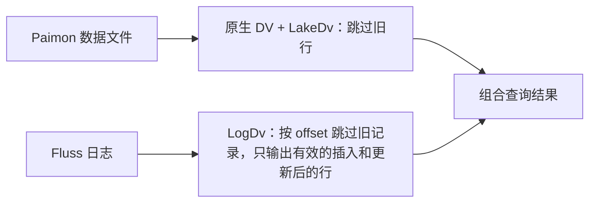
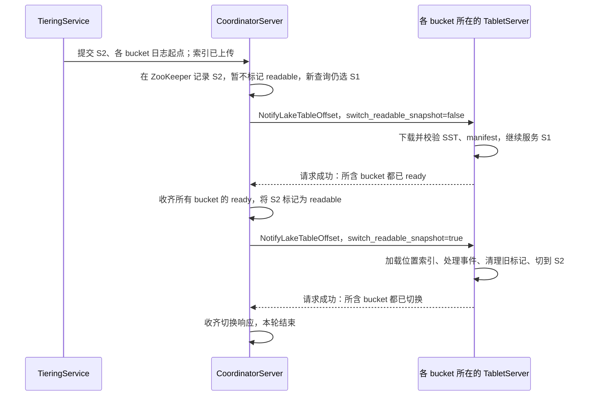

<!--
Licensed to the Apache Software Foundation (ASF) under one
or more contributor license agreements. See the NOTICE file
distributed with this work for additional information
regarding copyright ownership. The ASF licenses this file
to you under the Apache License, Version 2.0 (the
"License"); you may not use this file except in compliance
with the License. You may obtain a copy of the License at

    http://www.apache.org/licenses/LICENSE-2.0

Unless required by applicable law or agreed to in writing,
software distributed under the License is distributed on an
"AS IS" BASIS, WITHOUT WARRANTIES OR CONDITIONS OF ANY
KIND, either express or implied. See the License for the
specific language governing permissions and limitations
under the License.
-->

# FIP-47 会议讨论稿：Paimon 主键表如何按位置完成 Union Read

**核心思路：在更新、删除和文件切换时，提前找出需要跳过的位置；查询时分别过滤 Paimon 文件和 Fluss 日志，再组合结果。**

本文描述拟实现的设计。先用一个例子讲清数据如何变化，再介绍 TS 保存的状态，以及索引生成、快照切换、查询和恢复。完整字段与存储格式见[详细设计](FIP-47-paimon-primary-key-union-read-pk-index-zh.md)。

会议可以按“例子是否正确 → 文件变化如何处理 → 多个 bucket 如何切换 → 实现代价”的顺序展开。

## 1. 要解决什么问题

数据湖侧（Paimon）保存已经通过 tiering 写入的数据，Fluss 日志保存最近的变化。同一个主键可能同时存在于两边：

```text
Paimon 文件 A，第 0 行：key1 = v1
Fluss 日志：           key1 更新为 v4

查询应该返回：key1 = v4
需要跳过：  A 的第 0 行
```

对于 Fluss 当前保留的在线分区，方案维护一张位置索引：`RowPosIndex[key1] = A:0`。这里 `A:0` 表示文件 A 的第 0 个物理行。历史分区按需向 Paimon 查询位置，见第 9 节。

Fluss 收到更新时，按 PK 查到 A:0，将这个位置记入删除位图。查询读取文件时直接跳过 A:0。**PK 查找发生在写入和快照切换时，查询使用已经生成的位置标记。**

### 三种删除位图各自负责什么

DV（Deletion Vector）可以理解为一份“读取时跳过这些位置”的清单，用 bitmap 存储。

| 名称 | 谁维护 | 跳过什么 |
| --- | --- | --- |
| Paimon 原生 DV | Paimon compaction | Paimon 文件中已经失效的旧版本 |
| LakeDv | Fluss TabletServer | 因 Fluss 后续更新、删除而失效的 Paimon 行 |
| LogDv | Fluss TabletServer | 按旧记录的 offset，跳过 Fluss 日志中已被更新、删除的 +I、+U 记录 |



这里优化的是读取时的多版本去重；业务查询本身需要扫描的数据仍然要读取。

## 2. 用一个例子走完整个过程

只看一个 Fluss bucket（数据分桶）。日志 offset 是这个 bucket 内每条日志的位置。`+I` 表示插入，`-U / +U` 表示更新前、更新后的行，`-D` 表示删除。

### 第一步：三条数据已经可以从 Paimon 读取

Fluss 最初写入：

```text
offset 0：+I(key1, v1)
offset 1：+I(key2, v2)
offset 2：+I(key3, v3)
```

这些数据经过 tiering 和 compaction，形成可读快照 S1。假设 S1 的有效行都在文件 A：

| 物理位置 | 数据 | 位置索引 |
| --- | --- | --- |
| A:0 | key1 = v1 | key1 → A:0 |
| A:1 | key2 = v2 | key2 → A:1 |
| A:2 | key3 = v3 | key3 → A:2 |

**S1 已经反映日志 0～2，查询从日志 3 接着读。因此，S1 的 `readableOffset = 3`。**

以后看到这个字段，只需要把它读成“Fluss 日志从这里继续读”。它与快照一起确定 Paimon 和 Fluss 各自负责哪部分数据。

### 第二步：更新 key1，立即屏蔽 Paimon 中的旧行

用户更新 `key1 = v4`，Fluss 产生：

```text
offset 3：-U(key1, v1)，引用旧记录的 offset 0
offset 4：+U(key1, v4)
```

处理 offset 3 时，TabletServer 做三件事：

1. 查到 `key1 → A:0`，将 A:0 加入 LakeDv，并移除 key1 的位置索引项。
2. LogDv 标记旧记录的 offset 0。它已经在本次日志读取范围之外，不影响本次扫描。
3. 记住 `PendingDeletes[3] = key1`，供后续换文件时重新检查。

`PendingDeletes` 保存的是**尚未进入可读 Paimon 数据的更新、删除事件**。即使命中过旧文件的位置，事件也要保留。

此时查询：

| 读取来源 | 跳过什么 | 输出什么 |
| --- | --- | --- |
| S1 的文件 A | LakeDv 跳过 A:0 | key2=v2、key3=v3 |
| Fluss 日志 `[3,4]` | 不输出 -U | key1=v4 |

结果为 `key1=v4、key2=v2、key3=v3`。不需要等待 Paimon 再次 compaction。

### 第三步：将 key1 的更新同步到 Paimon

TieringService 读取日志 `[3,4]`，将更新同步到 Paimon：

| Fluss 日志 | 写入 Paimon |
| --- | --- |
| offset 3：-U(key1, v1) | UPDATE_BEFORE，表示更新前的行 |
| offset 4：+U(key1, v4) | ADD，写入更新后的完整行 |

本轮提交 APPEND 后，这两条变更已经进入 Paimon L0。此时尚未形成包含这次更新的可读 COMPACT 快照，查询仍使用 S1，从 Fluss 日志 offset 3 接着读。

### 第四步：再删除 key3

```text
offset 5：-D(key3, v3)，引用旧记录的 offset 2
```

这条删除发生在上一轮同步之后，尚未通过下一轮 APPEND 提交到 Paimon。

TabletServer 查到 `key3 → A:2`，标记 A:2，移除该索引项，保留 `PendingDeletes[5] = key3`，并在 LogDv 标记旧记录的 offset 2。

```text
LakeDv[A]      = {0, 2}
RowPosIndex    = {key2 → A:1}
PendingDeletes = {3 → key1, 5 → key3}

查询 S1 + 日志 [3,5]：key1=v4、key2=v2
```

### 第五步：compaction 把文件 A 换成文件 B

随后，Paimon 将文件 A 与 L0 中已经提交的 key1 更新一起 compaction，生成文件 B 和 COMPACT 快照 S2。在本例中，S2 形成时 offset 5 的 key3 删除仍未提交到 Paimon，因此 B 包含 key1 的新值，也仍然保留 key3。

S2 反映日志 0～4，可以作为下一次可读切换的目标，`readableOffset = 5`。

S2 的有效行如下。示例中 A 被整体重写，原生 DV 不再需要屏蔽这些输出行：

| 新物理位置 | 数据 | 对 Fluss 来说还需要做什么 |
| --- | --- | --- |
| B:0 | key1 = v4 | 更新已经进入文件，保留 |
| B:1 | key2 = v2 | 保留 |
| B:2 | key3 = v3 | 删除仍在 Fluss 日志中，需要屏蔽 |

切换到 S2 时，先加载 B 的 PK 位置。此前 PendingDeletes 中还保存着 `3 → key1` 和 `5 → key3`，分别对应 Fluss 侧发生的 key1 更新和 key3 删除。

随后检查这两次变化是否已经体现在 S2 中。已经体现的，从 PendingDeletes 中移除；尚未体现的，仍需要在文件 B 中设置删除标记。先清理前一类记录，再处理后一类：

| PendingDeletes 中的记录 | 与新日志起点 5 比较 | 处理 |
| --- | --- | --- |
| `3 → key1` | 3 < 5，S2 已处理 | 移除这条记录，不能再拿它去屏蔽 B:0 |
| `5 → key3` | 5 ≥ 5，S2 尚未处理 | 按 PK 查到 B:2，重新标记；继续保留这条记录 |

完成后，清理旧文件 A 的 LakeDv，切换读取状态：

```text
当前快照        = S2
日志读取起点    = 5
RowPosIndex    = {key1 → B:0, key2 → B:1}
LakeDv[B]      = {2}
PendingDeletes = {5 → key3}
```

| 切换前后 | Paimon 输出 | Fluss 日志输出 | 最终结果 |
| --- | --- | --- | --- |
| S1 + 日志 `[3,5]` | key2=v2 | key1=v4 | key1=v4、key2=v2 |
| S2 + 日志 `[5,5]` | key1=v4、key2=v2 | 无，只有 -D | key1=v4、key2=v2 |

**文件和日志起点都变了，查询结果保持一致。**

## 3. TabletServer 中的 DvRocksDB

前面例子中的位置索引、删除标记和 PendingDeletes，都由 TabletServer 保存在本地。每个 bucket 使用一个独立的 RocksDB 实例，称为 **DvRocksDB**。

业务 KV RocksDB 保存业务记录的当前值；DvRocksDB 保存 union read 所需的位置索引和删除状态，两者分别维护。DvRocksDB 包含五个列族（Column Family）：

| 列族 | 保存什么 |
| --- | --- |
| RowPosIndex | 在线分区的 `PK → 文件编号、物理行号`，定位当前尚未被 LakeDv 屏蔽的有效行 |
| LakeDv | `文件编号 → 需要跳过的行号 bitmap` |
| LogDv | 按范围保存需要跳过的日志 offset bitmap |
| PendingDeletes | `更新前 / 删除事件自身的 offset → PK`，供切换文件时重新定位 |
| FileId2Name | 文件路径与文件编号的双向字典，与 SST、manifest 使用一致的编号 |

处理实时更新、删除时，TS 修改这些状态；切换快照时，将在线分区的 SST 导入 RowPosIndex，再处理 PendingDeletes 和删除标记。历史分区通过 Paimon lookup 获得位置，仍维护对应的 LakeDv、LogDv 和 PendingDeletes。

**DvRocksDB checkpoint 就是这套本地状态的一份一致性备份。** 它保存五个列族，以及对应的 Paimon 快照 ID、日志读取起点和 DV 已处理到的日志 offset。这些内容一起保存，恢复时才能知道当前有哪些位置和删除标记，以及后续需要补齐哪些变化。

DvRocksDB checkpoint 与业务 KV 的 snapshot 分别维护。TS 恢复时，先加载 DvRocksDB checkpoint，再通过后续 changelog 补齐状态；在线分区的位置从索引 SST 恢复，历史分区按需向 Paimon 查询。

## 4. 位置索引从哪里来

本方案要求 Paimon 表开启 Deletion Vector（DV），并使用跳过 L0 的读取模式。新写入先进入 L0，经过 compaction 后才可从数据湖侧读取。在此之前，这部分数据继续从 Fluss 日志读取。

因此，只有在检测到符合读取条件的新 COMPACT 快照后，TieringService 才需要生成或更新位置索引。首次可读或位置发生变化的有效行生成新索引，没有变化的位置继续复用；仅提交 APPEND 不触发索引生成。

下面的 SST 生成和加载流程用于在线分区。历史分区不生成整份位置索引 SST，但快照元数据仍需记录相关文件变化，供切换时清理旧文件的 LakeDv。

```text
Paimon 产生 COMPACT 快照
    ↓
TieringService：扫描有效 PK 和物理位置
    ↓
TieringService：写入临时 RocksDB，生成供 TabletServer 直接导入的 SST
    ↓ 上传到远端存储
TabletServer：下载并校验 SST（预下载阶段）
    ↓ 收到快照切换通知
TabletServer：将 SST 导入本地 RowPosIndex（切换阶段）
```

这里生成的是可由 TabletServer 直接导入 RowPosIndex 的 RocksDB SST，由 **TieringService 生成，TabletServer 下载并加载**，具体分工是：

1. **TieringService 收集位置**：扫描目标快照最终保留的新增、重写或从 L0 升级后首次可读的文件，应用该快照的 Paimon 原生 DV，得到 `PK → FilePos`。FilePos 使用文件内的真实物理行号，每个存活 PK 对应唯一有效位置。
2. **TieringService 生成并上传 SST**：按 bucket 将 `PK → FilePos` 通过 `put` 写入临时 RocksDB，使用与 RowPosIndex 相同的 key 编码、FilePos 编码和比较规则，由 RocksDB 完成排序。随后按 key 顺序遍历，写出可由 TabletServer 直接导入 RowPosIndex 的 RocksDB SST，并上传远端存储。
3. **TabletServer 下载并导入**：预下载阶段只下载和校验文件。收到快照切换通知后，再将 SST 直接导入（ingest）本地 DvRocksDB 的 RowPosIndex，相同 PK 的新位置覆盖旧位置；随后处理 PendingDeletes。

同时，TieringService 收集从上一可读快照到目标快照的文件变化，将被替换、目标快照已不再使用的旧文件记入 `replacedFiles`。例如前面的 A 被 B 替换，本轮生成：

```text
RowPos SST：  {key1 → B:0, key2 → B:1, key3 → B:2}
replacedFiles：[A]
```

随附的 manifest 记录 SST 列表、新文件信息和 `replacedFiles`。TabletServer 切换时，先加载 B 的新位置并处理 PendingDeletes，再根据 `replacedFiles` 清理 A 的 LakeDv。A 的数据文件仍按快照保留机制管理，在途查询或恢复仍需引用时不能删除。

TieringService 根据 tiering 提交与 compaction 消费 L0 的关系，确定各 bucket 的日志起点。所选数据要完整反映起点之前的变化，且不包含起点及之后的变化；无法确认时继续使用旧快照。

## 5. 多个 bucket 如何一起换到新快照

同一次查询的所有 bucket 使用同一个 Paimon 快照，各 bucket 有自己的日志读取起点。CoordinatorServer（CS）协调切换，TabletServer（TS）保存各 bucket 的位置索引和 DV。

**保留两轮通知：先让所有 bucket 把文件下载好，再由 CS 将 S2 标记为 readable，并通知各 TS 完成本地切换。标记后，新查询开始选择 S2。**



TieringService 将目标快照对应的各 bucket 日志读取起点（readableOffset）汇总到一个元数据文件中，并向 CS 提交该文件的路径。例如，文件记录 `bucket 0 → 5`、`bucket 1 → 12`，表示使用该快照时，这两个 bucket 分别从日志 offset 5、12 接着读。

CS 先将 S2 的 snapshotId、上述元数据文件路径，以及 `dvPendingReadable=true` 持久化到 ZooKeeper，此时 S2 尚未标记为 readable，新查询仍选择 S1。收齐所有 bucket 的 ready 后，CS 将 `dvPendingReadable` 改为 false，即将 S2 标记为 readable，新查询开始选择 S2。随后 CS 通知各 TS 完成本地切换。CS 重启后可以根据这些信息恢复进度并继续推进。

### 第一轮：只下载，不修改当前读取状态

TS 在锁外下载并校验文件，缓存元数据。此时不加载新位置索引，不修改文件字典或 DV。

**Ready 就是第一次通知的成功响应。** 一个请求包含多个 bucket，就要等这些 bucket 全部准备好再成功返回；仅仅接收请求、启动后台任务都不算 ready。

### 第二轮：在本地完成切换

CS 将 S2 标记为 readable 后，才发送第二次通知。历史分区先按第 9 节查询并准备所需的新位置，随后 TS 在保护 DV 状态的写锁内完成：

1. 加载新文件字典和在线分区的位置索引，相同 PK 的新位置覆盖旧位置。
2. 删除 `事件 offset < 新日志起点` 的 PendingDeletes。
3. 用所有剩余事件定位并标记新位置：在线分区查 RowPosIndex，并移除命中的索引项；历史分区使用已准备的 lookup 结果。两者都继续保留事件。
4. 根据 manifest 中的 `replacedFiles` 清理旧文件的 LakeDv，并清理已经过期的 LogDv 范围。
5. 一起更新本地快照 ID 和日志起点，结束后才对外使用新状态。

同一 bucket 保留一套当前索引和 DV。第二次通知成功表示请求内的所有 bucket 都已完整切换。任一 bucket 失败则返回 RPC 错误，CS 重试整个请求，已经完成的 bucket 幂等跳过。本轮全部完成后，再启动下一轮。

### 切换期间查询会怎样

| 时刻 | 查询看到什么 |
| --- | --- |
| 预下载期间 | 继续查询 S1，远端下载不修改当前状态 |
| S2 已标记为 readable，部分 bucket 尚未切换 | 新查询选择 S2；若涉及尚未切换的 bucket，客户端需要持续重试，直到它们完成切换；不能混用 S1 和 S2 |
| bucket 已切换，收到新的 S1 请求 | 客户端刷新快照，整次读取按新快照重新规划 |
| 已取得完整读取信息的在途查询 | 使用固定的 DV 副本继续读，依赖的旧文件和日志仍需保留 |

**这里的取舍是：每个 bucket 只维护一套当前位置索引和 DV，减少存储与维护成本；代价是 S2 已标记为 readable 时，部分 bucket 可能尚未完成本地切换，涉及这些 bucket 的新查询需要持续重试。** 查询要等所涉及的 bucket 都能提供 S2 的读取信息，才能完成这次读取，因此会增加查询延迟和重试开销。若切换迟迟未完成，查询也可能超时。

预下载在 S2 标记为 readable 之前完成，此时新查询仍选择 S1。标记之后，查询的等待仍包含通知、本地切换和失败重试；慢 bucket 或缓存丢失后重新下载都会延长等待。

## 6. 查询只需要拿到一套匹配的读取信息

客户端先选择最新被 CS 标记为 readable 的快照 S，再向各 bucket 请求 S 对应的 DV。本地快照与 S 不一致的 bucket 按上一节的规则要求客户端刷新或重试。

TS 返回三部分信息：

| 信息 | 查询用途 |
| --- | --- |
| LakeDv | 跳过 Paimon 文件中已被 Fluss 更新、删除的行 |
| 日志范围 `[readableOffset, logEndOffset]` | 确定本次需要补读哪些日志；两端都包含 |
| 该范围的 LogDv | 按旧记录的 offset，跳过日志中已失效的 +I、+U 记录 |

客户端按同一个 S 规划 Paimon 文件和原生 DV；文件侧应用原生 DV、LakeDv，日志侧应用 LogDv，只输出存活的 +I、+U，最后组合结果。

## 7. 失败后怎么继续，哪些东西不能提前清理

| 失败位置 | 处理方式 |
| --- | --- |
| 索引生成、上传或 tiering 提交期间 | 幂等重试未完成的工作；新查询继续选择 S1 |
| 下载期间 | 重试下载，继续使用旧快照；成功校验的缓存可复用 |
| CS 重启时，S2 尚未标记为 readable | 从 ZooKeeper 读取已记录的 S2 信息，重新确认所有 bucket ready，再将 S2 标记为 readable，并通知各 TS 切换 |
| CS 重启时，S2 已标记为 readable | 重发切换通知；完成的 bucket 直接成功，其余继续处理 |
| TS 切换中途失败 | 暂停该 bucket 相关读写，恢复完整状态后再服务，不能把“已经加载 SST”当作切换完成 |
| TS 重启，缓存丢失 | 用 DvRocksDB checkpoint、后续日志恢复；在线分区重新下载索引文件，历史分区按对应快照重新 lookup |

恢复时，先加载 DvRocksDB checkpoint，再重放其中已处理日志 offset 之后的 changelog，补齐删除事件和 DV。在线分区按顺序加载恢复到当前可读快照所需、且实际持久化的索引轮次；历史分区按各轮目标快照查询所需的位置。每轮都先清理已被数据湖侧对应可读快照处理的 PendingDeletes，再对剩余事件重新定位、设置 LakeDv。

重复通知、旧 CS 的延迟通知和 bucket 迁移都要校验当前协调者、归属和目标快照。旧请求不能把本地状态切回去；同一目标快照携带不同日志起点应报错。

资源清理要看实际引用：当前 bucket 状态、在途查询、checkpoint 恢复都可能仍需要旧快照、数据文件、DV、Fluss 日志和索引 SST。**新快照标记为 readable，不代表旧资源已经可以删除。**

从空表开始写入的场景下，尚未形成第一个可读 Paimon 快照时，查询依赖保留的 Fluss 日志。

## 8. 适用范围和需要承担的成本

首版在建表时选择启用，默认关闭，创建后不直接切换。要求 Fluss 主键表开启 tiering 和 FULL changelog；Paimon 使用 DEDUPLICATE 与原生 DV。Fluss 先完成自身 merge engine 的计算，再写入完整结果。业务写入、删除都经过 Fluss；外部任务可执行保持逻辑内容的 compaction。

| 成本发生在哪里 | 主要工作或资源 |
| --- | --- |
| Fluss 更新、删除 | 在线分区查本地 PK 索引，历史分区按需 lookup；维护两个 DV 和 PendingDeletes |
| Fluss 本地存储 | 每个 bucket 独立的 DvRocksDB；KV 和 changelog 保存内部版本信息 |
| Compaction 之后 | 为在线分区扫描有效 PK、生成和上传 SST、预下载索引 |
| 快照切换 | 在线分区加载索引，历史分区 lookup 所需位置；重新处理保留事件、持锁更新状态 |
| 全表协调 | 等待所有 bucket ready，再等待所有 bucket 切换完成 |

## 9. 历史分区如何按需查询位置

数据湖侧可能保留多年的分区，而 Fluss 只保留最近一段时间的数据。历史分区不常驻完整 RowPosIndex；收到更新、删除时，按 PK 向 Paimon 查询对应的文件位置。

| 分区 | 如何获得位置 |
| --- | --- |
| Fluss 当前保留的在线分区 | 从本地 RowPosIndex 查询 |
| 历史分区 | 按指定快照、原始 Paimon 分区、bucket 和 PK 查询 Paimon，按需缓存结果 |

例如，更新历史分区中的 `key1=v1`：

```text
收到 key1 的更新
    ↓
按当前 readable 快照 S1，向 Paimon 查询 key1 的有效位置
    ↓
得到 A:5
    ↓
设置 LakeDv[A][5]，并保留 PendingDeletes
    ↓
查询跳过 A:5，从 Fluss 日志读取更新后的值
```

历史写入本来就需要从 Paimon 查询旧值时，如果旧值和位置使用同一快照的相同可读数据，可以一次 lookup 同时返回旧值、文件名和物理行号。旧值已经在 Fluss 本地时，仍需在缺少位置缓存的情况下查询数据湖侧的位置。实现上需要扩展现有 lookup 接口，接入 Paimon 内部返回 value 和位置的能力，并支持指定快照及其原生 DV。

**处理写入时，查位置必须使用本地正在服务的 readable 快照及其原生 DV、跳过 L0，不能直接查 Paimon 最新快照。** 缓存也要区分快照；应用 lookup 结果前若已切换快照，需要重新查询。确认该快照没有有效行时，无需设置 LakeDv，但仍保留 PendingDeletes；lookup 失败则重试，不能当成 PK 不存在，也不能让查询越过尚未处理完 DV 的日志。

切换到 S2 时，沿用前面的 PendingDeletes 处理顺序：先排除 `事件 offset < S2 日志起点` 的记录，只为剩余记录涉及的 PK 查询 S2 中的有效位置，再设置 LakeDv、清理被替换文件的旧标记。例如 key1 仍需屏蔽，而 compaction 将它从 A:5 移到了 B:2，就改为标记 B:2。

历史分区切换时，先暂停该 bucket 的新写入，处理完此前写入对应的 DV 事件，固定待处理的 PendingDeletes。在 DV 写锁外完成上述位置查询，再进入第 5 节的本地切换；完成后恢复写入。

历史写入通过共享的 Fluss 历史分区承接时，lookup 和 LakeDv 仍对应记录原来的 Paimon 分区、bucket。历史分区全部变更已被当前 readable 快照处理，且没有新的 Fluss 变更时，查询直接使用该快照的数据湖文件和 Paimon 原生 DV，无需常驻位置缓存。

这里的取舍是：Fluss 无需维护所有历史主键的位置，但历史写入和快照切换可能需要等待 lookup。Paimon 底层仍可能下载或构建文件级 lookup 缓存，需要限制缓存规模；首次访问的成本也应计入写入和切换耗时。

## 附录：讨论到实现细节时再看

### A. LogDv 如何知道要跳过哪条日志记录

LogDv 按旧记录的 offset 设置删除标记。为此，-U、-D 需要携带它们所更新、删除的那条 +I 或 +U 记录的 offset。

例如 offset 10 插入一行，offset 20 删除它：

```text
offset 10：+I(key1, v1)
offset 20：-D(key1, v1)，引用旧记录的 offset 10

LogDv 标记 10：跳过 offset 10 的旧记录。
PendingDeletes[20] = key1：用删除事件自身的 offset 20，判断该事件是否已被数据湖侧的可读快照处理。
```

单独看连续更新的情况：若第一次更新在 offset 12 写出 +U，第二次更新的 -U 就引用 12。LogDv 标记 offset 12，日志扫描最终只输出仍有效的 +I、+U 记录。

内部格式将正向记录的 offset 保存在 RowId 字段中。KV value 保存 `[RowId(8B)][schemaId(2B)][BinaryRow]`，changelog 也携带 RowId；旧记录具有 Fluss 日志 offset 时，-U、-D 从旧 KV value 取得该 offset。讨论 LogDv 的过滤逻辑时，直接称它为“旧记录的 offset”。

当前可读快照中没有该 PK 的有效行时，仍然记录 PendingDeletes；旧记录具有 Fluss 日志 offset 时，也更新 LogDv。后续快照切换时，再处理这些事件。新的 +I、+U 不直接写入位置索引；在线分区的位置通过 SST 加载，历史分区的位置通过 lookup 获取。

### B. 两次通知如何区分

复用 `NotifyLakeTableOffset` 的 `PbNotifyLakeTableOffsetReqForBucket`，增加：

```protobuf
optional int64 readable_snapshot_id = 8;
optional int64 readable_offset = 9;
optional bool switch_readable_snapshot = 10;
```

| 字段组合 | 含义 |
| --- | --- |
| 无目标快照和日志起点，切换标志未设置或为 false | 普通 offset 通知 |
| 有目标快照和日志起点，切换标志为 false 或未设置 | 预下载；成功响应即 ready |
| 有目标快照和日志起点，切换标志为 true | 执行本地切换；成功响应即全部完成 |

目标快照和日志起点必须成对提供；无目标却要求切换应报错。原有 `snapshot_id` 和日志 offset 字段继续表达 tiered 进度。两次调用都使用现有的空成功响应，不增加独立 ready 上报 RPC。

查询使用 `GetLakeDvSnapshot`，请求携带目标快照 ID，响应携带 LakeDv、LogDv 和日志范围。写入、查询同时需要 KvTablet 与 DV 两把锁时，统一先获取 KvTablet 锁，再获取 DV 锁。
