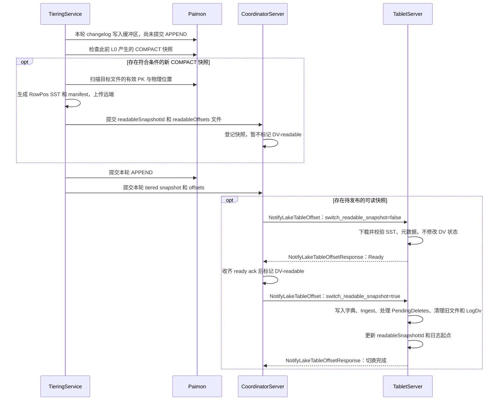

<!--
Licensed to the Apache Software Foundation (ASF) under one
or more contributor license agreements. See the NOTICE file
distributed with this work for additional information
regarding copyright ownership. The ASF licenses this file
to you under the Apache License, Version 2.0 (the
"License"); you may not use this file except in compliance
with the License. You may obtain a copy of the License at

    http://www.apache.org/licenses/LICENSE-2.0

Unless required by applicable law or agreed to in writing,
software distributed under the License is distributed on an
"AS IS" BASIS, WITHOUT WARRANTIES OR CONDITIONS OF ANY
KIND, either express or implied. See the License for the
specific language governing permissions and limitations
under the License.
-->

# FIP-47：使用 Deletion Vector 加速 Paimon 主键表 Union Read（PK 位置索引）

## 动机

在 Streamhouse 架构中，Fluss 保存实时数据，Paimon 保存通过 tiering 写入的历史数据。Union read 组合 Paimon 数据与 Fluss changelog，为每个主键返回读取范围内的最新结果。

日志表只需要追加读取，主键表还需要处理更新和删除。现有 Paimon 主键表 union read 通过 sort-merge 对两边的数据去重。本提案将这部分去重工作提前到写入和快照切换时完成，查询使用文件位置和日志 offset 的删除标记。

### 问题一：跨存储层去重

假设 `(key1, v1)` 已写入 Paimon 文件 A 的行号 5。用户在 Fluss 更新 `key1 → v2`，产生 `-U(key1,v1)` 和 `+U(key1,v2)`。此时 v2 在 Fluss 日志中，A:5 仍保存 v1。

Union read 必须跳过 A:5，只返回 v2。读取时按 PK 归并可以得到正确结果，但大范围查询需要处理大量历史记录，即使最近只有少量 PK 发生变化。

### 问题二：Paimon 侧的 merge-on-read 开销

Paimon 主键表的多个 LSM 文件可能保存同一 PK 的不同版本。普通读取需要合并这些版本。Paimon 已提供 compaction 生成的原生 deletion vectors，可以直接跳过旧位置，减少 merge-on-read 开销。

### 目标

使用三层 Deletion Vector（DV）：

1. Fluss TabletServer 维护 LakeDv 和 LogDv，即时屏蔽 Paimon 文件与 Fluss 日志中的旧版本，无需等待下一轮 compaction。
2. Paimon compaction 维护原生 DV，处理已经进入 Paimon 的更新和删除。Fluss 不生成 Paimon 物理 DV 文件。

Fluss 通过 `RowPosIndex[PK] → FilePos` 定位 Paimon 行，查询按位置 bitmap 过滤。Fluss KV 和 changelog 中的 RowId 用于识别日志版本，供 LogDv 标记旧版本。

---

## 公开接口

### 新增表配置

| 配置 | 类型 | 默认值 | 说明 |
| --- | --- | --- | --- |
| `table.datalake.deletion-vectors.enabled` | Boolean | `false` | Fluss 三层 DV 的开关，创建表时确定，之后不可修改 |

启用时校验：

- 表具有主键。
- 已开启 `table.datalake.enabled`。
- 使用 `table.changelog.image = FULL`，更新、删除提供旧版本信息，供 LogDv 维护使用。

该开关涉及 Fluss KV 状态和 changelog 的内部格式，创建后不允许通过 `ALTER TABLE` 直接切换。

Fluss DV 开启时，Paimon 侧的 `paimon.deletion-vectors.enabled` 必须开启：未设置时自动启用，已经开启则保留，显式关闭则拒绝创建。Fluss DV 关闭时，Paimon 侧配置沿用现有行为。

### Paimon 表与位置索引

使用 Paimon 表的业务主键构建位置索引，将目标快照中的有效 PK 映射到文件位置。

Paimon 使用 `DEDUPLICATE` merge engine。Fluss 先完成自身 merge engine 计算，再按日志顺序写入完整行。外部任务可以执行 compaction，但业务更新、删除必须经过 Fluss，不能独立修改表内容。

### 内部磁盘与传输格式

DV 表使用 RowId 标识 Fluss 记录的版本：

- **KV value**：`[RowId(8B)][schemaId(2B)][BinaryRow]`。
- **Changelog value**：四种记录都携带 8 字节 RowId。`+I`、`+U` 携带自身日志 offset；`-U`、`-D` 携带旧版本 RowId。
- **RowPos SST**：key 为完整 PK 编码，value 为 FilePos。
- **PendingDeletes**：key 为 `deleteOffset`，value 为 PK 编码。

以上均为 Fluss 内部格式。

### 新增与扩展 RPC

#### 公共消息

```protobuf
message PbLakeDvEntry {
  required string file_path = 1;
  // Serialized Roaring64Bitmap of deleted row positions.
  required bytes deleted_positions_bitmap = 2;
}
```

#### `GetLakeDvSnapshot`：获取 union read 所需的 DV

请求指定可读快照。响应包含按文件路径组织的 LakeDv、LogDv 和日志读取范围。

```protobuf
message GetLakeDvSnapshotRequest {
  required int64 table_id = 1;
  required int32 bucket_id = 2;
  required int64 readable_snapshot_id = 3;
  optional int64 partition_id = 4;
}

message GetLakeDvSnapshotResponse {
  // LakeDv: per-file deleted position bitmaps (file_path as key, resolved via FileId2Name)
  repeated PbLakeDvEntry lake_dv_entries = 1;
  // LogDv: deleted log offsets bitmap (serialized Roaring64Bitmap)
  optional bytes log_dv_bitmap = 2;
  // The log end offset at snapshot time
  required int64 log_end_offset = 3;
  // The log start offset for this snapshot (snapshotStartLogOffset)
  required int64 snapshot_start_offset = 4;
}
```

DV 表通过两次 `NotifyLakeTableOffset` 调用推进快照：第一次预下载 RowPos SST，所有 bucket ready 后发布快照，再通过第二次调用执行本地切换。两次调用复用同一个 per-bucket 消息结构。

#### `NotifyLakeTableOffset`：预下载与切换

复用 `NotifyLakeTableOffsetRequest`，在 `PbNotifyLakeTableOffsetReqForBucket` 中增加目标 `readable_snapshot_id`、`readable_offset` 和布尔字段 `switch_readable_snapshot`。字段为 `false` 时仅预下载，为 `true` 时执行本地可读快照切换。

```protobuf
message NotifyLakeTableOffsetRequest {
  required int32 coordinator_epoch = 1;
  repeated PbNotifyLakeTableOffsetReqForBucket notify_buckets_req = 2;
}

message PbNotifyLakeTableOffsetReqForBucket {
  required int64 table_id = 1;
  optional int64 partition_id = 2;
  required int32 bucket_id = 3;
  required int64 snapshot_id = 4;   // the tiered lake snapshot (existing meaning; may be an APPEND)
  optional int64 log_start_offset = 5;
  optional int64 log_end_offset = 6;
  optional int64 max_timestamp = 7;
  // NEW (DV): the COMPACT snapshot to make DV-readable; locates rowPos/{id}/rowpos.manifest
  // and is set as readableSnapshotId at the switch.
  optional int64 readable_snapshot_id = 8;
  // NEW (DV): base-file coverage; becomes snapshotStartLogOffset (the union-read changelog start).
  optional int64 readable_offset = 9;
  // false: only prefetch SSTs; true: switch the local readable snapshot.
  optional bool switch_readable_snapshot = 10;
}

message NotifyLakeTableOffsetResponse {
}
```

**请求处理规则**：

| 每个 bucket 的请求字段 | 行为 | 成功响应的含义 |
| --- | --- | --- |
| 不带 readable_snapshot_id 和 readable_offset，切换标志未设置或为 false | 普通 lake offset 通知 | 原有通知处理完成 |
| 携带 readable_snapshot_id 和 readable_offset，切换标志为 false | 预下载目标快照的 SST 和元数据 | Ready：预下载、校验完成 |
| 携带 readable_snapshot_id 和 readable_offset，切换标志为 true | 执行目标快照的本地切换 | 切换全部完成 |

`readable_snapshot_id` 和 `readable_offset` 必须同时提供。DV 请求未设置 `switch_readable_snapshot` 时按 false 处理；缺少目标快照却设置 true 的请求报错。原有 `snapshot_id` 和日志 offset 字段继续表示 tiered 进度，不能用 readableOffset 替代它们。

**Ready 就是预下载请求的成功响应**，不增加独立的 ready 上报 RPC。一个请求包含多个 bucket 时，所有 bucket 完成对应操作后才返回空的 `NotifyLakeTableOffsetResponse`；不能在收到请求或提交后台任务时提前返回成功。预下载阶段可异步完成 RPC future，期间旧快照继续服务查询。

任一 bucket 失败则通过 RPC 错误返回；超时、失败或响应丢失时，CoordinatorServer 重试整个请求。已完成的 bucket 幂等跳过，已下载且校验通过的文件可以复用。CoordinatorServer 根据请求中的 `(table_id,partition_id,bucket_id)`、目标快照和切换标志判断成功响应确认了哪些操作。

CoordinatorServer 只有收齐覆盖所有目标 bucket 的 ready 响应，并将目标快照发布为 DV-readable 后，才能发送 `switch_readable_snapshot = true`。本地已有 SST 不代表允许切换。接口复用保留两阶段及两轮完成确认。

### RowPos 索引文件：远端湖存储

位置索引保存在表的远端 lake-snapshot 目录中：

```text
{remoteLakeTableSnapshotDir}/
├── metadata/
│   └── {UUID}.offsets
└── rowPos/
    └── {snapshotId}/[{partitionId}/]
        ├── rowpos.manifest
        └── {bucketId}/
            └── {fileName}.sst
```

`{remoteLakeTableSnapshotDir}` 为 `{remote.data.dir}/lake/{databaseName}/{tableName}-{tableId}`。

**rowpos.manifest** 使用 `RowPosSstIndex`，保存每个 bucket 的 SST 列表、新文件字典和被替换文件列表，version 标识格式版本：

```json
{
  "version": 2,
  "buckets": {
    "0": {
      "rowPosSstFiles": [ { "name": "sst_0.sst", "size": 12345 } ],
      "fileId2Name": [ { "fileId": 7, "name": "data-abc.parquet" } ],
      "replacedFiles": [ "data-old.parquet" ]
    }
  }
}
```

本提案使用版本 2，SST key 为完整 PK 编码。PK 的编码版本需要在格式约定中固定，读取时校验格式和编码是否受支持。

**RowPos SST** 保存有序的 `PK → FilePos`：

- Key 使用 Fluss 和 Paimon 都能产生的相同完整主键编码，保留复合键字段顺序、类型和边界。
- Value 为 `varint(file_id) || varint(row_position)`。
- 按 RocksDB 的 key 比较器排序，按 SST 大小分文件；不能假定 Paimon 文件的排序顺序与该字节顺序一致。

FileId2Name 在同一列族中保存双向字典：`0x00 + path → BE(fileId)`，`0x01 + BE(fileId) → path`。预下载阶段缓存 manifest，切换和恢复时将其中的字典项写入 FileId2Name；查询由 TabletServer 将 fileId 解析为文件路径。字典不需要作为额外数据通过查询 RPC 传递。

### 用户可见行为

Paimon 主键表 union read 使用三层 DV 过滤，无需更换客户端 API，结果语义保持一致。减少的是去重开销；业务查询需要扫描的数据仍然需要读取。

---

## 设计变更

### 1. 架构：三层 Deletion Vector

```text
Fluss                                      Paimon
  Changelog                                  数据文件
  LogDv：日志中的旧版本 offset                 原生 DV：compaction 维护
  LakeDv：Paimon 中需跳过的行位置
  RowPosIndex：PK → 文件位置
```

- **Paimon 原生 DV**：Fluss 写入更新、删除记录，Paimon compaction 处理多版本与物理删除标记。
- **LogDv**：屏蔽本次读取范围内已经被更新或删除的 changelog 正向版本。
- **LakeDv**：Fluss 收到更新或删除后立即屏蔽 Paimon 旧行。文件被 compaction 替换后，按文件生命周期清理。

### 2. 数据模型与存储

#### 2.1 RowId

RowId 标识 Fluss KV 记录的一个具体版本，等于生成该版本的 `+I` 或 `+U` 的日志 offset。

| KV 操作 | Changelog | RowId |
| --- | --- | --- |
| `PUT(key1,v1)` | `+I(offset=0,key1,v1)` | 0 |
| `PUT(key1,v2)` | `-U(offset=1,key1,v1)`、`+U(offset=2,key1,v2)` | `-U` 引用 0，新版本为 2 |
| `DELETE(key1)` | `-D(offset=3,key1,v2)` | 引用 2 |

KV value 保存当前版本 RowId。`-U`、`-D` 从旧 KV value 取得 oldRowId，用于标记 LogDv。

Paimon 行的位置由业务 PK 定位：`RowPosIndex[key1] = (fileId,rowPosition)`。

固定 Paimon 快照，排除 L0 并应用该快照的原生 DV 后，每个存活 PK 至多有一个有效位置。构建索引时必须使用这些有效行，并还原与 Fluss 一致的主键及 partition、bucket 信息。

#### 2.2 FilePos

FilePos 包含：

- `file_id`：Paimon 数据文件的字典编号。
- `row_position`：文件内从 0 开始的物理行号。

两个字段使用无符号 varint 编码。过滤后返回记录的序号不能代替物理行号；索引构建和 DV reader 必须使用相同的位置坐标。

同一 bucket 的 SST、manifest 和 FileId2Name 必须使用一致的文件编号映射。重试和恢复时，已使用的 fileId 不能指向另一个文件。

#### 2.3 DvRocksDB

每个 bucket 使用独立于 KvTablet RocksDB 的 DvRocksDB，包含五个列族：

| 列族 | Key | Value | 说明 |
| --- | --- | --- | --- |
| `RowPosIndex` | PK 编码 | FilePos | 当前可读快照中尚未被 LakeDv 屏蔽的有效行位置；新位置通过 switch 时 ingest 写入 |
| `LogDv` | range start，8 字节大端序 | 32 位 RoaringBitmap | 按时间范围分段，保存相对范围起点的日志 offset；过期范围整体清理 |
| `LakeDv` | file_id，4 字节大端序 | Roaring64Bitmap | 每个 Paimon 文件需要额外跳过的物理行号 |
| `FileId2Name` | 带方向前缀的路径或 fileId | fileId 或路径 | 双向文件字典 |
| `PendingDeletes` | deleteOffset，8 字节大端序 | PK 编码 | 保存每条已处理的 `-U`、`-D`，按 `[0,readableOffset)` 清理 |

LogDv 可按 `datalake.freshness / N` 的时间窗口分段。每段以第一个 offset 为 key，保存相对 offset；整段结束位置早于 snapshotStartLogOffset 时可以删除。

命中 RowPosIndex 并生成 LakeDv 后，删除对应 PK 索引项。PendingDeletes 无论是否命中过位置都继续保留，直到该事件已经进入新的可读 Paimon 数据。

> **Offset 记法**：`readableOffset` 是赋给 `snapshotStartLogOffset` 的日志起点，`logEndOffset` 是包含在读取范围内的最后一条日志。若 Paimon 已经处理日志 0～4，则 readableOffset 为 5，继续读取 `[5,logEndOffset]`，清理 PendingDeletes 中 offset 小于 5 的事件。日志范围不拆开一次更新的 `-U`、`+U`。附录使用相同约定。

### 3. 写入路径

#### 3.1 实时写入：`+I`、`+U`

在 KV value 和 changelog value 的头部保存 RowId：

- 新 PK：产生 `+I(value,rowId)`，写入 PrewriteBuffer 和 changelog，KV 保存 `[RowId][schemaId][BinaryRow]`。
- 更新已有 PK：从旧 value 读取 oldRowId，产生 `-U(oldValue,oldRowId)` 和 `+U(newValue,newRowId)`，更新 KV。
- 删除已有 PK：产生 `-D(oldValue,oldRowId)`，删除 KV。

#### 3.2 更新和删除处理：`-U`、`-D`

Changelog 同步完成后，在 KvTablet 写锁保护下：

1. 将 PrewriteBuffer flush 到 RocksDB。
2. 获取 DvRWLock 写锁。
3. 对每条位于 `deleteOffset` 的 `-U`、`-D`，取得 PK 和 oldRowId，查询 `RowPosIndex[PK]`：
   - **命中 FilePos**：设置 `LakeDv[fileId]` 中的行号位，并删除 `RowPosIndex[PK]`。
   - **未命中**：可能尚未加载位置，也可能旧行已被前一次更新屏蔽；等待下一轮 switch 再检查。
   - 两种情况都写入 `PendingDeletes[deleteOffset] = PK`，并在 LogDv 中标记 `oldRowId`。
4. 释放 DvRWLock。
5. 推进 `log_hw`，释放 KvTablet 写锁。

DV 必须先于日志高水位更新完成。查询不能看到新的 logEndOffset，却仍使用旧的 LakeDv。需要同时获取两把锁时，统一先 KvTablet、再 DvRWLock。

恢复时，已经小于当前 snapshotStartLogOffset 的旧事件不能再通过 PK 屏蔽当前 Paimon 行。重放按 §8.2 的进度和每轮 readableOffset 处理。

### 4. Tiering 流程：Paimon

1. 新写入首先进入 L0。查询所需的位置索引通过扫描 compaction 输出构建。
2. 只在发现符合读取条件的新 COMPACT 快照时触发 prepare、publish 和 switch。APPEND 提交本身不触发切换。

CoordinatorServer 统一编排。TieringService 写入数据、检测 compaction、扫描输出并报告结果。

#### 4.1 端到端时序



时序中的提交顺序固定为：**先提交本轮检测到的可读 COMPACT 快照信息，再提交本轮 APPEND**。Prepare 和 switch 由 CoordinatorServer 推进；TieringService 的恢复以 APPEND 是否完成为判断依据。

两次成功响应分别确认整个请求中的 bucket 已完成预下载和切换。CoordinatorServer 收齐第一轮成功响应后发布，收齐第二轮成功响应后结束本轮；失败请求整体重试。

#### 4.2 阶段 A：写入与提交

**TabletServer 生成 split**：

1. 在 KvTablet 读锁内读取 `log_hw`，记为 `latest_offset`。
2. 生成 `(last_tiered_offset,latest_offset]` 范围的 split。

**TieringService 写入 Paimon**：

| Changelog | Paimon 写入 |
| --- | --- |
| `+I`、`+U` | 按日志顺序写入 ADD 和完整 value |
| `-D` | 写入 DELETE |
| `-U` | 写入 UPDATE_BEFORE |

Paimon writer 按自身规则管理内部 sequence number。位置索引通过扫描目标快照的有效 PK 和物理位置构建。

**提交本轮 APPEND 前，检查新 COMPACT 快照**：

1. **检测**：查找已经处理此前提交 L0 的新 COMPACT 快照；没有则直接提交 APPEND。
2. **计算 offset**：根据 tiering 提交进度和 compaction 对 L0 的消费关系，计算每个 bucket 的 readableOffset，并维护 tieredOffsets。所读 Paimon 数据必须完整反映 readableOffset 之前的日志，不能遗漏前面的变更或混入后面的变更。
3. **收集文件变化**：从上一可读快照到目标快照收集 `allNewFiles`、`allReplacedFiles`，包含后台及外部 compaction。中间产生后又被替换的文件不进入目标扫描。
4. **扫描**：对目标快照仍读取的新增或重写文件投影已有 PK，应用目标快照的 Paimon 原生 DV，生成 `PK → (file_id,row_position)`。L0 原地升级后首次可读的文件也在此范围内。
5. **生成并上传 SST**：按 PK 编码排序生成每个 bucket 的 SST，上传到 `rowPos/{snapshotId}/[{partitionId}/]{bucketId}/`，写入 rowpos.manifest。
6. **提交可读快照信息**：向 CoordinatorServer 提交 `readableSnapshotId` 和 `readable_bucket_offsets_file_path`。前者定位 SST 与 manifest，后者保存各 bucket 的 readableOffset。

**随后提交 APPEND**：向 Paimon 提交带 `fluss.tiering` 属性的 APPEND，并向 Fluss 提交对应 lake-table snapshot 和 tiered offsets。没有新 COMPACT 时，本轮只执行 APPEND 提交。

`readableOffset` 对应已经能够从目标 Paimon 文件读到的数据。仅完成 tiering、还停留在 L0 的记录继续从 Fluss 日志读取。相关 L0 尚未完整处理、无法确定连续日志范围时，不发布该候选快照。

#### 4.3 阶段 B：Prepare（switch_readable_snapshot = false）

**CoordinatorServer** 收到 `CommitLakeTableSnapshotRequest` 后：

1. 在 ZooKeeper 登记快照，保存本轮信息。
2. 向相关 TabletServer 发送 `NotifyLakeTableOffsetRequest`，携带每个 bucket 的 `readable_snapshot_id`、`readable_offset`，并设置 `switch_readable_snapshot = false`。
3. 等待所有 ready ack，此时尚未标记 DV-readable。

**TabletServer** 对每个目标 bucket：

1. 在锁外读取 `rowPos/{snapshotId}/[{partitionId}/]rowpos.manifest`，取得 SST、newFileId2Name 和 replacedFiles，下载 SST。
2. 校验文件完整性、索引格式以及请求的 readable_snapshot_id、bucket 和 readableOffset 与已登记元数据的一致性。按目标快照缓存 SST、manifest 和 readableOffset；不向 FileId2Name 写入字典，不 ingest。
3. 本请求中所有 bucket 预下载、校验完成后，返回成功的 `NotifyLakeTableOffsetResponse`，即 ready ack。

Prepare 只缓存文件和元数据，不修改五个 DV 列族或本地 readableSnapshotId。失败时重试下载即可，不需要回滚业务状态。远端下载放在发布前完成，使正常切换只需执行本地操作。

#### 4.4 阶段 C：Publish 与 readable switch（switch_readable_snapshot = true）

**CoordinatorServer** 收齐 ready ack 后：

1. 更新 LakeTableZNode，将目标 COMPACT 快照标记为 DV-readable。
2. 再次发送 `NotifyLakeTableOffsetRequest`，携带相同的目标 `readable_snapshot_id` 和 `readable_offset`，设置 `switch_readable_snapshot = true`。

**TabletServer** 先检查本地是否已经完整应用目标快照；若已完成且 readableOffset 一致，直接完成该 bucket 的操作，无需重新下载或 ingest。否则确认预下载文件可用，且请求的 readableOffset 与缓存元数据一致。如果重启或缓存丢失，则在锁外重新获取、校验文件，再进入切换。对每个尚未完成的 bucket，在 DvRWLock 写锁内再次检查是否已完成，并按顺序执行：

1. **加载字典与位置索引**：将 manifest 中的 newFileId2Name 幂等写入 FileId2Name；同一 fileId 对应不同路径时报错。将 replacedFiles 解析为本次切换要清理的 fileId，随后 ingest SST 到 RowPosIndex。相同 PK 的新位置覆盖旧位置；此前被删除的 PK 项可能暂时被重新写入，由下一步处理。
2. **处理 PendingDeletes**：
   - 删除 `PendingDeletes[0,readableOffset)`。这些更新、删除已经由目标 Paimon 快照处理。
   - 从 readableOffset 开始遍历剩余 `(deleteOffset,PK)`，查询 `RowPosIndex[PK]`。
   - 命中则设置目标位置的 LakeDv，并删除该 PK 索引项；未命中则等待后续快照。
   - 两种情况都保留剩余 PendingDeletes，不能因本轮命中过位置就删除事件。
3. **清理 replacedFiles**：对本次解析出的旧 fileId 删除对应 LakeDv。
4. **清理过期 LogDv**：整段结束位置早于新的 snapshotStartLogOffset 时删除该段；跨越起点的段按读取范围裁剪。
5. **切换读取状态**：同时更新 `readableSnapshotId` 和 `snapshotStartLogOffset = readableOffset`。
6. 释放锁，完成该 bucket 的切换任务。全部目标 bucket 成功后，返回空的 `NotifyLakeTableOffsetResponse`，表示本请求的切换完成。

如果部分 bucket 失败，本请求通过 RPC 错误返回。CoordinatorServer 重试整个请求，已经完整切换的 bucket 不重复 ingest，未完成的 bucket 继续处理。执行中间步骤后失败的 bucket 必须恢复完整状态后才能继续相关读写，不能把仅完成 ingest 当作切换成功。

这里必须先清理已处理事件，再按 PK 定位。例如目标快照已经处理 offset 3 的 key1 更新，不能再拿 `PendingDeletes[3] = key1` 去屏蔽目标快照中的新 key1。

对于仍由 Fluss 日志提供结果的更新和删除，即使已经在旧文件上生成过 LakeDv，也要在新位置上再次检查。这样清理旧文件的 LakeDv 才不会丢失标记。

### 5. LakeDv 清理：文件生命周期

Compaction 替换文件后，删除整个旧文件的 LakeDv 项，不按位维护物理 DV 的差集。

- 触发：§4.2 报告 replacedFiles，并完成 §4.4 的新位置加载和 PendingDeletes 处理。
- 清理：对旧 fileId 删除 LakeDv。
- 新标记保留：仍需生效的事件已在目标文件的新位置设置 LakeDv，因此删除旧文件标记不影响目标快照。

如果旧文件未被替换，只是 Paimon 原生 DV 新增了删除位，可以保留该文件上冗余的 LakeDv 位。这些位对应已经失效的物理行，不会屏蔽新版本。

### 6. Union Read

同一次 union read 的所有 bucket 使用同一个 requestedSnapshotId。Prepare 期间继续服务旧快照；发布后尚未完成本地切换的 bucket 对新快照请求返回未就绪，由客户端重试。

1. 客户端取得最新 DV-readable snapshotId，并在请求中携带 requestedSnapshotId。
2. Lake source 根据该快照的 manifest 规划 LakeSplit，选择非 L0 数据文件及同一快照的原生 DV。Fluss 的 rowPos SST 不属于 Paimon 数据文件。
3. 在 KvTablet 读锁和 DvRWLock 读锁内检查 `readableSnapshotId == requestedSnapshotId`：
   - 请求较旧：刷新到较新快照，重新规划读取。
   - 请求较新：当前 bucket 尚未切换，保持该目标 snapshotId 重试。
4. 读取 logEndOffset，复制 LakeDv，并按 `[snapshotStartLogOffset,logEndOffset]` 取得 LogDv。
5. 释放锁，在锁外序列化并返回。Bitmap 副本不随后续写入变化。

**客户端读取**：

1. 对 Paimon 数据应用原生 DV 和返回的 LakeDv，跳过任一 bitmap 标记的物理行。
2. 读取 `[snapshotStartLogOffset,logEndOffset]` changelog，过滤被 LogDv 标记的 `+I`、`+U`，不输出 `-U`、`-D`。
3. 对存活记录应用查询谓词，组合两边结果。查询不为冷热去重额外执行 PK 匹配。

若 Paimon 中的 PK 后续未发生变化，就保留其有效行；若后续发生更新或删除，LakeDv 屏蔽它，日志侧只输出最后仍有效的版本或不输出。该结论依赖准确的位置索引、完整的 PendingDeletes 和一致的快照、日志范围。

新值不满足谓词时，旧值也必须被屏蔽。DV 的生成独立于查询谓词，物理行号不因投影或过滤改变。

### 7. Compaction 场景

Compaction 可以来自独立作业、定时任务或 Paimon 后台线程。TieringService 在提交本轮 APPEND 前检测结果，先执行扫描 PK、构建 RowPos、提交可读快照信息，再提交 APPEND。

跨多个 COMPACT 快照收集文件变化后，以最终目标快照的文件和原生 DV 构建索引。同一 PK 的过期物理版本不得覆盖有效位置；如果扫描后仍出现两个不同有效位置，本轮报错。

没有变化且未重写的有效行保留已有索引。被更新或删除的旧项已由 §3.2 删除；新增版本或重写后的有效位置通过 SST 写入。恢复也必须重放这些更新、删除，不能只加载文件而遗漏事件处理。

Paimon 快照过期策略需要保留当前可读快照，以及在途查询和恢复仍引用的文件与元数据。

### 8. 故障处理与恢复

#### 8.1 TieringService：无状态恢复

恢复以 **本轮 APPEND 是否提交完成** 为界。可读快照信息在 APPEND 前提交。

| 失败位置 | 恢复 |
| --- | --- |
| APPEND 完成前，包括可读快照信息提交期间 | 重试本轮写入、COMPACT 检测、必要的 RowPos 构建、可读快照信息提交和 APPEND；Paimon commitIdentifier 及 CoordinatorServer 的幂等处理避免重复提交 |
| APPEND 已完成 | 本轮此前发现的可读快照信息已经提交，无需 TieringService 重做；CoordinatorServer 继续 prepare 或 switch |

RowPos 路径按快照确定，重试时 SST 与 manifest 中的文件编号映射必须保持一致。

#### 8.2 TabletServer

DvRocksDB checkpoint 独立于 KvTablet snapshot，保存五个列族及：

- `restoreSnapshot`：checkpoint 对应的可读快照。
- `snapshotStartLogOffset`：该快照的日志读取起点。
- `checkpointLogHw`：checkpoint 时已经处理完的日志高水位。

Checkpoint 中的列族和上述进度在同一个一致状态下取得。RowPosIndex 的新位置只能来自 SST ingest，changelog 重放只删除 PK 项、更新 DV 和 PendingDeletes。

恢复步骤：

1. **加载 checkpoint**：恢复 RowPosIndex、FileId2Name、LakeDv、LogDv 和 PendingDeletes，暂不提供 union read。
2. **补齐 changelog**：从 `checkpointLogHw + 1` 重放已持久化的 `-U`、`-D`。按 PK 查询位置，命中则设置 LakeDv 并删除索引项；两种情况都保存 `PendingDeletes[deleteOffset] = PK`。oldRowId 位于当前日志读取范围内时更新 LogDv。
3. **推进到当前可读快照**：从 LakeTableZNode 取得 S_readable。对 checkpoint 之后已经生成 RowPos 文件的相关快照按提交顺序恢复：读取对应 rowpos.manifest 和 readableOffsets，加载字典及 SST，执行该轮 §4.4 的清理、重新定位和文件回收，再进入下一轮。
4. 确认目标快照及日志处理进度一致后恢复读取。

使用 PK 时，每轮 ingest 后都处理该轮 PendingDeletes，避免中间 SST 重新插入的旧 PK 项越过后续删除处理。只重放 `deleteOffset >= 当前 snapshotStartLogOffset` 的事件；较早事件不能再匹配当前 PK。

恢复只读取实际持久化的 RowPos 轮次，不要求每个 Paimon COMPACT 快照都存在 Fluss SST。重复处理保留事件是幂等的；若切换中途崩溃，恢复完成整轮后才能对外读取，不能仅凭 ingest 已完成跳过后续处理。

#### 8.3 CoordinatorServer

LakeTableZNode 保存两个阶段：快照已登记但尚未 DV-readable；收齐 ready ack 后已标记 DV-readable。

- **已登记、尚未发布**：发送 `switch_readable_snapshot = false` 的 NotifyLakeTableOffset 请求，收齐 ready ack 后发布，再发送标志为 true 的请求。
- **已发布**：通过 LakeSnapshotMetadata 的 readableOffsetsFilePath 恢复 bucket 集合和各 bucket 的 readableOffset，重发 `switch_readable_snapshot = true` 的请求。已完成的 bucket 幂等跳过；未完成且预下载缓存丢失的 bucket 按 §4.4 重新获取文件。本请求全部 bucket 完成后才返回成功。
- **没有待处理轮次**：等待 TieringService 报告或重试。

LakeSnapshotMetadata 保留显式的 `dvPendingReadable`：

| 时机 | dvPendingReadable | readableOffsetsFilePath |
| --- | --- | --- |
| DV 快照登记 | true | 已设置 |
| 标记 DV-readable | false | 保持不变 |
| 非 DV 快照登记 | false | 沿用现有含义 |

启动时扫描未发布轮次并继续推进。查询最新可读快照时使用 `readableOffsetsFilePath != null && !dvPendingReadable`，避免把仅登记的快照暴露给客户端。

#### 8.4 一轮 DV 未完成后的读取

假设当前可读快照为 S10，日志从 O10 开始：

1. Tiering 检测到 S11，上传 `rowPos/S11/`，但在 S11 成为可读快照前失败。
2. 查询仍使用 S10，并读取从 O10 开始的 changelog；这些日志继续保留。
3. 后续出现 S12。构建时从实际可读的 S10 收集到 S12 的文件变化，不以未完成的 S11 为起点。
4. 对 S12 最终文件应用其原生 DV，生成 PK 位置索引。期间的更新、删除仍在 PendingDeletes，或通过重放恢复。
5. S12 switch 加载 SST 后处理这些事件，再清理旧文件。没有被任何可读轮次引用的 S11 临时索引可以回收。

等待期间需要读取更长的 Fluss 日志，不会因跳过未完成的 S11 而漏数据。

#### 8.5 顺序与幂等

CoordinatorServer 串行编排，同一表上一轮 switch 完成后才启动下一轮 prepare。每个 split 同时只有一个有效执行，失败确认后再重试，已取消执行不继续报告或确认。

两次 NotifyLakeTableOffset 调用都携带有效的 coordinator_epoch。CoordinatorServer 只统计当前轮次、当前 bucket 归属下的响应；归属变化后重新确认该 bucket 的准备或切换进度，不能沿用旧归属的 ready。

按 `(table_id,partition_id,bucket_id,readable_snapshot_id,switch_readable_snapshot)` 区分 DV 操作。重复预下载复用有效缓存；目标已完整应用时，重复切换直接成功，不重新 ingest。较旧请求不能回退已应用的快照，较新请求不能跳过恢复所需的中间轮次；同一目标快照出现不同 readableOffset 时报错。

保留当前读取及在途查询所需的日志、Paimon 文件、DV，以及 checkpoint 恢复依赖的 RowPos 文件。发布新快照本身不代表所有 bucket 已切换，不能据此提前回收旧资源。

### 9. 数据格式与协议变更汇总

- KV 与 changelog 保存 RowId，LogDv 按 oldRowId 标记日志版本。
- 扫描 Paimon 目标快照中的有效 PK 和物理位置，构建位置索引。
- RowPosIndex 和 RowPos SST 使用 `PK → FilePos`；PendingDeletes 使用 `deleteOffset → PK`。
- rowPos 目录保存 SST 与 rowpos.manifest；RowPosSstIndex 描述索引文件，FileId2Name 保存文件字典，readableOffsets 文件保存各 bucket 的日志读取起点。
- GetLakeDvSnapshot 的查询格式保持一致。两阶段统一使用 NotifyLakeTableOffset，在 PbNotifyLakeTableOffsetReqForBucket 中携带 readable_snapshot_id、readable_offset 和 switch_readable_snapshot；成功的空响应分别表示预下载或切换完成。

---

## 兼容性、弃用与迁移计划

- **默认关闭**：通过 `table.datalake.deletion-vectors.enabled` 在建表时选择，未开启的表继续使用当前 tiering 和 sort-merge union read。
- **不提供已有表的直接切换**：开关创建后不可变。已有 Fluss KV 的 RowId、DV 状态和索引需要专门的初始化或重建流程，本提案不增加该迁移流程。
- **前置条件**：主键、lake tiering 和 FULL changelog 在建表时校验。Fluss DV 开启时强制启用 Paimon DV，关闭时保留 Paimon 侧现有配置行为。
- **存储和写入成本**：Fluss KV 与 changelog 保存 8 字节 RowId；每个 bucket 维护 DvRocksDB；compaction 后扫描已有 PK 并生成 SST；查询应用 LakeDv 和 LogDv。长字符串、复合主键增加索引和 PendingDeletes 的体积。
- **持久化格式**：manifest 的版本对应明确的 PK 编码和 FilePos 序列化规则，读取索引时校验格式与编码的一致性。
- **内部协议**：普通 offset 通知保持原有行为；DV 两阶段要求通信双方支持上述三个 per-bucket 字段。混合版本部署中，不能把不支持这些字段的 TabletServer 返回的普通成功响应当作 ready 或切换完成，启用前必须确认协议支持。

Fluss MergeEngine 在 FULL changelog 下的处理：

| MergeEngine | 说明 |
| --- | --- |
| DEDUPLICATE | 标准 upsert，`-U`、`-D` 携带 oldRowId |
| FIRST_ROW | 重复键被忽略，不产生对应 `-U`；删除仍产生 `-D` |
| PARTIAL_UPDATE | Fluss 完成计算后写出完整行 |
| AGGREGATE | Fluss 完成计算后写出完整行 |

Paimon 统一使用 DEDUPLICATE 接收完整结果。外部任务只执行保持逻辑内容的 compaction，不绕过 Fluss 写入或删除业务数据。

---

## 测试计划

- **Union read 正确性**：插入、更新、连续更新、删除、删除后重插跨越多轮 tiering；按日志顺序计算最终 PK 状态作为对照，检查漏行和重复行；覆盖附录完整示例。
- **Paimon 写入**：四种记录保持 ADD、UPDATE_BEFORE、DELETE 语义；Paimon writer 正确保持输入顺序；非 DV 模式不变。
- **PK 位置索引**：主键编码与 Fluss 一致，覆盖复合键、分区和 bucket；应用目标快照原生 DV；只扫描最终有效文件；物理行号不因过滤改变；L0 原地升级也生成索引。
- **Offset 与 compaction**：每个 bucket 的 readableOffset 只跳过已经由 Paimon 完整处理的日志；部分 L0 未完成时不错误推进；仅 COMPACT 触发可读切换；只更新原生 DV 的轮次也被正确识别。
- **Tiering 流程**：先提交可读快照信息，再提交 APPEND；prepare 仅缓存文件和元数据，不修改 DV 列族；switch 写入字典并 ingest，先清理 PendingDeletes 中的已处理事件，再重新定位所有剩余事件；随后按文件生命周期清理 LakeDv。
- **通知协议**：普通通知、切换标志缺省或 false 的预下载请求、true 的切换请求正确分流；DV 的目标快照和 readableOffset 不成对，或没有目标快照却设置 true 时拒绝；下载全部完成前不返回 ready，全部切换完成前不返回成功；覆盖发布前禁止发送 true、部分 bucket 失败后的整请求重试，以及旧版本协议不被误判为支持 DV。
- **故障恢复**：APPEND 提交前后失败及幂等重试；checkpoint、changelog 和逐轮 SST 恢复；中间 SST 重新写入 PK 后，后续删除仍生效；CoordinatorServer 在登记、发布和部分 bucket 切换后的恢复。
- **并发**：DV 更新先于 log_hw 发布；返回 bitmap 是固定副本；快照切换不暴露中间状态；重复、延迟 RPC 和 bucket 归属变化；同一次查询的 bucket 使用同一快照；在途读取所需的文件和日志不提前清理。
- **配置**：创建时拒绝缺少主键、tiering 或 FULL changelog 的配置；开关不可变；Paimon DV 的联动保持一致。

测试计划是实现验收要求，不表示本文已经完成对应集成验证。

---

## 未采用的方案

- **继续在每次读取时做完整 sort-merge**：结果正确，但大范围查询的去重开销随参与读取的数据量增加。本提案提前生成位置 bitmap。
- **不启用 Paimon 原生 DV**：Paimon 内部仍需 merge-on-read，也无法直接按一个 PK 的唯一有效位置读取。
- **只使用写出 L0 时的位置**：compaction 会改变文件和位置，仍需扫描目标输出的 PK 更新映射。
- **同时维护两份可读快照状态**：需要维护两套位置索引和 LakeDv。本提案维持单份状态，通过客户端重试处理切换窗口。
- **省略 prepare，发布后才下载**：远端下载会进入已发布但尚未切换的等待时间，也失去发布前的 ready 检查。
- **Prepare 时提前 ingest**：当前查询仍使用旧快照，提前替换位置可能使索引和 LakeDv 不匹配。Ingest 留到 switch 的写锁内执行。

---

## 附录 A：端到端示例

依次观察初始写入、tiering、compaction、更新删除和 union read。示例使用 RowId 标识 Fluss 日志与 KV 中的版本，Paimon 文件表格列出 PK、value 和物理行号。

### 初始状态

| 组件 | 状态 |
| --- | --- |
| Paimon | 没有数据文件 |
| RowPosIndex | 空 |
| LakeDv / LogDv / PendingDeletes | 空 |
| readableSnapshotId | 无 |

### 步骤 1：写入三条记录

```text
PUT(key1,v1) → +I(offset=0) → RowId=0
PUT(key2,v2) → +I(offset=1) → RowId=1
PUT(key3,v3) → +I(offset=2) → RowId=2
```

Fluss KV 保存 `key1→[RowId=0][v1]`、`key2→[RowId=1][v2]`、`key3→[RowId=2][v3]`。尚无更新删除，DV 状态不变。

### 步骤 2：第一次 tiering

Split 为 `[0,2]`，TieringService 将三条 `+I` 写入 Paimon L0：

| 记录 | PK | Value |
| --- | --- | --- |
| 0 | key1 | v1 |
| 1 | key2 | v2 |
| 2 | key3 | v3 |

提交前没有发现 COMPACT，因此不提交可读快照信息，直接向 Paimon 和 Fluss 提交本轮 APPEND。

| 组件 | 状态 |
| --- | --- |
| Paimon | 三条记录位于 L0 |
| RowPosIndex | 空 |
| readableSnapshotId | 无 |

此时尚未切换到 Paimon 文件读取，查询仍从 Fluss 日志取得数据。

### 步骤 3：更新 key1

```text
PUT(key1,v4)
  → -U(offset=3,oldRowId=0)
  → +U(offset=4,newRowId=4)
```

处理 `-U`：

- 查询 `RowPosIndex[key1]`，未命中。
- 写入 `PendingDeletes[3] = key1`。
- LogDv 标记 offset 0。

| 组件 | 状态 |
| --- | --- |
| RowPosIndex | 空 |
| LakeDv | 空 |
| PendingDeletes | `3 → key1` |
| LogDv | 标记 0 |

### 步骤 4：第二次 tiering，检测到 compaction

此前提交的三条 L0 已完成 compaction，产生 COMPACT 快照 S1 和 file_A：

| 文件 | 物理行号 | PK | Value |
| --- | --- | --- | --- |
| file_A | 0 | key1 | v1 |
| file_A | 1 | key2 | v2 |
| file_A | 2 | key3 | v3 |

S1 已处理日志 0～2，所以 `readableOffset = 3`。

本轮 split 为 `[3,4]`，先把更新写入 Paimon 缓冲区：3 为 UPDATE_BEFORE，4 为 ADD，尚未提交本轮 APPEND。

提交前检测到 S1：

1. 扫描 file_A 的 PK 和物理位置，原生 DV 在本例中为空。
2. 生成 SST：`{key1→A:0,key2→A:1,key3→A:2}`，示例中 file_A 的编号为 1。
3. 上传 SST 和 rowpos.manifest。
4. 向 CoordinatorServer 提交 S1 及 readableOffset=3。
5. 再向 Paimon 和 Fluss 提交本轮 APPEND。

CoordinatorServer 发送 `NotifyLakeTableOffset(readable_snapshot_id=S1, readable_offset=3, switch_readable_snapshot=false)`。TabletServer 下载并校验 SST、缓存 manifest 和 offset，返回成功响应作为 ready ack，尚不写入 FileId2Name。

收齐所有目标 bucket 的 ready 后，CoordinatorServer 发布 S1，再发送同一接口的 `switch_readable_snapshot=true` 请求。TabletServer 执行：

1. 写入 `file_A → fileId=1` 的字典映射，ingest 三条 PK 位置。
2. 清理 `PendingDeletes[0,3)`，没有需要删除的事件。
3. 处理 `3 → key1`，命中 A:0，设置 `LakeDv[A] = {0}`，删除 `RowPosIndex[key1]`。
4. 更新 `readableSnapshotId = S1`、`snapshotStartLogOffset = 3`。

本请求中所有 bucket 切换完成后，返回成功的 NotifyLakeTableOffsetResponse。

| 组件 | 切换后 |
| --- | --- |
| RowPosIndex | `key2→A:1`、`key3→A:2` |
| LakeDv | `file_A → {0}` |
| PendingDeletes | `3 → key1`，仍保留 |
| readableSnapshotId | S1 |
| snapshotStartLogOffset | 3 |

### 步骤 5：使用 S1 进行 union read

TabletServer 返回 S1 对应的 LakeDv 和日志范围 `[3,4]`。LogDv 中旧 offset 0 不在该范围内。

| 来源 | 数据 | 处理 | 输出 |
| --- | --- | --- | --- |
| file_A | key1=v1、key2=v2、key3=v3 | LakeDv 跳过行号 0 | key2=v2、key3=v3 |
| 日志 `[3,4]` | `-U(key1,v1)`、`+U(key1,v4)` | 不输出 -U，保留 +U | key1=v4 |

最终结果：`(key1,v4)`、`(key2,v2)`、`(key3,v3)`。

### 步骤 6：删除 key3

```text
DELETE(key3) → -D(offset=5,oldRowId=2)
```

处理 `-D`：

- 查询 `RowPosIndex[key3]`，命中 A:2。
- 设置 `LakeDv[A] = {0,2}`，删除该 PK 索引项。
- 保存 `PendingDeletes[5] = key3`。
- LogDv 标记 oldRowId=2；该 offset 小于当前日志读取起点 3，不影响本次日志扫描。

| 组件 | 状态 |
| --- | --- |
| RowPosIndex | `key2→A:1` |
| LakeDv | `file_A → {0,2}` |
| PendingDeletes | `3→key1`、`5→key3` |

### 步骤 7：第三次 tiering，再次处理 compaction

本轮 split 为 `[5,5]`，将 key3 的 DELETE 写入 Paimon 缓冲区。

提交前检测到 S2：此前 APPEND 的更新日志 3、4 已完成 compaction，file_A 被 file_B 替换。本轮的删除日志 5 尚未提交，因此 file_B 仍保留 key3：

| 文件 | 物理行号 | PK | Value |
| --- | --- | --- | --- |
| file_B | 0 | key1 | v4 |
| file_B | 1 | key2 | v2 |
| file_B | 2 | key3 | v3 |

S2 已处理日志 0～4，故 `readableOffset = 5`，`replacedFiles = {file_A}`。

1. 扫描 file_B 的有效 PK，生成 `{key1→B:0,key2→B:1,key3→B:2}`。
2. 上传 SST 和 manifest，示例中 file_B 的编号为 2。
3. 向 CoordinatorServer 提交 S2 及 readableOffset=5。
4. 再提交本轮 APPEND。

CoordinatorServer 发送 `NotifyLakeTableOffset(readable_snapshot_id=S2, readable_offset=5, switch_readable_snapshot=false)`。Prepare 下载、校验新 SST 并缓存 manifest，完成后返回 ready；file_B 的字典信息和 replacedFiles 仍保存在 manifest 中。此时 DV 列族尚未变化：

| 组件 | Prepare 后 |
| --- | --- |
| RowPosIndex | `key2→A:1` |
| LakeDv | `file_A → {0,2}` |
| PendingDeletes | `3→key1`、`5→key3` |

收齐 ready 并发布 S2 后，CoordinatorServer 再发送 `switch_readable_snapshot=true` 的 NotifyLakeTableOffset 请求。TabletServer 执行：

1. 写入 `file_B → fileId=2` 的字典映射，将 replacedFiles 中的 file_A 解析为 fileId=1；ingest `key1→B:0`、`key2→B:1`、`key3→B:2`。
2. 清理 `PendingDeletes[0,5)`：删除 `3→key1`，因为 key1 的更新已进入 S2。
3. 处理剩余 `5→key3`：命中 B:2，设置 `LakeDv[B] = {2}`，删除 `RowPosIndex[key3]`，保留事件。
4. 删除旧 `LakeDv[A]`，按范围清理过期 LogDv。
5. 更新 `readableSnapshotId = S2`、`snapshotStartLogOffset = 5`。

本请求中所有 bucket 切换完成后返回成功响应，CoordinatorServer 收齐所有切换响应后结束本轮。

| 组件 | 切换后 |
| --- | --- |
| RowPosIndex | `key1→B:0`、`key2→B:1` |
| LakeDv | `file_B → {2}` |
| PendingDeletes | `5→key3` |
| snapshotStartLogOffset | 5 |

key1 已经由 file_B 提供，不能再按旧事件屏蔽它。key3 的删除仍由 Fluss 日志负责，所以在 B:2 上重新设置标记。

### 步骤 8：使用 S2 进行 union read

读取 S2，Fluss 日志范围为 `[5,5]`：

| 来源 | 数据 | 处理 | 输出 |
| --- | --- | --- | --- |
| file_B | key1=v4、key2=v2、key3=v3 | LakeDv 跳过行号 2 | key1=v4、key2=v2 |
| 日志 `[5,5]` | `-D(key3)` | 不输出 -D | 无 |

最终结果：`(key1,v4)`、`(key2,v2)`。

### 步骤 9：新增写入后再次读取 S2

```text
UPDATE key2
  → -U(offset=6,oldRowId=1)
  → +U(offset=7,key2,v5,RowId=7)
INSERT key4
  → +I(offset=8,key4,v6,RowId=8)
```

处理 offset 6：

- 查询 `RowPosIndex[key2]`，命中 B:1。
- 设置 `LakeDv[B] = {1,2}`，删除 `RowPosIndex[key2]`。
- 保存 `PendingDeletes[6] = key2`。
- LogDv 标记 oldRowId=1，该 offset 不在当前日志读取范围内。

| 组件 | 状态 |
| --- | --- |
| RowPosIndex | `key1→B:0` |
| LakeDv | `file_B → {1,2}` |
| PendingDeletes | `5→key3`、`6→key2` |

读取 S2 和日志 `[5,8]`：

| 来源 | 处理 | 输出 |
| --- | --- | --- |
| file_B | LakeDv 跳过行号 1、2 | key1=v4 |
| 日志 `[5,8]` | 跳过 -D、-U，保留 offset 7、8 的正向记录 | key2=v5、key4=v6 |

最终结果：`(key1,v4)`、`(key2,v5)`、`(key4,v6)`。
