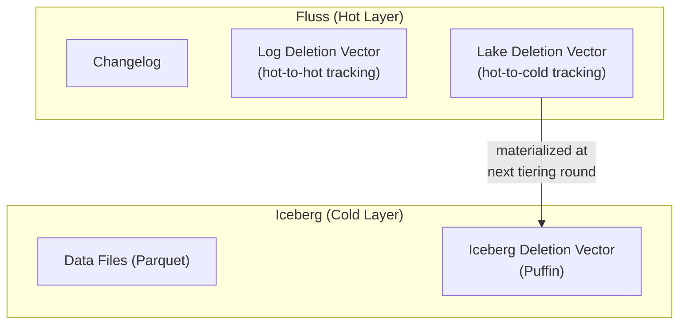
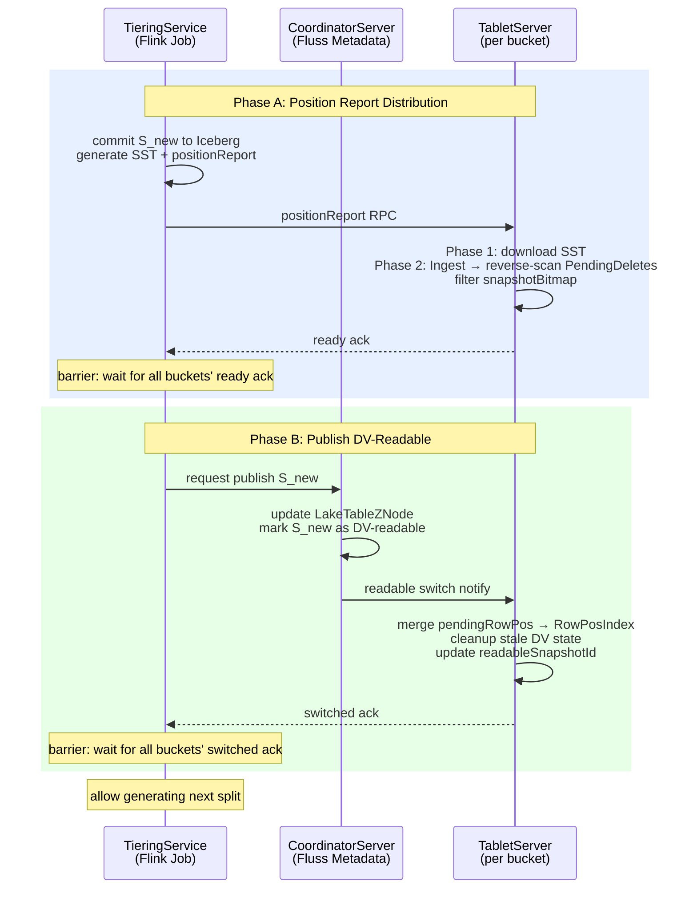

# Fluss Deletion Vector Design Document

## 1. Motivation

Under the Streamhouse architecture, Fluss serves as the real-time layer while Iceberg serves as the historical layer. Fluss continuously tiers real-time data into Iceberg via lake tiering, and provides **union read** — a capability that combines hot-layer incremental data not yet tiered with historical data in Iceberg, presenting a single, complete table with exactly-once semantics.

This design addresses two problems:

### Problem 1: Cross-Layer Deduplication for Union Read

For primary key tables, updates and deletes first arrive at Fluss, but old versions of the same row may already have been tiered into Iceberg. During union read, the system must precisely mask rows in Iceberg that have been updated or deleted on the Fluss side; otherwise, stale rows resurface from the historical layer, violating exactly-once semantics.

Currently there is no such cross-layer real-time deduplication mechanism. Deletes and updates arriving between two tiering rounds cannot be reflected in union read in real time — either the client reads stale deleted rows (data duplication), or the client must perform an in-memory full merge (poor performance). This is precisely why Fluss does not yet support union read for primary key tables — although union read for log tables (append-only, no deduplication needed) is already supported.

### Problem 2: Equality Delete Degradation

Current tiering writes to Iceberg handle DELETE and UPDATE_BEFORE via Iceberg v2 **equality delete**. This approach suffers from:

- **Small file accumulation**: Each tiering round produces equality delete files that pile up over time.
- **Read amplification**: Query engines must apply equality deletes to all historical data files, causing continuous read performance degradation.
- **Metadata bloat**: Manifest entries grow linearly with the number of delete files.

### This Design

Introduces a three-layer **Deletion Vector** to solve both problems simultaneously:

1. **Solving union read deduplication**: Maintaining lightweight logical delete markers (Lake Deletion Vector + Log Deletion Vector) on the Fluss TabletServer side, enabling union read to **instantly** mask rows in Iceberg and the hot-layer Fluss changelog that have been updated or deleted, without waiting for the next tiering commit. This achieves exactly-once union read semantics.
2. **Replacing equality delete**: When tiering writes to Iceberg, using Iceberg v3 position delete mechanism (RoaringBitmap in Puffin files, precisely marking deleted row positions) to completely replace equality delete, eliminating small file accumulation and read performance degradation.

---

## 2. Architecture: Three-Layer Deletion Vector



### Layer 1: Iceberg Deletion Vector

Standard Iceberg v3 deletion vector. When the Fluss Tiering Writer writes to Iceberg, it materializes delete operations as **Puffin files** containing RoaringBitmaps that precisely point to deleted row positions within data files. This completely replaces equality delete.

### Layer 2: Log Deletion Vector

Tracks deletes and updates within the Fluss real-time changelog. Applies only to data still in the hot layer that has not yet been tiered to Iceberg.

After a tiering round completes, new DELETE and UPDATE records continue to arrive at Fluss. The old rows corresponding to these changes may exist in two places: earlier records still in Fluss, or historical data already tiered to Iceberg. Log Deletion Vector handles the former — marking rows within Fluss that have been superseded or deleted by subsequent operations, ensuring that union read does not read stale versions from the changelog. The latter (old rows already in Iceberg) is handled by Lake Deletion Vector.

### Layer 3: Lake Deletion Vector

The bridge between the real-time and historical layers. When Fluss receives a delete or update targeting a row already tiered to Iceberg:

- TabletServer records a logical delete marker in LakeDv (datafile → deleted row position bitmap).
- This logical delete takes effect **immediately** during union read, without waiting for the next Iceberg snapshot write.
- These logical deletes are materialized as physical deletion vectors (Puffin files) in Iceberg during the next tiering commit.

### Union Read Semantics

During union read (Fluss hot data + Iceberg historical data), the query engine applies all three layers of deletion vectors:

- **Iceberg Deletion Vector**: Masks rows in Iceberg that have been physically deleted (materialized).
- **Lake Deletion Vector**: Masks rows in Iceberg that have been logically deleted on the Fluss side but not yet materialized.
- **Log Deletion Vector**: Masks rows in the Fluss hot layer that have been superseded or deleted by subsequent operations.

The three layers cooperate to ensure correct upsert semantics: UPDATE produces the latest value, DELETE completely removes the row, regardless of which layer the original data resides in.

---

## 3. Data Model & Storage

### 3.1 RowId

**Definition**: A RowId uniquely identifies a **specific version** of a KV record, not the primary key itself. Different versions of the same key have different RowIds.

**Value**: The **log offset** of the corresponding `INSERT (+I)` or `UPDATE_AFTER (+U)` changelog record.

**Example**:

| KV Operation | Changelog Record | RowId |
|---|---|---|
| `PUT (key1, v1)` | `+I (offset=0, key1, v1)` | RowId = 0 (first version) |
| `PUT (key1, v2)` | `-U (offset=1, key1, v1)` | references RowId = 0 (old version to delete) |
| | `+U (offset=2, key1, v2)` | RowId = 2 (second version) |
| `DELETE (key1)` | `-D (offset=3, key1, v2)` | references RowId = 2 (old version to delete) |

**RowId correspondence across components**:

- **`+I`/`+U` changelog**: RowId = the record's own log offset, determined at write time.
- **`-U`/`-D` changelog**: RowId = the log offset of the deleted version, extracted from the old KV state value header.
- **KV state (RocksDB)**: RowId = the current version's log offset, prepended to the value header (8 bytes).

RowId is 8 bytes and ties directly to the Iceberg `__rowid` column.

### 3.2 FilePos

Locates a row's physical position in Iceberg, consisting of two parts:

- **file_id**: Dictionary-encoded ID of the data file (int type, not the raw file path).
- **row_position**: Row number within that file (0-based).

Both are packed into a single 8-byte value: upper 4 bytes = file_id, lower 4 bytes = row_position. 4-byte file_id supports ~4 billion unique files — even at 1 new file per second, exhaustion takes ~136 years. 4-byte row_position supports ~4 billion rows per file, well beyond typical Iceberg data file sizes; this is also consistent with Iceberg's own position delete format which uses int for row position.

### 3.3 DvRocksDB

DvRocksDB is a dedicated RocksDB instance, independent from KvTablet RocksDB, containing six column families:

| Column Family | Key | Value | Description |
|---|---|---|---|
| **RowPosIndex** | RowId (8B) | FilePos (8B) | Position in the current readable snapshot |
| **pendingRowPos** | RowId (8B) | FilePos (8B) | Position in the not-yet-readable new snapshot; merged into RowPosIndex during readable switch |
| **LogDv** | offset_range | del_bitmap | Deleted offsets within each changelog range |
| **LakeDv** | file_id (4B) | del_bitmap (RoaringBitmap) | Unmaterialized logical deletes for Iceberg files |
| **FileDict** | file_path (string) ↔ file_id (int) | (bidirectional) | Dictionary encoding for file paths; stores both forward and reverse mappings |
| **PendingDeletes** | RowId (8B) | FilePos (8B) | Unmaterialized dead-row log. Value `{0, 0}` is a reserved placeholder meaning "position unknown" (written when both CFs miss); any other value is the row's latest unmaterialized position. fileId = 0 is never allocated — FileDictAllocator starts `nextFileId` from 1. |

**Why two CFs (RowPosIndex + pendingRowPos)**:

Suppose readable snapshot S_old has rowId=R at file_A:pos5. A new snapshot S_new arrives but is not yet readable. If we directly overwrite RowPosIndex[R] to file_B:pos7, then a delete arrives for R: §4.2 looks up RowPosIndex, hits file_B:pos7, and marks file_B in LakeDv — but union read still reads S_old (only scanning file_A), so file_A:pos5 has no masking marker. The stale row resurfaces, and the delete is silently lost.

With `pendingRowPos`: new positions are written to `pendingRowPos` (RowPosIndex unchanged). §4.2 performs a point-get on both `RowPosIndex` and `pendingRowPos`, **marking both old and new files** — safe regardless of which snapshot union read currently uses. During readable switch, all entries in `pendingRowPos` are migrated to `RowPosIndex`.

**Why separate from KvTablet RocksDB**:

- DV checkpoint/recovery is independent from KV data checkpoint.
- DV lifecycle differs from KV data (DV is bound to Iceberg snapshots).
- DV RocksDB parameters (compaction strategy, block cache) can be tuned independently.

**PendingDeletes column family**:

PendingDeletes is a **complete unmaterialized dead-row log** — tracking all RowIds that have been processed by §4.2 / §9.1 changelog replay but whose corresponding LakeDv delete markers have not yet been materialized to Iceberg DV. It serves two purposes:

1. **Timing gap resolution (Case Y)**: When a `-U/-D` arrives but the deleted row is currently being tiered (position report not yet received), both `RowPosIndex` and `pendingRowPos` miss. The `oldRowId` is recorded in PendingDeletes with sentinel `{0, 0}`. When the position report arrives later, §5.3's reverse scan fills in the LakeDv marker.

2. **External compaction detection (Case X)**: When a `-U/-D` hits a CF, the hit position is also recorded in PendingDeletes. When the position report arrives, §5.3's reverse scan checks `pendingRowPos` — if `pendingRowPos[R]` was newly ingested (meaning external compaction rewrote R to a new file and tiering captured its position), the new position gets a LakeDv marker without requiring an alive check on every SST entry.

**Concurrency: DvRWLock (reader-writer lock)**:

All write paths (§4.2 / §5.3 / §5.4) acquire the **write lock** and are serialized; union read (§6) acquires the **read lock**, mutually exclusive with write paths but concurrent among readers.

| Lock holder | Section | Lock type | Operations |
|-------------|---------|-----------|------------|
| Changelog sync success | §4.2 | DvRWLock write lock, held for entire batch | RowPosIndex + pendingRowPos point-gets, PendingDeletes write, LakeDv update, LogDv update |
| Position report | §5.3 Phase 2 | DvRWLock write lock, held for Ingest + post-processing | FileDict write, Ingest SST → pendingRowPos, hard-link copy, reverse-scan PendingDeletes |
| Readable switch | §5.4 | DvRWLock write lock | Ingest pendingSstFiles → RowPosIndex, rebuild pendingRowPos CF, cleanup oldFiles/LakeDv/PendingDeletes/LogDv |
| Union read | §6 | DvRWLock read lock | Read readableSnapshotId, clone LakeDv bitmap subset, read LogDv range |

**Why a reader-writer lock suffices**: §4.2 is already serialized under KvTablet write lock; §5.3 is low-frequency (once per tiering round); §5.4 is even less frequent. All three hold DvRWLock write lock with minimal contention. Union read holds the read lock; the critical section only performs range reads and bitmap subset clones (typically sub-millisecond); serialization and network I/O happen after lock release.

**Lock ordering**: §4.2 follows `KvTablet.writeLock → DvRWLock.writeLock`; §6 follows `KvTablet.readLock → DvRWLock.readLock`; §5.3 and §5.4 only acquire `DvRWLock.writeLock`, no ordering issue.

**Consistency invariant for §4.2**: §4.2 acquires DvRWLock write lock inside KvTablet write lock, completes LakeDv / LogDv / PendingDeletes modifications, releases DvRWLock write lock, and only then updates `log_hw` and releases KvTablet write lock. Union read under KvTablet read lock never sees the intermediate state where `log_hw` is updated but DV is not.

### 3.4 Concurrency: DvRWLock

See the table above. The read-write lock is sufficient because:

- Write-path critical sections are short: §4.2's DV modifications, §5.3 Phase 2's hard-link + Ingest + reverse-scan PendingDeletes (O(|PendingDeletes|)), and §5.4's Ingest + DropCF + diff — all are O(1) to O(|PendingDeletes|) metadata operations.
- Read-path critical sections are short: union read clones bitmap subsets under the read lock, then serializes and sends outside the lock.
- If future read QPS grows to where write-lock latency becomes a problem, this can be upgraded to a CoW snapshot approach (volatile reference to an immutable `DvReadableState` object).

---

## 4. Write Path

### 4.1 Real-Time Write (+I/+U)

This flow is identical to the existing write path, with one addition: the RowId (= log offset) is prepended to the KV state value and changelog value. No DV-related operations are involved.

When a KV record enters Fluss:

1. **Acquire KvTablet write lock**
2. Look up the key in KvTablet's RocksDB:
   - **Key not found (new key)**:
     - Generate `+I(value, rowId)` where `rowId` = the log offset about to be assigned
     - Write to PrewriteBuffer
     - Write to changelog
     - Write `[RowId][schemaId][BinaryRow]` to KV state
   - **Key found (existing key)**:
     - Extract `oldRowId` from the old value header
     - **PUT operation**:
       - Generate `-U(oldValue, oldRowId)` and `+U(newValue, newRowId)`
       - Write to PrewriteBuffer, write to changelog
       - Update KV state to `[newRowId][schemaId][BinaryRow(newValue)]`
     - **DELETE operation**:
       - Generate `-D(oldValue, oldRowId)`
       - Write to PrewriteBuffer, write to changelog
       - Delete the key from KV state
3. **Release KvTablet write lock**, wait for changelog sync to succeed

### 4.2 Deletion Processing (-U/-D)

After changelog is successfully synced to all replicas:

1. **Acquire KvTablet write lock**
2. Flush PrewriteBuffer data to RocksDB
3. **Acquire DvRWLock write lock**
4. For each `-U` / `-D` entry in the flushed PrewriteBuffer:
   - a. Point-get `RowPosIndex` and `pendingRowPos` for `oldRowId`, collecting all hit FilePos values:
     - **At least one hit (Case X)**: For each hit `{file_id, row_position}`, add `row_position` to the del_bitmap for `file_id` in LakeDv, and delete the entry from the corresponding CF. Both CFs may hit simultaneously (external compaction window: `RowPosIndex` has old position, `pendingRowPos` has new position) — both files must be marked. If `pendingRowPos` hits, also `pendingDeletedRowIds.add(oldRowId)`. **Write PendingDeletes[oldRowId] = {fileId, pos}** (prefer `pendingRowPos` hit, as it points to the more recent file).
     - **All miss (Case Y)**: The row may currently be in the tiering pipeline (position report not yet received). **Write PendingDeletes[oldRowId] = sentinel {0, 0}**. The subsequent position report's reverse scan (§5.3) will fill in the LakeDv marker.
   - b. Update LogDv: mark `offset = oldRowId` as deleted in the corresponding changelog range.
5. **Release DvRWLock write lock**
6. Update `log_hw` (high watermark)
7. **Release KvTablet write lock**

> **Ordering constraint**: DV must be updated and DvRWLock released before `log_hw` is updated. If `log_hw` were updated first, union read could see a larger `logEndOffset` while LakeDv has not yet been updated, causing deleted data to be read.

> **Why Case X also writes PendingDeletes**: PendingDeletes serves a dual role — not only as a timing gap fallback for Case Y, but also as a **reverse index** for §5.3's "external compaction alive check." §5.3 Phase 2 only needs to reverse-scan PendingDeletes (|PendingDeletes| ≪ |SST entries|) and point-get `pendingRowPos` for each, precisely handling all dead rows rewritten by external compaction, without doing `RowPosIndex.get()` alive checks on every SST entry.

---

## 5. Tiering Pipeline

This is the core chapter. It is organized as **constraints first → flow details**.

### 5.1 End-to-End Overview

A single tiering round advances the readable snapshot from S_old to S_new through three components coordinated by a **two-phase ack barrier**. Note: this barrier is an additional post-Iceberg-commit coordination mechanism for DV metadata distribution, not a replacement for the existing 2PC commit flow. The existing tiering commit (write data → commit Iceberg snapshot) remains unchanged; the barrier runs after the Iceberg commit succeeds.

```
newFiles = snapshot_files(S_new) - snapshot_files(S_old)   // files added in S_new
oldFiles = snapshot_files(S_old) - snapshot_files(S_new)   // files replaced or removed
```

> **Note:** `oldFiles` is only non-empty when external compaction (e.g., Spark, Trino) has rewritten Iceberg files between S_old and S_new. Fluss tiering is strictly append-only — it never replaces or removes existing data files.

**SST and RowId-to-position mapping**: Since Fluss itself writes data to Iceberg (via TieringService), it naturally knows which file and which row position each record lands in. During the tiering write, the TieringService records the mapping from each RowId (the changelog offset of the original `+I`/`+U`) to its physical Iceberg position `(file_id, row_position)`. These mappings are serialized into a RocksDB **SST file** (Sorted String Table) — an immutable, sorted index — and uploaded to remote storage. Later, TabletServer downloads and ingests this SST to build its local RowPosIndex, which enables it to resolve any RowId to its Iceberg file position for deletion vector tracking.

**End-to-end timeline**:



*Each phase is covered in detail: Phase A in §5.2, position report processing in §5.3, and readable switch in §5.4.*

**Two-phase ack semantics**:

| | ready ack | switched ack |
|--|-----------|-------------|
| **Meaning** | "My DV metadata is ready; I can correctly answer client queries" | "I have completed local switch; old snapshot state is cleaned up" |
| **Gates** | Gates CoordinatorServer from publishing S_new as DV-readable | Gates next split generation |
| **Why needed** | Prevents client from querying S_new before TabletServer is ready | Ensures at most one `snapshotBitmap` exists — S_new+1's split cannot be generated before S_new's switch |

### 5.2 Phase A: Split Generation & Tiering Writer

#### Split Generation (TabletServer side)

A tiering split defines the changelog range for this round: `(last_tiered_offset, latest_offset]`.

When generating the tiering split, **LakeDv and LogDv are simultaneously snapshotted**:

1. **Acquire KvTablet read lock** (ensures LakeDv, LogDv, and `log_hw` consistency)
2. Read current `log_hw` as `latest_offset`
3. Snapshot the entire LakeDv content, mapping `file_id` to `file_path` via FileDict, producing `lakeDvSnapshot: {file_path → bitmap}`.
4. Snapshot LogDv for the split range `(last_tiered_offset, latest_offset]`, producing `logDvSnapshot` — the set of RowIds within this range that have been deleted. This allows the Tiering Writer to skip intra-split write-then-delete rows (§5.2 Step 2).
5. **Release read lock**
6. Generate tiering split: `{offset_range: (last_tiered_offset, latest_offset], lakeDvSnapshot: {file_path → bitmap}, logDvSnapshot: {deleted RowIds within range}}`

> LakeDv snapshot uses `file_path` (not `file_id`) because `file_id` is TabletServer-internal dictionary encoding. TabletServer resolves `file_id` to `file_path` via local FileDict when generating the snapshot.

#### Tiering Writer Processing

The Tiering Writer receives the split and processes it:

**Step 1. Read changelog** `(last_tiered_offset, latest_offset]`

**Step 2. Apply split-scoped logDvSnapshot**:
- If a `+I/+U` RowId hits logDvSnapshot, the row was deleted within this round — skip, do not write to data file.
- Non-hit `+I/+U` rows are written to Iceberg data file (Parquet), recording `(RowId, file, row_position)` in positionReport.

**Step 3. `-U/-D` do not directly generate DV**:
- Cross-split deletes are already captured in lakeDvSnapshot.
- Intra-split write-then-delete cases are filtered by Step 2's logDvSnapshot.

**Step 4. Generate Puffin DV files**:
- Read current Iceberg table state, get `currentFiles` set and `baseSnapshotId`.
- Filter lakeDvSnapshot: retain only files still present in `currentFiles` (stale file protection).
- Serialize filtered lakeDvSnapshot into Puffin files.

**Step 5. Pre-commit: generate RowPosIndex SST and upload to remote storage** (see FileDictAllocator):
- For each `file_path` in positionReport, look up/allocate `fileId` via FileDictAllocator.
- Collect newly allocated `(fileId → file_path)` entries as `newFileDictEntries`.
- Collect `materializedDvFiles` (= filtered lakeDvSnapshot keys that actually produced Puffin DV).
- Generate random UUID per bucket.
- SstFileWriter generates SST (`key=RowId` sorted, `value=fileId+row_position`) to local temp path.
- Upload SST to remote `{$remoteLakeTableSnapshotDir}/rowPos/{bucketId}/{uuid}/sst_0.sst`.
- Write per-bucket manifest to `{$remoteLakeTableSnapshotDir}/rowPos/{bucketId}/{uuid}/manifest`, containing: SST file names, `newFileDictEntries`, `splitOffsetRange`, `materializedDvFiles`.
- Write cross-bucket index to `{$remoteLakeTableSnapshotDir}/rowPos/{indexUuid}`, mapping each `bucketId` to its `sstDir`.

**Step 6. Commit**:
- `RowDelta rowDelta = table.newRowDelta()`
- `rowDelta.validateFromSnapshot(baseSnapshotId)`
- `rowDelta.validateDataFilesExist(lakeDvReferencedFiles)`
- `rowDelta.addRows(dataFiles)`
- `rowDelta.addDeletes(dvFiles)`
- `rowDelta.commit()` — on failure: abort & retry.
- Iceberg snapshot property records `indexUuid` and `fluss.nextFileId`.

**Step 7. positionReport RPC to TabletServer**:
- `sstDir` — remote SST directory path
- `newFileDictEntries` — new fileId → file_path mappings
- `materializedDvFiles` — files that actually got DV materialized
- `lakeDvSnapshot` — LakeDv snapshot from split generation, for rebuilding snapshotBitmap on retry
- `splitOffsetRange` — `(last_tiered_offset, latest_offset]`
- `actualSnapshotId` — Iceberg commit's actual snapshot id

> **Intra-split write-then-delete**: When a row is first written by `+I/+U` and then deleted by `-U/-D` within the same split, the writer does not need to deduce the delete from `oldRowId`. The split's `logDvSnapshot` already covers this round's deletes; the writer checks each `+I/+U` RowId against `logDvSnapshot` before writing — hits are skipped. The data written to Iceberg naturally contains only rows that survived this round's log DV.

> **lakeDvSnapshot stale file protection**: Between split generation and commit, external compaction may replace or delete files referenced by lakeDvSnapshot. The Tiering Writer **must** read the current Iceberg table state's file set and filter lakeDvSnapshot, generating Puffin DV only for files that still exist. Filtered-out files' logical deletes remain in TabletServer's LakeDv (not removed by diff cleanup since `materializedDvFiles` does not include them).

> **Commit validation and conflict handling**: Current `IcebergLakeCommitter` performs no validation since position deletes only reference files added in the same commit. With LakeDv materialization, position deletes now reference **historical data files** that may have been replaced by external compaction. The modified commit must call `validateFromSnapshot(baseSnapshotId)` and `validateDataFilesExist(lakeDvReferencedFiles)`. On `ValidationException`, the tiering task **aborts** and the next round retries. LakeDv markers are unaffected — union read continues to correctly mask stale rows via LakeDv until the next materialization.

#### FileDictAllocator (TieringService Global fileId Allocator)

Each DV-enabled primary key table has an in-memory **FileDictAllocator** on the TieringService side, responsible for allocating globally unique `fileId` values for all new `file_path` values.

```
FileDictAllocator {
    nextFileId   : int            // monotonically increasing counter
    pathToFileId : Map<String, int>  // batch-local dedup (pure memory, not persisted)
}
```

**Stateless design**: The allocator does not depend on Flink state backend. `nextFileId` is recovered from Iceberg snapshot property — each commit writes the current `nextFileId` to the snapshot property field `fluss.nextFileId`. `pathToFileId` is only maintained in memory for batch dedup.

**Restart recovery**: On startup, TieringService reads `nextFileId` from the latest committed snapshot's property. After restart, the same `file_path` may receive a different `fileId` (batch dedup lost), but this is functionally correct — each bucket's RowPosIndex entries and local FileDict entries are self-consistent.

**fileId space**: int (4 bytes), ~4 billion upper limit. For tables with extremely many files (running for years), periodic **fileId remapping** can be performed as an operational tool.

### 5.3 Phase B: Position Report Processing (TabletServer)

After Tiering Writer commits (SST already uploaded in §5.2 Step 5), positionReport is sent to TabletServer via RPC.

#### Design Constraints

Before diving into the processing flow, this section explains **why** the two-phase ack and pendingRowPos are necessary.

**Why two-phase ack is necessary — partial failure → torn state**: Consider a simpler design where TabletServer completes all operations (Ingest SST → merge into RowPosIndex → cleanup oldFiles LakeDv → diff cleanup → update readableSnapshotId) upon receiving positionReport, then TieringService collects acks and notifies CoordinatorServer to publish. This has two fatal problems:

1. **Partial success causes state tearing**: If 5 buckets exist and buckets 0-3 complete the switch (readableSnapshotId = S_new) but bucket 4 fails: buckets 0-3 can only serve S_new (LakeDv cleaned, cannot serve S_old), bucket 4 can only serve S_old (not switched), CoordinatorServer has not published (ack not collected). The client cannot complete a query using either S_old or S_new — the **entire table becomes unavailable** until bucket 4 recovers. In the current design, positionReport processing does not modify RowPosIndex or cleanup LakeDv, so all buckets remain available on S_old; partial bucket failure does not affect overall availability.

2. **Attempt failure cannot be cleanly rolled back**: In the current design, attempt failure is rolled back via `DropColumnFamily(pendingRowPos)` — O(1) cleanup with zero RowPosIndex pollution. If positions were already merged into RowPosIndex, S_new entries are mixed with S_old entries and cannot be distinguished or removed — RowPosIndex is permanently polluted, and subsequent retry attempts produce unpredictable results.

**Why pendingRowPos must be a separate CF**:

- **Dual-check requirement**: §4.2 must be able to simultaneously look up both old and new positions. If new positions were written directly to RowPosIndex, old positions would be overwritten and lost.
- **Atomic rollback**: `DropColumnFamily` provides O(1) clean rollback. If new entries were merged into RowPosIndex, rollback would require scanning and selectively removing entries — expensive and error-prone.

**Optimization — pendingReadableSnapshotId**: After CoordinatorServer publishes S_new but before TabletServer completes readable switch, client requests for S_new receive stale errors. However, TabletServer already has the capability to serve S_new after sending ready ack — union read does not depend on RowPosIndex (only LakeDv + LogDv), and LakeDv before diff cleanup is a superset for both S_old and S_new (correct for both; S_new clients receive some redundant already-materialized LakeDv entries, which only cause extra masking, never data loss). This can be optimized by recording `pendingReadableSnapshotId = S_new` after positionReport completion, and relaxing the snapshot consistency check to accept both `readableSnapshotId` and `pendingReadableSnapshotId`. After publish, all TabletServers immediately serve S_new; readable switch becomes a background cleanup that does not affect availability.

#### Processing Flow

**positionReport RPC fields**:

```
sstDir               = remote SST directory path ({...}/rowPos/{bucketId}/{uuid}/)
newFileDictEntries   = Map<fileId, file_path>   // newly allocated mappings
splitOffsetRange     = (last_tiered_offset, latest_offset]
materializedDvFiles  = List<file_path>          // files that actually got DV materialized
lakeDvSnapshot       = Map<file_path, bitmap>   // LakeDv snapshot from split generation, for rebuilding snapshotBitmap on retry
actualSnapshotId     = long                     // Iceberg commit's actual snapshot id
```

> **Why no per-row SST parsing is needed**: The old approach required iterating all SST entries and doing alive checks. The new approach **reverse-scans PendingDeletes**, which is sized at |unmaterialized dead rows| — far smaller than the SST row count (which includes all new writes + all externally compacted rows, most of which are alive).

TabletServer processing:

**Step 0: staleness validation** (see §9.3):

Compare `splitOffsetRange.last_tiered_offset` with TabletServer's own `lastTieredOffset` (updated after each readable switch):

- `last_tiered_offset < lastTieredOffset`: Stale positionReport from an already-completed round. **Reject**.
- `last_tiered_offset > lastTieredOffset`: Out-of-order positionReport from a future round (previous round not yet readable-switched). **Reject**.
- `last_tiered_offset == lastTieredOffset`: Valid next round (first time or idempotent retry — both handled identically). **Reset pending state**: `DropColumnFamily(pendingRowPos)` + recreate empty CF, clear `pendingSstFiles`, clear `pendingDeletedRowIds`. Continue (`snapshotBitmap` will be built in Step 9). Processing is idempotent, so no need to distinguish first attempt from retry.

Step 1: Add `newFileDictEntries` file paths to `knownFiles` set.

**Phase 1 (no lock — pure remote I/O, no DvRocksDB reads/writes)**:

Step 2: **Download SST**: Download `manifest` from `sstDir`, parse SST file names, download each SST to local temp path.

**Phase 2 (acquire DvRWLock write lock)**:

Step 3: **Acquire DvRWLock write lock**.

Step 4: **Create hard-link**: `link(sstPath, sstCopyPath)` — O(1) filesystem operation. Append `sstCopyPath` to `pendingSstFiles` list (for readable switch Ingest to RowPosIndex, see §5.4).

Step 5: **Write newFileDictEntries to FileDict CF**: WriteBatch writes this round's `fileId → file_path` (and reverse `file_path → fileId`). If a `fileId` already maps to the **same** `file_path`: idempotent retry, skip. If it maps to a **different** `file_path`: global Allocator invariant violated, must be a bug — fail-fast.

Step 6: **Ingest SST into pendingRowPos CF**: Via `IngestExternalFile(sstPath, pendingRowPos)`. After Ingest, all new entries are immediately visible to §4.2 and to this Phase 2's reverse scan.

Step 7: **Reverse-scan PendingDeletes to patch LakeDv** (replaces the old "iterate every SST row for alive check"):

```python
for (R, v) in PendingDeletes:
    hit = pendingRowPos.get(R)
    if hit is not None:
        # R was deleted by -U/-D (§4.2 wrote PendingDeletes), and now position report
        # wrote R back into pendingRowPos — external compaction rewrote R from old file
        # to new file hit.{fileId, pos}. Patch LakeDv for new file and remove the
        # "resurrected" entry from pendingRowPos.
        LakeDv[hit.fileId] |= { hit.pos }
        pendingRowPos.delete(R)
        pendingDeletedRowIds.add(R)   # for §5.4 to cleanup hard-link Ingest orphans
        PendingDeletes.put(R, {hit.fileId, hit.pos})  # update to latest position
    else:
        # R not in this batch's SST — no action, keep in PendingDeletes
        pass
```

All LakeDv updates, pendingRowPos deletes, and PendingDeletes value updates are committed via a single WriteBatch. **PendingDeletes entries are NOT removed** — cleanup is deferred to readable switch (§5.4).

Step 8: **Release DvRWLock write lock**.

Step 9: Build `snapshotBitmap` from positionReport's `lakeDvSnapshot` (resolve file_path → file_id via FileDict), then filter it using `materializedDvFiles`: remove entries for files not in `materializedDvFiles` — those files' DV was not materialized (due to stale file protection in §5.2 Step 4), so their LakeDv must not be cleaned up by bitmap diff (§5.4).

Step 10: Send this bucket's **ready ack** (must be after Step 9).

> **Ready ack must be sent after Step 9**: If sent earlier, CoordinatorServer may prematurely mark the snapshot as DV-readable and trigger diff cleanup with an unfiltered `snapshotBitmap`, which would incorrectly remove unmaterialized LakeDv entries.

**Correctness argument for reverse-scan PendingDeletes**: SST entries fall into two categories — (A) rows newly written by this tiering round (RowId ∈ splitOffsetRange) and (B) rows rewritten by external compaction from old files to new files (RowId ∉ splitOffsetRange).

- **(A) New rows**: Their RowIds are this round's `+I/+U` log offsets, never previously in Iceberg, never referenced by any `-U/-D` — therefore **never in PendingDeletes**. If deleted within this split, they were filtered by `logDvSnapshot` and never appear in the SST. If deleted after commit, §4.2 will find them in `pendingRowPos` and handle synchronously. **Conclusion: (A) entries need no action in the reverse scan — Ingest is the correct result.**

- **(B) External compaction rows**: Their RowIds are from earlier tiering rounds. If deleted by `-U/-D`, §4.2 must have written PendingDeletes (both Case X and Case Y write PendingDeletes). Therefore **all dead rows that need LakeDv patches are precisely hit by reverse-scanning PendingDeletes + querying pendingRowPos**.

**Concurrency correctness**: DvRWLock write lock ensures §5.3 Phase 2 and §4.2 are mutually exclusive. Both orderings are correct:

- §4.2 executes first: old RowPosIndex entry deleted, old file's LakeDv marked, PendingDeletes written. §5.3 Phase 2 Ingests new entry, reverse scan hits `pendingRowPos[R]`, patches new file's LakeDv.
- §5.3 executes first: Ingest writes new entry to `pendingRowPos`, old RowPosIndex entry untouched. Reverse scan finds no PendingDeletes entry (not yet written). Later §4.2 hits both `RowPosIndex` (old entry) and `pendingRowPos` (new entry), marks both files in LakeDv.

### 5.4 Phase C: Publish & Readable Switch

#### Publish DV-Readable

After collecting all buckets' ready acks, TieringService requests CoordinatorServer to publish S_new as DV-readable. CoordinatorServer updates LakeTableZNode and notifies all relevant TabletServers to execute readable switch.

Clients can now issue union read targeting S_new. TabletServers that have not yet completed the switch may temporarily return stale snapshot errors; clients retry with the same S_new per §6's rules.

#### Readable Switch (TabletServer)

Upon receiving the readable switch notification, TabletServer executes the local switch under DvRWLock write lock:

1. **Migrate pendingRowPos → RowPosIndex**:
   - `IngestExternalFile(pendingSstFiles, RowPosIndex)` — one-shot Ingest of all hard-link SST copies accumulated by §5.3.
   - **Clear window-period orphan entries**: For each R in `pendingDeletedRowIds`, execute `RowPosIndex.delete(R)`, then clear `pendingDeletedRowIds`. Hard-link SSTs are copies of the original SST and do not contain pendingRowPos CF's delete tombstones; without this cleanup, dead RowIds would be "resurrected" into RowPosIndex by Ingest.
   - `DropColumnFamily(pendingRowPos)` + recreate empty CF — the old CF's SST files are deleted (hard-link copies are now in RowPosIndex; physical data is not lost).
   - Clear `pendingSstFiles` list.

2. **Cleanup oldFiles**: For each file in oldFiles, remove its LakeDv entry and remove from `knownFiles`. Also cleanup PendingDeletes entries whose `value.fileId` points to oldFiles.

3. **Cleanup PendingDeletes based on snapshotBitmap**: For each `(R, v)` in PendingDeletes:
   - If `v == sentinel {0, 0}` and `R < currentTieredOffset`: The row was covered by tiering but never written to a data file (filtered by logDvSnapshot). The sentinel will never be resolved. **Delete PendingDeletes[R]**.
   - If `v == sentinel {0, 0}` and `R >= currentTieredOffset`: Row still being processed. Keep.
   - If `v = {fileId, pos}` and `snapshotBitmap[fileId]` exists and contains `pos`: This position was materialized in this tiering round's Iceberg DV. **Delete PendingDeletes[R]**.
   - Otherwise: Position not yet materialized. Keep for next round.

4. **Bitmap diff cleanup LakeDv**: Execute `current bitmap AND NOT snapshotBitmap` for each file_id in LakeDv. Remove entries with empty result bitmaps. Clear `snapshotBitmap`.

5. **Cleanup expired LogDv**: Delete LogDv entries where `range end offset < snapshotStartLogOffset` (the new readable snapshot's start offset).

6. Update `readableSnapshotId` and `snapshotStartLogOffset`.

7. **Release DvRWLock write lock**. Send **switched ack**.

> **Why migration is lightweight**: SSTs were generated by TieringService and downloaded in §5.3 Phase 1. This step only Ingests hard-link copies — O(1) metadata operation (update MANIFEST + fsync), independent of SST entry count. The `pendingDeletedRowIds` delete pass is O(|pendingDeletedRowIds|), typically far smaller than SST row count. The entire critical section completes in milliseconds.

### 5.5 First-Time Bootstrap

After the first tiering completes, RowPosIndex and pendingRowPos are both empty, and no previous readable snapshot exists.

- Tiering Writer reports new rows' `(RowId, file, row_position)` mappings.
- TieringService allocates fileId via FileDictAllocator, generates SST, uploads to remote.
- TabletServer processes via §5.3 flow: download SST → hard-link → write FileDict → Ingest to pendingRowPos.
- Since this is the first snapshot, after commit it becomes the first DV-readable snapshot — the subsequent readable switch migrates pendingRowPos to RowPosIndex.
- LakeDv is empty at this point (no deletes to mark).

---

## 6. Union Read

Client union read flow using DV:

1. Client obtains the latest DV-readable snapshot id (denoted `requestedSnapshotId`) and sends a union read request **carrying `requestedSnapshotId`**.
2. Fluss lists the data files under that snapshot.
3. **Acquire KvTablet read lock**
4. **Acquire DvRWLock read lock**
5. **Snapshot consistency check**: Read current `readableSnapshotId`, verify `readableSnapshotId == requestedSnapshotId`. On mismatch, release locks and return **stale snapshot error** (with `currentReadableSnapshot`):
   - `requestedSnapshotId < currentReadableSnapshot`: TabletServer has already switched to a newer snapshot. Client refreshes to the newer snapshotId and retries.
   - `requestedSnapshotId > currentReadableSnapshot`: CoordinatorServer has published a newer target snapshot, but this TabletServer has not yet completed readable switch. Client **keeps the same `requestedSnapshotId`**, retries with backoff. **Must not fall back to an older snapshot**.
6. Get current `logEndOffset`
7. From LakeDv, **clone bitmap subset** for the fileIds corresponding to the data file list. Clone targets only query-relevant files (typically far fewer than full LakeDv), completed inside the lock.
8. From LogDv, get the log DV from the current snapshot's start offset to `logEndOffset` (range read, also under DvRWLock read lock).
9. **Release DvRWLock read lock**
10. **Release KvTablet read lock**
11. **Outside locks**: Serialize and send to client: `{lakeDv, logDv, logEndOffset}`

**Concurrency safety**:

- **KvTablet read lock**: Mutual exclusion with §4.2 (changelog sync success), ensuring `log_hw` read is consistent with the DV view.
- **DvRWLock read lock**: Mutual exclusion with §4.2/§5.3/§5.4 write locks, ensuring `readableSnapshotId` and LakeDv bitmap subset reads have no concurrent writes. Bitmap subset clone completes inside the lock — once released, even if §5.4 subsequently modifies LakeDv, the cloned bitmap is independent.
- **Serialization outside locks**: Step 11's serialization and network send are outside DvRWLock read lock, keeping the critical section at sub-millisecond level.

**Client-side processing**:

1. Apply Iceberg DV (physical DV from Puffin files) on the Iceberg snapshot
2. Apply lakeDv (logical DV returned by TabletServer)
3. Read surviving Iceberg rows
4. Fetch `[snapshot_start_offset, logEndOffset]` changelog, apply logDv, skip deleted records
5. Merge results for complete data

---

## 7. LakeDv Materialization & Cleanup

### Trigger

Executed with each tiering commit round.

### Materialization Flow

1. When generating the tiering split, TabletServer snapshots current LakeDv under read lock, resolving `file_id` to `file_path` via FileDict.
2. The LakeDv snapshot (`{file_path → bitmap}`) is sent with the tiering split to the Tiering Writer.
3. For each file in the LakeDv snapshot, the Tiering Writer checks whether the file already has an existing Puffin DV in the current Iceberg snapshot:
   - **No existing DV**: Generate Puffin DV directly from the LakeDv snapshot bitmap.
   - **Existing DV**: Read the existing Puffin DV (remote read), merge with the LakeDv snapshot bitmap (RoaringBitmap OR), and generate a new Puffin DV containing the merged result.
4. Puffin DV files are committed to Iceberg together with data files via the `RowDelta` API.

> **Merge cost**: Merging requires reading existing Puffin DVs — one remote read per affected file. However, the scope is limited: (1) bitmap diff cleanup (§5.4) ensures LakeDv only contains incremental deletes since the last round, so the number of affected files is small; (2) Puffin DV blobs are compact RoaringBitmaps (typically a few KB), not full data files.

### Cleanup: Bitmap Diff

**Cleanup timing**: After the new snapshot becomes DV-readable, **not** when the tiering commit succeeds.

> **Why not cleanup at commit time**: After tiering commit succeeds, the new snapshot's Puffin DV already contains the LakeDv snapshot's deletes. But at this point, the new snapshot has not been marked as DV-readable by CoordinatorServer (waiting for all buckets' acks). Union read clients still hold the old readable snapshot. If TabletServer has already cleaned LakeDv, rows in the old snapshot have neither physical DV (old snapshot has no Puffin DV for these deletes) nor logical LakeDv masking — stale rows resurface. **Correctness problem**.

**Cleanup method: bitmap diff**.

Between snapshotting LakeDv and the new snapshot becoming DV-readable, new `-U/-D` may arrive and append new bits to the same file's bitmap. Direct clearing would lose these new bits — these deletes have not been materialized, and losing them means stale row resurrection.

For each file_id in LakeDv:

```
cleaned bitmap = current bitmap AND NOT snapshot bitmap
```

- Empty result → remove the file_id entry.
- Non-empty result → replace current bitmap with the diff bitmap.

`snapshotBitmap` stores the materialized subset of LakeDv at split generation time (built from positionReport's `lakeDvSnapshot`, filtered by `materializedDvFiles` in §5.3 Step 9), used as the right operand of the diff. Since split n+1 generation cannot occur before readable switch n, `snapshotBitmap` has at most one active copy — no per-snapshotId grouping needed.

> **snapshotBitmap alignment with materialization**: If the Tiering Writer filtered some lakeDvSnapshot files due to external compaction (stale file protection), those files' DV was not materialized. TabletServer must remove unmaterialized files from `snapshotBitmap` after receiving `materializedDvFiles` (§5.3 Step 9). Otherwise, diff cleanup would incorrectly remove unmaterialized LakeDv entries.

---

## 8. External Compaction

External engines (e.g., Spark, Trino) may compact Fluss-managed Iceberg tables, merging old files into new ones. Fluss does not control external compaction timing but must correctly handle the resulting file changes.

To support this, Fluss must add two system columns to Iceberg data files:

- **`__rowid`**: The RowId (changelog offset of the original `+I`/`+U`). After compaction rewrites rows into new files, TieringService needs to re-establish the RowId → new FilePos mapping. Without `__rowid`, there is no way to recover the RowId from a compacted file.
- **`__bucket`**: The Fluss bucket id. External compaction may merge files across buckets into a single file. Without `__bucket`, TieringService cannot determine which bucket a row belongs to without recomputing the hash from the primary key.

External engines performing compaction or rewrite on Fluss-managed tables **must preserve these two columns and their values**.

### 8.1 Detection Timing

Fluss does not monitor Iceberg snapshot changes in real time. External compaction snapshots are invisible to Fluss until the next Fluss tiering commit. At that point, TieringService compares the last known snapshot with the current Iceberg table state and discovers external compaction changes.

### 8.2 Detection & Handling

TieringService performs detection during commit. Since Fluss tiering commits tag each Iceberg snapshot with a Fluss-specific property (via `IcebergLakeCommitter`), detection traverses the snapshot history between the last known snapshot and the current table state, identifying snapshots **without** the Fluss property — these are external compaction snapshots:

```
externalSnapshots = []
for snapshot in snapshots_since(lastKnownSnapshotId):
    if not snapshot.hasProperty("fluss.tiering"):
        externalSnapshots.append(snapshot)

externalNewFiles = union(s.addedDataFiles() for s in externalSnapshots)
externalOldFiles = union(s.removedDataFiles() for s in externalSnapshots)
```

This is cheaper than diffing full file sets — only snapshot metadata (typically a few entries) is traversed, rather than the entire file list.

If `externalNewFiles` is non-empty, external compaction occurred. TieringService then **scans the external new files** to rebuild RowId-to-position mappings:

1. **Scan external new files**: Read `__rowid` and `__bucket` columns from each file in `externalNewFiles`. `__rowid` is the RowId, `__bucket` identifies the Fluss bucket.
2. **Group by bucket**: Group `(RowId, file, row_position)` entries by `__bucket` value.
3. **Merge into SST pipeline**: Each bucket's external compaction position entries are merged with this round's new tiering rows into §5.2 Step 5's SST generation flow. Each bucket gets a single SST containing both new rows and externally rewritten rows, reported via positionReport RPC.
4. **Report old file list**: Notify TabletServer of `externalOldFiles` for cleanup during the next readable snapshot advance.

TabletServer processes via §5.3's unified logic. After Phase 2 Ingest, the reverse-scan PendingDeletes handles all dead rows rewritten by external compaction.

### 8.3 Physically Deleted Rows

External compaction applies existing Iceberg DV (Puffin files), excluding physically deleted rows from new files. These rows do not appear in scan results of `externalNewFiles`.

These rows leave no residue in RowPosIndex / pendingRowPos:

- **Alive rows**: Their RowIds in new files match old files; reported via §5.3 and Ingested to pendingRowPos. Not in PendingDeletes (never deleted by `-U/-D`), so reverse scan does not touch them.
- **Physically deleted rows**: When deleted, §4.2 already removed them from RowPosIndex/pendingRowPos and wrote PendingDeletes. If subsequently rewritten by external compaction, §5.3's reverse scan hits the pendingRowPos entry and patches LakeDv for the new position.

### 8.4 Operational Constraint: Snapshot Expiration

Iceberg snapshot expiration must preserve the Fluss current readable snapshot and all data files it references.

- Set `history.expire.min-snapshots-to-keep` large enough to cover the snapshot count generated within tiering intervals.
- Or have Fluss mark the current readable snapshot id in table properties so external expiration tools skip it.

If the readable snapshot is expired prematurely and data files are physically deleted, union read fails.

### 8.5 Observability

Log or report metrics (e.g., `external_compaction_files_scanned`) when external compaction files are detected, so operators are aware that external engines are modifying Fluss-managed Iceberg tables.

---

## 9. Failure Handling & Recovery

### 9.1 TieringService Failures

Since §5.2 places SST generation/upload (Step 5) **before** Iceberg commit (Step 6), failure recovery follows a precise pre-commit / post-commit boundary:

| Failure point | Remote SST state | Iceberg state | Recovery strategy |
|---------------|-----------------|---------------|-------------------|
| Before SST upload | Missing or incomplete | Not committed | **Full retry**: Re-execute Steps 1-7. `nextFileId` recovered from last committed snapshot property. New UUID generates new paths. |
| SST uploaded, before commit | Complete | Not committed | **Full retry**: Same as above. Old UUID path's remote SST + index become orphans (cleaned periodically). |
| Commit succeeded, before positionReport RPC | Complete | Committed | **Post-commit Metadata Reconcile** (see below): Must not re-commit; only complete Fluss registration. |
| positionReport RPC failed | Complete | Committed | **Post-commit Metadata Reconcile**: Same as above. |
| Full TieringService failover | Depends on failure point | Depends on failure point | Recover `nextFileId` from latest snapshot property; detect committed-but-unregistered snapshots; reconcile as needed. |

**Post-commit Metadata Reconcile**:

Once `rowDelta.commit()` succeeds, the split's data is persisted in Iceberg. **Must not re-commit the same splitOffsetRange** — the writer's append would duplicate alive rows, and DV can only mask deleted rows, not deduplicate alive ones.

Recovery path is **metadata-only reconcile**:

1. Read `indexUuid` from Iceberg snapshot property.
2. Download cross-bucket index file, get each bucket's `sstDir`.
3. For each unregistered bucket, download manifest from `sstDir`, recovering: SST file names, `newFileDictEntries`, `splitOffsetRange`, `materializedDvFiles`.
4. Get `actualSnapshotId` from Iceberg snapshot.
5. Re-send positionReport to each unregistered bucket.
6. TabletServer receives it; `last_tiered_offset == lastTieredOffset` validation passes, resets pending state and processes normally (idempotent).
7. Collect all buckets' ready acks → publish DV-readable → readable switch.

### 9.2 TabletServer Failures

#### DvRocksDB Checkpoint

DvRocksDB periodically checkpoints (note: DvRocksDB checkpoint is independent from KvTablet snapshot — they have no overlapping data, different lifecycles, and recover independently; see §3.3), uploading SST files to remote storage. Each checkpoint records:

- `restoreSnapshot`: Current DV-readable snapshot ID
- `snapshotStartLogOffset`: The snapshot's changelog start offset
- `checkpointLogHw`: `log_hw` at checkpoint time

> **Why `checkpointLogHw` is needed**: The checkpoint captures "incremental state at a specific runtime moment," including all `-U/-D` processing results between `snapshotStartLogOffset` and `checkpointLogHw`. Recovery must start replay from `checkpointLogHw + 1` to avoid reapplying already-processed operations.

> **RowPosIndex and checkpoint**: RowPosIndex data comes from TieringService position reports (§5.3), not from changelog. **Changelog replay cannot add RowPosIndex entries** — it can only delete entries (processing `-U/-D`) and update LakeDv/LogDv/PendingDeletes. RowPosIndex recovery fully depends on the DvRocksDB checkpoint state plus downloading remote SSTs for post-checkpoint snapshots.

#### Recovery Steps

1. Pull SST files from remote storage, load DvRocksDB. RowPosIndex reflects `restoreSnapshot` state. pendingRowPos CF is empty (checkpoint is recommended after readable switch, when pendingRowPos has been migrated and cleared).

2. Replay changelog from **`checkpointLogHw + 1`** (skipping already-checkpointed portion).

3. For each `-U`/`-D` record, extract `oldRowId` (**only process deletes, do not add RowPosIndex entries**; PendingDeletes rules same as §4.2):
   - Point-get `RowPosIndex` and `pendingRowPos`:
     - **At least one hit (Case X)**: Mark LakeDv, delete from hit CF, write PendingDeletes.
     - **All miss (Case Y)**: Write PendingDeletes with sentinel `{0, 0}`.
   - If `oldRowId < snapshotStartLogOffset`: No LogDv update needed (deleted row's changelog already covered by lake snapshot).
   - If `oldRowId >= snapshotStartLogOffset`: Update LogDv.

4. **Process post-checkpoint readable-switched snapshots**: The restored state is for `restoreSnapshot`. Query CoordinatorServer for current DV-readable snapshot (`S_readable`). If `S_readable` is newer, advance RowPosIndex:

   Query LakeStorage for all committed snapshots between `restoreSnapshot` and `S_readable` in commit order, denoted `S_1, S_2, ..., S_n` (where `S_n = S_readable`). These have all completed readable switch (guaranteed by two-phase ack barrier).

   **Sequential position state rebuild** — using `indexUuid` from each snapshot's Iceberg property, locate remote SSTs via cross-bucket index:

   For each `S_i` (from `S_1` to `S_n`):

   a. Read `indexUuid` from `S_i`'s snapshot property, download index file, get this bucket's `sstDir`. Download manifest for SST file names and `newFileDictEntries`.

   b. Download SSTs — same as §5.3 Phase 1. SSTs contain complete `RowId → {fileId, row_position}` mappings.

   c. Write `newFileDictEntries` from manifest to local FileDict CF (idempotent).

   d. **Ingest SST → RowPosIndex**. IngestExternalFile assigns a sequence number higher than the current DB maximum, ensuring later snapshots' entries override earlier ones for the same RowId.

   > **Why in-order Ingest is required**: IngestExternalFile assigns sequence numbers in call order. If `S_1` and `S_2` both contain RowId=100 (due to compaction rewriting), in-order Ingest ensures `S_2`'s entry has a higher sequence number — RocksDB reads return the latest value. Reversed order would let `S_1`'s stale entry win.

   > **Why Ingest to RowPosIndex (not pendingRowPos)**: `S_1` to `S_n` have all completed readable switch; their position data belongs to the current readable snapshot. Ingest to RowPosIndex maintains the invariant "RowPosIndex reflects the current readableSnapshot."

   After all Ingests complete, execute delete recovery:

   e. **Update `readableSnapshotId = S_readable`** and corresponding `snapshotStartLogOffset`.

   f. **Replay changelog `-U/-D` from `S_n.tieredOffset + 1`**: For each oldRowId, look up RowPosIndex (now containing `S_readable`'s positions); hits mark LakeDv, delete RowPosIndex entry, write PendingDeletes; misses write PendingDeletes sentinel.

   g. **Reverse-scan PendingDeletes to patch LakeDv** (same logic as §5.3 Step 7): For each `(R, v)` in PendingDeletes, execute `hit = RowPosIndex.get(R)`:
      - Hit: Set LakeDv bit for `{hit.fileId, hit.pos}`, delete R from RowPosIndex, update `PendingDeletes[R] = {hit.fileId, hit.pos}`.
      - Miss: Keep PendingDeletes[R].

   h. **snapshotBitmap handling**: In recovery, `snapshotBitmap` is not populated. After recovery, the next §5.4 readable switch **skips bitmap diff cleanup**. LakeDv may retain redundant already-materialized entries, but this does not affect correctness — union read applies both Iceberg DV and LakeDv, and double-marking is idempotent. Redundant entries are eliminated in the next normal tiering round (see Appendix C).

#### Checkpoint Strategy

- **Trigger timing**: Recommended after each readable snapshot advance (§5.4). At this point, pendingRowPos has just been migrated and cleared, RowPosIndex reflects the latest readable snapshot — checkpoint state is consistent. This also minimizes changelog replay and SST downloads during recovery.
- **Degradation**: If checkpoint fails, log and retry at the next readable switch. Normal writes and queries are unaffected. Recovery from an older checkpoint requires replaying more changelog and downloading more SSTs, but correctness is preserved.
- **Remote SST cleanup**: After checkpoint completes, remote SST directories for all covered snapshots can be safely deleted.

### 9.3 Ordering Guarantee

**Single-flight / force-cancel semantics**:

- **Single-flight constraint**: At most one active attempt per tiering split at any time.
- **Explicit failure before retry**: Retry only after CoordinatorServer **explicitly declares** the current attempt failed. Timeouts, network jitter, or brief unresponsiveness do not trigger a new attempt.
- **Force-cancel semantics**: An attempt declared failed by CoordinatorServer must be forcefully cancelled; after cancellation, it must not send any positionReport, ready ack, or switched ack requests.

**Staleness validation (local hard validation)**: Protocol guarantees alone cannot prevent stale positionReport delivery due to network delays. If an old round's positionReport arrives after the corresponding round has already completed readable switch, old FilePos would overwrite correct entries in pendingRowPos, causing §4.2 to mark LakeDv for the wrong file and dead rows to resurrect.

TabletServer solves this by comparing `splitOffsetRange.last_tiered_offset` with its own `lastTieredOffset` (updated after each readable switch):

- `last_tiered_offset < lastTieredOffset`: **Reject** — this round has already been completed.
- `last_tiered_offset > lastTieredOffset`: **Reject** — out-of-order arrival; the previous round has not yet completed readable switch.
- `last_tiered_offset == lastTieredOffset`: **Valid** — reset pending state and process. Since processing is idempotent, first attempt and retry are handled identically.

No additional epoch counter is needed — `lastTieredOffset` is already maintained by TabletServer and naturally reflects the latest completed round.

**Ordering guarantee**: TabletServer enforces sequential round processing locally via `lastTieredOffset` validation. Round n+1's positionReport has `last_tiered_offset = round_n.latest_offset`; until round n's readable switch completes and updates `lastTieredOffset`, round n+1's positionReport is rejected (`last_tiered_offset > lastTieredOffset`). This ensures `pendingRowPos` is fully merged and cleared before the next round, with no cross-snapshot accumulation.

**Idempotency**: Position report processing is **naturally idempotent** — all operations (pendingRowPos writes, LakeDv bitmap sets, reverse-scan PendingDeletes, FileDict writes) produce the same result on re-execution. The key is that §5.3 Step 7 **does not remove** PendingDeletes entries (only updates their values): on retry, entries are still present, the reverse scan follows the same path, LakeDv bit-set is idempotent, pendingRowPos delete is idempotent, PendingDeletes value overwrite to the same value is idempotent. PendingDeletes cleanup is deferred to readable switch (§5.4).

---

## 10. Data Format & Protocol Changes

### 10.1 KV State Value Format

Prepend 8-byte RowId to the existing value format:

```
Before: [schemaId (2 bytes)][BinaryRow (variable)]
After:  [RowId (8 bytes)][schemaId (2 bytes)][BinaryRow (variable)]
```

RowId is placed at the head so that when a key is updated or deleted, the old RowId can be extracted by reading the first 8 bytes without parsing the variable-length BinaryRow.

### 10.2 Changelog Format Extension

**Uniform rule**: All four changelog record types (`+I`, `+U`, `-U`, `-D`) carry an 8-byte RowId at the value header, consistent with the KV state value format.

```
+I/+U value: [RowId (8 bytes)][schemaId][BinaryRow]
-U/-D value: [RowId (8 bytes)][schemaId][BinaryRow]
```

- **`+I`/`+U`**: RowId = this record's own log offset, filled by the writer at write time.
- **`-U`/`-D`**: RowId = the old version's RowId, directly copied from the old KV state value header.

> **Why `+I`/`+U` also store RowId instead of deriving from offset**: Although `+I`/`+U`'s RowId semantically equals its own log offset and could theoretically be omitted, unifying the format across all four record types provides greater benefit: (1) consumers need no type-based branching; (2) avoids repeated implementation of the implicit "RowId = log offset" constraint across all consumption paths; (3) future-proofs against decoupling RowId from log offset. The 8-byte overhead per record is typically < 10% of total payload.

### 10.3 Iceberg Data Column Extension

When tiering writes Iceberg data files, the following system columns are included alongside user columns:

- **`__rowid`**: The `+I`/`+U` changelog log offset (= RowId). Existing column, used for identifying rows after external compaction.
- **`__bucket`**: The Fluss bucket id (int type). **New column**, used for identifying a row's bucket after external compaction, avoiding the need to read primary key columns for hash computation.

> **Constraint**: Fluss must be the sole writer for data ingestion. External engines must not INSERT directly into Fluss-managed Iceberg tables — externally inserted rows would be invisible to Fluss's changelog and KV state, breaking upsert semantics and union read consistency. This is a general Fluss constraint that exists independently of DV. External engines may only perform compaction or rewrite on existing data, and **must preserve `__rowid` and `__bucket` columns and their values**.

### 10.4 Iceberg Format Version

Default to Iceberg v3 Deletion Vectors (Puffin DV) to replace equality delete. Users may explicitly set `format-version=2` to fall back to v2 position deletes.

- **Default (v3)**: When DV is enabled, tables are created with `format-version=3`. Deletes are materialized as Deletion Vectors (RoaringBitmap in Puffin files) — compact, mergeable, no small file accumulation.
- **Fallback (v2)**: Users can explicitly set `format-version=2`. In this case, deletes are materialized as v2 position delete files (Parquet files listing `(file_path, position)` pairs). This still eliminates equality delete but retains per-operation delete file accumulation.
- **Existing v2 tables**: In-place upgrade to v3 is supported; historical equality deletes remain valid.

> **Implementation note**: The fallback only affects the materialization format in the Tiering Writer (§5.2 Step 4) — v3 generates Puffin DV files, v2 generates position delete Parquet files. The upstream data model (LakeDv, RowPosIndex, PendingDeletes, etc.) is format-agnostic and remains unchanged.

### 10.5 Prerequisite: FULL Changelog Mode

DV requires primary key tables to use **FULL changelog mode** (i.e., updates write both `-U` and `+U`). In LOOKUP changelog mode, updates only write `+U` without `-U`, making it impossible to determine the old version's RowId and thus impossible to locate the old row in Iceberg for deletion marking.

When creating a primary key table with DV enabled, the system should validate that changelog mode is FULL; otherwise, reject creation.

**MergeEngine compatibility matrix**:

| MergeEngine | DV supported | Notes |
|-------------|-------------|-------|
| DEDUPLICATE | Yes | Standard upsert; -U/-D carry oldRowId |
| FIRST_ROW | Yes | Duplicate keys are ignored (no -U); DELETE still produces -D with oldRowId |
| PARTIAL_UPDATE | Yes | Requires FULL changelog mode; -U/-D carry oldRowId |
| AGGREGATE | Yes | Requires FULL changelog mode; -U/-D carry oldRowId |

All MergeEngine types are compatible with DV, provided the table uses FULL changelog mode.

---

## 11. Summary Table

| Dimension | Design decision |
|-----------|-----------------|
| **RowId** | Uses `+I`/`+U` log offset; naturally unique and monotonically increasing; consistent with `__rowid` column |
| **RowPosIndex** | Dual-CF architecture: `RowPosIndex` for current readable snapshot, `pendingRowPos` for pending positions; §4.2 does exactly 2 point-gets; SST generated by TieringService and uploaded remotely; TabletServer only downloads + hard-links + Ingests; hard-link makes readable switch O(1) Ingest (no data copy); dictionary-encoded file paths |
| **LakeDv** | Incremental storage; bitmap diff cleanup after each materialization |
| **LogDv** | Range-based bitmap, segmented by fixed offset intervals |
| **Storage** | DvRocksDB independent from KvTablet RocksDB; six CFs (RowPosIndex, pendingRowPos, LogDv, LakeDv, FileDict, PendingDeletes); DvRWLock (global R/W lock); position report naturally idempotent + lastTieredOffset staleness validation |
| **Architecture** | TabletServer: lightweight metadata + snapshot LakeDv + SST download/Ingest; Tiering Writer: writes data files + materializes Puffin DV; TieringService: stateless, holds in-memory FileDictAllocator, generates SST before commit, uploads to remote |
| **DV materialization** | LakeDv snapshot covers cross-split deletes; intra-split write-then-delete filtered by logDvSnapshot; validateDataFilesExist guards against stale files |
| **Commit validation** | IcebergLakeCommitter upgraded from no validation to `validateFromSnapshot` + `validateDataFilesExist` |
| **Position building** | Writer reports (default) + TieringService scans external compaction files (fallback); both merged into SST pipeline; reverse-scan PendingDeletes O(\|PendingDeletes\|) replaces O(\|SST\|) alive checks |
| **Changelog format** | `-U`/`-D` value header carries oldRowId (8 bytes); `+I`/`+U` header carries RowId for format uniformity |
| **KV state format** | Prepend RowId (8 bytes) to value header |
| **Iceberg columns** | New `__bucket` column for bucket identification after compaction |
| **Iceberg version** | Switch to v3; new tables enforce v3, existing v2 tables upgrade in-place |
| **External compaction** | TieringService detects and scans external new files; groups by `__bucket`; merges into SST pipeline; oldFiles cleanup deferred to readable switch |
| **Recovery** | TabletServer: load DvRocksDB checkpoint, replay changelog, download remote SSTs by snapshot order, reverse-scan PendingDeletes. TieringService (stateless): recover `nextFileId` from snapshot property, detect committed-but-unregistered snapshots, metadata-only reconcile |
| **Prerequisite** | Primary key tables must use FULL changelog mode |

---

## Appendix A: End-to-End Walkthrough

This walkthrough traces a primary key table through its full DV lifecycle: initial writes → first tiering → updates/deletes triggering LakeDv → union read with three-layer DV → second tiering with materialization and cleanup. Each step shows only the logical state changes; implementation details (SST paths, UUIDs, manifests) are covered in §5.

### Initial State

| Component | State |
|-----------|-------|
| Iceberg | No data files |
| RowPosIndex | empty |
| LakeDv / LogDv | empty |
| readableSnapshotId | none |

---

### Step 1: Write 3 Records

```
PUT (key1, v1)  → +I (offset=0)  → RowId=0
PUT (key2, v2)  → +I (offset=1)  → RowId=1
PUT (key3, v3)  → +I (offset=2)  → RowId=2
```

KV state now stores RowId in each value: `key1→[rowId=0][v1]`, `key2→[rowId=1][v2]`, `key3→[rowId=2][v3]`.

DV state unchanged — no deletes, no tiering yet.

---

### Step 2: First Tiering Round

**Split generation**: `offset_range: [0, 2]`, `lakeDvSnapshot: empty`, `logDvSnapshot: empty` (no deletes yet).

**Tiering Writer** reads changelog, applies logDvSnapshot (empty — no hits), writes all 3 rows to Iceberg:

| Iceberg file_A | RowId | Key | Value |
|----------------|-------|-----|-------|
| pos0 | 0 | key1 | v1 |
| pos1 | 1 | key2 | v2 |
| pos2 | 2 | key3 | v3 |

No LakeDv → no Puffin DV file. Commit snapshot **S1**.

**positionReport**: TieringService allocates `file_A → fileId=1`, generates SST mapping `{0→(1,pos0), 1→(1,pos1), 2→(1,pos2)}`, sends to TabletServer.

**TabletServer** (§5.3): download SST → Ingest to pendingRowPos. PendingDeletes empty, reverse-scan is no-op.

**Readable switch** (§5.4): merge pendingRowPos → RowPosIndex, clear pendingRowPos.

| Component | After readable switch |
|-----------|----------------------|
| RowPosIndex | `0→(file_A,pos0)`, `1→(file_A,pos1)`, `2→(file_A,pos2)` |
| LakeDv | empty |
| readableSnapshotId | S1 |

*This step demonstrates: basic tiering flow — write to Iceberg, build RowPosIndex via SST, readable switch.*

---

### Step 3: Update key1

```
PUT (key1, v4)  → -U (offset=3, oldRowId=0) + +U (offset=4)  → new RowId=4
```

**Changelog sync** (§4.2) processes the `-U`:
- Point-get `RowPosIndex[0]` → hit `(file_A, pos0)` (Case X)
- **LakeDv**: mark `file_A:pos0` as deleted → `file_A → {0}`
- **Delete** `RowPosIndex[0]`
- **PendingDeletes**: write `0 → (fileId=1, pos=0)`
- **LogDv**: mark offset=0 as deleted

| Component | State |
|-----------|-------|
| RowPosIndex | `1→(file_A,pos1)`, `2→(file_A,pos2)` — entry 0 removed |
| LakeDv | `file_A → {0}` — pos0 logically deleted |
| PendingDeletes | `0 → (1, pos0)` — awaiting materialization |
| LogDv | offset 0 marked deleted |

*This step demonstrates: §4.2 deletion processing — RowPosIndex lookup triggers LakeDv marking (Case X).*

---

### Step 4: Union Read (snapshot S1)

Client requests union read targeting S1.

**TabletServer returns**: `lakeDv = {file_A: {0}}`, `logDv = {offset 0 deleted}`, `logEndOffset = 4`.

**Client-side**:

| Source | Data | DV applied | Result |
|--------|------|-----------|--------|
| Iceberg file_A | pos0(key1,v1), pos1(key2,v2), pos2(key3,v3) | lakeDv masks pos0 | key2=v2, key3=v3 |
| Changelog [3,4] | offset=3: `-U`, offset=4: `+U(key1,v4)` | logDv: offset 0 not in range | -U retracted, key1=v4 output |

**Final result**: `(key1, v4), (key2, v2), (key3, v3)` ✓

*This step demonstrates: union read with two-layer DV — LakeDv masks deleted Iceberg rows, changelog provides untiered updates.*

---

### Step 5: Delete key3

```
DELETE (key3)  → -D (offset=5, oldRowId=2)
```

**Changelog sync** (§4.2):
- Point-get `RowPosIndex[2]` → hit `(file_A, pos2)` (Case X)
- **LakeDv**: `file_A → {0, 2}` (pos2 added)
- **Delete** `RowPosIndex[2]`
- **PendingDeletes**: write `2 → (fileId=1, pos=2)`
- **LogDv**: mark offset=2 as deleted

| Component | State |
|-----------|-------|
| RowPosIndex | `1→(file_A,pos1)` — only key2 remains |
| LakeDv | `file_A → {0, 2}` — pos0 and pos2 deleted |
| PendingDeletes | `0→(1,pos0)`, `2→(1,pos2)` |
| LogDv | offset 0, 2 marked deleted |

---

### Step 6: Second Tiering Round

**Split generation** (§5.2): `offset_range: [3, 5]`, `lakeDvSnapshot: {file_A: {0, 2}}`, `logDvSnapshot: empty` (no intra-split write-then-delete — the deletes at offset 3 and 5 delete RowIds 0 and 2 which were written in a previous split, not in this one).

**Tiering Writer** (§5.2):
- offset=3: `-U` → skip (delete record)
- offset=4: `+U(key1, v4)` → write to new data file
- offset=5: `-D` → skip (delete record)

| Iceberg file_B | RowId | Key | Value |
|----------------|-------|-----|-------|
| pos0 | 4 | key1 | v4 |

Puffin DV generated from lakeDvSnapshot: `file_A → {0, 2}`. Commit snapshot **S2**.

**positionReport**: allocates `file_B → fileId=2`, SST maps `{4→(2,pos0)}`, includes `lakeDvSnapshot` and `materializedDvFiles=[file_A]`.

**TabletServer** (§5.3):
- Ingest SST → pendingRowPos: `4→(file_B, pos0)`
- Reverse-scan PendingDeletes: `R=0` and `R=2` both miss in pendingRowPos (RowIds 0 and 2 are not in this round's SST, which only contains RowId=4) → no action
- Step 9: build snapshotBitmap from lakeDvSnapshot, filter by materializedDvFiles → `snapshotBitmap = {file_A: {0, 2}}`

| Component | After positionReport (before readable switch) |
|-----------|------|
| RowPosIndex | `1→(file_A,pos1)` |
| pendingRowPos | `4→(file_B,pos0)` |
| LakeDv | `file_A → {0, 2}` (unchanged) |
| PendingDeletes | `0→(1,pos0)`, `2→(1,pos2)` (unchanged) |
| LogDv | offset 0, 2 marked deleted (unchanged) |

**Readable switch** (§5.4):
- Merge pendingRowPos → RowPosIndex
- **Bitmap diff** LakeDv: `{0, 2} AND NOT {0, 2} = {}` → remove file_A entry ✓
- **Cleanup PendingDeletes**: both entries' positions are in snapshotBitmap → delete both ✓
- Update readableSnapshotId = S2

| Component | After readable switch |
|-----------|----------------------|
| RowPosIndex | `1→(file_A,pos1)`, `4→(file_B,pos0)` |
| LakeDv | empty — materialized deletes cleaned ✓ |
| PendingDeletes | empty — materialized entries cleaned ✓ |
| LogDv | expired entries cleaned (offset range before S2's start offset removed) |

*This step demonstrates: full tiering cycle — LakeDv materialization to Puffin DV, bitmap diff cleanup, PendingDeletes cleanup.*

---


---### Step 7: New Writes + Union Read (S2)

New writes:
```
UPDATE key2 → -U (offset=6, oldRowId=1) + +U (offset=7, key2, v5)
INSERT key4 → +I (offset=8, key4, v6)
```

**Changelog sync** (§4.2) for offset=6 `-U(oldRowId=1)`:
- Point-get `RowPosIndex[1]` → hit `(file_A, pos1)` (Case X)
- **LakeDv**: `file_A → {1}`
- **Delete** `RowPosIndex[1]`
- **PendingDeletes**: write `1 → (fileId=1, pos=1)`
- **LogDv**: mark offset=1 as deleted

| Component | State |
|-----------|-------|
| RowPosIndex | `4→(file_B,pos0)` — only key1 remains |
| LakeDv | `file_A → {1}` — new unmaterialized delete |
| PendingDeletes | `1→(1,pos1)` |
| LogDv | offset 1 marked deleted |

**Client union read (snapshot S2)**:

TabletServer returns: `lakeDv = {file_A: {1}}`, `logDv = {offset 1 deleted}`, `logEndOffset = 8`.

| Source | Data | DV applied | Result |
|--------|------|-----------|--------|
| Iceberg file_A | pos0(key1,v1), pos1(key2,v2), pos2(key3,v3) | Iceberg DV masks pos0,pos2; lakeDv masks pos1 | no surviving rows |
| Iceberg file_B | pos0(key1,v4) | no DV | key1=v4 |
| Changelog [6,8] | offset=6: `-U`, offset=7: `+U(key2,v5)`, offset=8: `+I(key4,v6)` | logDv: offset 1 not in range | -U retracted, key2=v5 and key4=v6 output |

**Final result**: `(key1, v4), (key2, v5), (key4, v6)` ✓

*This step demonstrates: **three-layer DV cooperation** — Iceberg DV filtered file_A's pos0/pos2 (materialized historical deletes), LakeDv filtered file_A's pos1 (unmaterialized new delete), changelog + LogDv provided untiered incremental data.*


## Appendix B: snapshotBitmap Proof

### Problem

LakeDv records "which Iceberg rows are deleted, but Iceberg doesn't know yet" — logical delete markers. After tiering commit materializes the LakeDv snapshot into Puffin DV files, these deletes are now known to Iceberg and the corresponding LakeDv entries become redundant.

But the cleanup method matters:

- **No cleanup**: LakeDv grows unboundedly; each round redundantly materializes existing deletes; union read scans redundant bitmaps. Correct but inefficient.
- **Direct clear**: Between snapshotting LakeDv and cleanup (possibly minutes), new `-U/-D` may append new bits to the same file's bitmap. Clearing removes these new bits — since they haven't been materialized, losing them means stale row resurrection. **Correctness problem**.

### Solution: Bitmap Diff

```
cleaned bitmap = current bitmap AND NOT snapshot bitmap
```

Only removes bits present at snapshot time (materialized); preserves bits added after the snapshot (unmaterialized).

`snapshotBitmap` stores the materialized subset of LakeDv at split generation time (built from positionReport's `lakeDvSnapshot`, filtered by `materializedDvFiles` in §5.3 Step 9), used as the right operand. Since split n+1 generation cannot occur before readable switch n, at most one `snapshotBitmap` is active at any time.

### Concrete Example

```
Time T1: generate split, snapshot LakeDv = {file_A: {0, 2}}
         lakeDvSnapshot sent to TieringService as part of split

Time T2: new -D arrives, LakeDv becomes {file_A: {0, 2, 5}}     ← bit 5 is new

Time T3: S2 commit succeeds, S2's Puffin DV contains {file_A: {0, 2}}

Time T4: positionReport arrives with lakeDvSnapshot, TabletServer builds
         snapshotBitmap = {file_A: {0, 2}} (filtered by materializedDvFiles)

Time T5: S2 becomes DV-readable, execute diff cleanup:
         {0, 2, 5} AND NOT {0, 2} = {5}
         LakeDv becomes {file_A: {5}}     ← bit 5 preserved ✓
         clear snapshotBitmap
```

Without `snapshotBitmap`, the alternatives are: no cleanup (bloat) or clear (bit 5 lost, stale row resurrection).

### Alternative Analysis

| Approach | Feasibility | Issue |
|----------|-------------|-------|
| No cleanup | Correct but inefficient | LakeDv grows unboundedly, redundant materialization, union read degradation |
| Direct clear | **Not feasible** | Loses post-snapshot new deletes, stale row resurrection |
| Reverse-engineer from Iceberg Puffin DV | Theoretically feasible | TabletServer needs remote file I/O, violates "lightweight local operations only" principle |
| **Save snapshot copy for diff (current approach)** | **Correct and efficient** | `lakeDvSnapshot` carried in positionReport, TabletServer builds `snapshotBitmap` on arrival; typically only minutes of incremental data, very low cost |

---

## Appendix C: Post-Recovery Redundant LakeDv Elimination

### Problem

In the recovery scenario, the positionReport for the in-flight round may have already been processed before failover, but the readable switch never completed. After recovery, the TabletServer rebuilds RowPosIndex from remote SSTs but does not have `snapshotBitmap` (it is only built when a positionReport is accepted, and no new positionReport is sent for already-completed rounds). The next readable switch therefore skips diff cleanup, leaving redundant already-materialized entries in LakeDv. This appendix proves these redundant entries are precisely eliminated in the next normal tiering round.

### Scenario Setup

**Initial state**:

- S2 is the readable snapshot (tiered offset = 50)
- DvRocksDB checkpoint triggered after S2 readable switch
- At checkpoint: RowPosIndex = `{10→file_A:pos0, 20→file_A:pos1, 30→file_A:pos2}`, LakeDv = `{}`, checkpointLogHw = 55

### Events After Checkpoint, Before Failover

```
offset=56: DELETE key(RowId=10) → §4.2: LakeDv[file_A] += {0}, delete RowPosIndex[10]
offset=57: DELETE key(RowId=20) → §4.2: LakeDv[file_A] += {1}, delete RowPosIndex[20]

→ generate tiering split (50, 60]
→ lakeDvSnapshot = {file_A: {0, 1}} sent with split

offset=58: +I(key4) → RowId=58
offset=59: DELETE key(RowId=30) → §4.2: LakeDv[file_A] += {2}, delete RowPosIndex[30]
                                   ← bit {2} added after snapshot

→ Tiering Writer processes split:
  - +I writes to file_B:pos0
  - lakeDvSnapshot {file_A: {0,1}} materialized as Puffin DV
  - commit S3 (tiered offset = 60, Iceberg DV: file_A → {0,1})

→ position report arrives, §5.3 processing completes
→ snapshotBitmap built from lakeDvSnapshot, filtered by materializedDvFiles = {file_A: {0,1}}

★ FAILOVER (before readable switch to S3)
  snapshotBitmap lost, S3's RowPosIndex entries lost (not checkpointed)
```

### Recovery Flow

**Step 1**: Load checkpoint

```
RowPosIndex = {10→file_A:pos0, 20→file_A:pos1, 30→file_A:pos2}
LakeDv = {}
snapshotBitmap = empty
```

**Steps 2-3**: Replay changelog from offset=56

```
offset=56: -D(oldRowId=10) → RowPosIndex[10]=file_A:pos0 ✓
           → LakeDv[file_A] += {0}, delete RowPosIndex[10]
offset=57: -D(oldRowId=20) → RowPosIndex[20]=file_A:pos1 ✓
           → LakeDv[file_A] += {1}, delete RowPosIndex[20]
offset=58: +I → skip (not -U/-D)
offset=59: -D(oldRowId=30) → RowPosIndex[30]=file_A:pos2 ✓
           → LakeDv[file_A] += {2}, delete RowPosIndex[30]
```

After recovery:

```
RowPosIndex = {}
LakeDv = {file_A: {0, 1, 2}}   ← bits {0,1} redundant (already in S3 Iceberg DV)
                                   bit {2} valid (unmaterialized)
```

**Step 4**: Query CoordinatorServer for current DV-readable → S3. Download S3's remote SST, Ingest → RowPosIndex. Reverse-scan PendingDeletes. Skip diff cleanup (no `snapshotBitmap` available — recovery does not receive a positionReport for already-completed rounds).

```
Result:
  readableSnapshotId = S3
  RowPosIndex = {58 → {fileId_B, pos0}}
  LakeDv = {file_A: {0, 1, 2}}   ← bits {0,1} redundant
```

### Next Normal Tiering Round (Redundancy Elimination)

**§5.2**: Generate split (60, 70]

```
Snapshot LakeDv → lakeDvSnapshot = {file_A: {0, 1, 2}} sent with split
                  (fully captures redundant bits)
```

Suppose another delete arrives after snapshot:

```
offset=65: DELETE key(RowId=58) → §4.2: LakeDv[file_B] += {0}

LakeDv now = {file_A: {0, 1, 2}, file_B: {0}}
                                  ↑ file_B added after snapshot
```

**Tiering Writer**:
```
lakeDvSnapshot = {file_A: {0, 1, 2}}
filter currentFiles: file_A exists → retain
generate Puffin DV for file_A: {0, 1, 2}
  (S3 already has file_A Puffin DV: {0,1}; new DV is superset, idempotent safe)
commit S4
materializedDvFiles = [file_A]
```

**positionReport for S4** (§5.3 Step 9): build snapshotBitmap from lakeDvSnapshot, filtered by materializedDvFiles = [file_A] → `snapshotBitmap = {file_A: {0, 1, 2}}`

**Readable switch to S4** (§5.4):
```
Diff cleanup:
  current LakeDv[file_A] = {0, 1, 2}
  snapshotBitmap[file_A] = {0, 1, 2}
  → {0, 1, 2} AND NOT {0, 1, 2} = {}  → remove file_A entry ✓

  file_B not in snapshotBitmap → unaffected
  LakeDv[file_B] = {0}                 → preserved (unmaterialized) ✓

clear snapshotBitmap

Result:
  LakeDv = {file_B: {0}}   ← redundant bits {0,1} eliminated ✓
                               valid bit {2} also eliminated (materialized to S4) ✓
                               file_B:{0} preserved (next round) ✓
```

### Conclusion

Redundant entries are precisely eliminated in the next normal tiering round. The key path:

1. **`lakeDvSnapshot` captures completely**: §5.2 snapshots LakeDv indiscriminately — redundant bits and valid bits alike enter `lakeDvSnapshot`, and `snapshotBitmap` is built from it in §5.3 Step 9.
2. **Materialization is idempotent-safe**: The Tiering Writer's Puffin DV with redundant bits is a superset of existing Iceberg DV; Iceberg handles this idempotently.
3. **Diff precisely eliminates**: §5.4's `current bitmap AND NOT snapshotBitmap` removes all materialized bits (including redundant ones), preserving only post-snapshot unmaterialized bits.
