# Fluss Deletion Vector 设计概览（Deferred Ingest 版）

本文档是 [Fluss Deletion Vector 详细设计文档](./fluss-deletion-vector-design-v2.md) 的简化版本，采用 **Deferred Ingest** 协议优化，消除了双 CF（pendingRowPos），并将 **CoordinatorServer 作为统一调度中心**驱动 prepare / publish / readable switch 全流程，TieringService 不再直接与 TabletServer 通信。

---

## 1. 问题背景

Fluss 的 Streamhouse 架构中，**Fluss 是实时层**，**Iceberg 是历史层**。Fluss 通过 lake tiering 将实时数据同步到 Iceberg，并提供 **union read**（联合查询）能力。

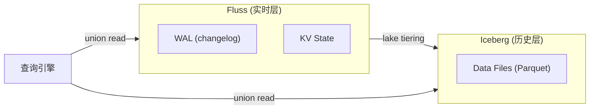
```mermaid
graph LR
    subgraph Fluss["Fluss (实时层)"]
        WAL["WAL (changelog)"]
        KV["KV State"]
    end
    subgraph Iceberg["Iceberg (历史层)"]
        DataFiles["Data Files (Parquet)"]
    end
    Fluss -->|"lake tiering"| Iceberg
    Client["查询引擎"] -->|"union read"| Fluss
    Client -->|"union read"| Iceberg
```

**核心问题**：

| 问题 | 描述 | 影响 |
|------|------|------|
| **跨层数据去重** | 用户删除/更新了一条数据，但旧版本已在 Iceberg 中 | union read 会读到"已删除"的旧行 |
| **Equality Delete 性能劣化** | 当前 tiering 用 Iceberg v2 equality delete 处理删除 | 小文件累积、读取性能持续下降 |

**解决方案**：引入三层 Deletion Vector，同时解决以上两个问题。

**前置要求**：主键表必须使用 **FULL changelog 模式**（更新时同时写 `-U` 和 `+U`），否则无法获知被覆盖的旧版本 RowId。

---

## 2. 整体架构：三层 Deletion Vector

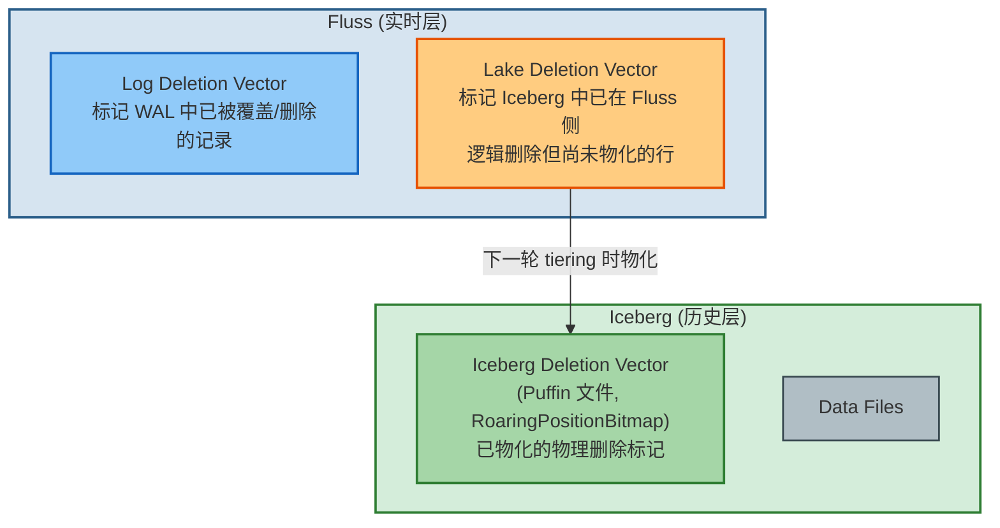
```mermaid
graph TB
    subgraph FlussLayer["Fluss (实时层)"]
        direction TB
        LogDv["Log Deletion Vector<br/>标记 WAL 中已被覆盖/删除的记录"]
        LakeDv["Lake Deletion Vector<br/>标记 Iceberg 中已在 Fluss 侧<br/>逻辑删除但尚未物化的行"]
    end

    subgraph IcebergLayer["Iceberg (历史层)"]
        direction TB
        IcebergDv["Iceberg Deletion Vector<br/>(Puffin 文件, RoaringPositionBitmap)<br/>已物化的物理删除标记"]
        DataFiles["Data Files"]
    end

    LakeDv -->|"下一轮 tiering 时物化"| IcebergDv

    style FlussLayer fill:#d6e4f0,stroke:#2c5f8a,stroke-width:2px,color:#333
    style IcebergLayer fill:#d4edda,stroke:#2e7d32,stroke-width:2px,color:#333
    style LogDv fill:#90caf9,stroke:#1565c0,stroke-width:2px,color:#333
    style LakeDv fill:#ffcc80,stroke:#e65100,stroke-width:2px,color:#333
    style IcebergDv fill:#a5d6a7,stroke:#2e7d32,stroke-width:2px,color:#333
    style DataFiles fill:#b0bec5,stroke:#37474f,stroke-width:1.5px,color:#333
```

### 三层协作

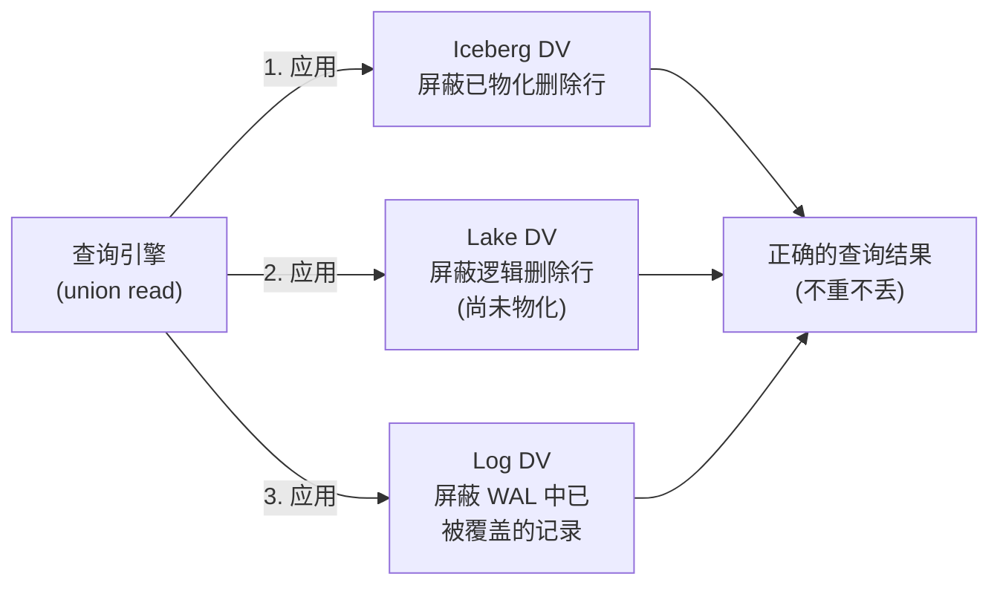
```mermaid
graph LR
    Query["查询引擎<br/>(union read)"]

    Query -->|"1. 应用"| IDV["Iceberg DV<br/>屏蔽已物化删除行"]
    Query -->|"2. 应用"| LDV["Lake DV<br/>屏蔽逻辑删除行<br/>(尚未物化)"]
    Query -->|"3. 应用"| LOGDV["Log DV<br/>屏蔽 WAL 中已<br/>被覆盖的记录"]

    IDV --> Result["正确的查询结果<br/>(不重不丢)"]
    LDV --> Result
    LOGDV --> Result
```

| 层 | 位置 | 作用 | 生命周期 |
|----|------|------|----------|
| **Iceberg DV** | Iceberg Puffin 文件 | 物理删除标记 | Iceberg snapshot 管理 |
| **Lake DV** | TabletServer DvRocksDB | 跨层逻辑删除（实时生效） | 每轮 tiering 后差集清理 |
| **Log DV** | TabletServer DvRocksDB | WAL 内部去重 | readable snapshot 前移后清理 |

---

## 3. 核心概念

### 3.1 RowId

每条数据的**版本标识**，取值为 `+I`/`+U` changelog 的 log offset。

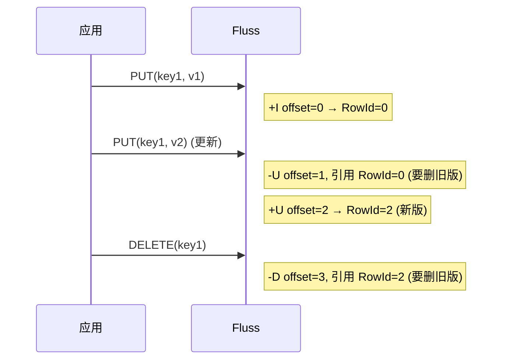
```mermaid
sequenceDiagram
    participant App as 应用
    participant Fluss as Fluss

    App->>Fluss: PUT(key1, v1)
    Note right of Fluss: +I offset=0 → RowId=0

    App->>Fluss: PUT(key1, v2) (更新)
    Note right of Fluss: -U offset=1, 引用 RowId=0 (要删旧版)
    Note right of Fluss: +U offset=2 → RowId=2 (新版)

    App->>Fluss: DELETE(key1)
    Note right of Fluss: -D offset=3, 引用 RowId=2 (要删旧版)
```

### 3.2 FilePos

标记数据在 Iceberg 中的物理位置：

- `file_id`：data file 的字典编码 ID（int，节省存储）
- `row_position`：数据在文件中的行号（从 0 开始，**long 类型**，与 Iceberg spec 一致）

两个字段均采用 **unsigned varint**（LEB128）编码。典型场景下（file_id < 数千，row_position < 百万），单个 FilePos 仅 **3–5 字节**。

### 3.3 RowPosIndex（单 CF 架构）

RowId → FilePos 的映射，用于快速定位行在 Iceberg 中的物理位置。

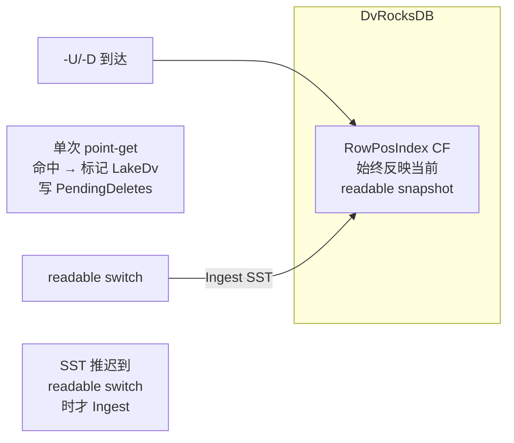
```mermaid
graph LR
    subgraph DvRocksDB
        RPI["RowPosIndex CF<br/>始终反映当前<br/>readable snapshot"]
    end

    Delete["-U/-D 到达"] --> RPI
    Note["单次 point-get<br/>命中 → 标记 LakeDv<br/>写 PendingDeletes"]

    Switch["readable switch"] -->|"Ingest SST"| RPI
    Note2["SST 推迟到<br/>readable switch<br/>时才 Ingest"]
```

**Deferred Ingest 核心思想**：

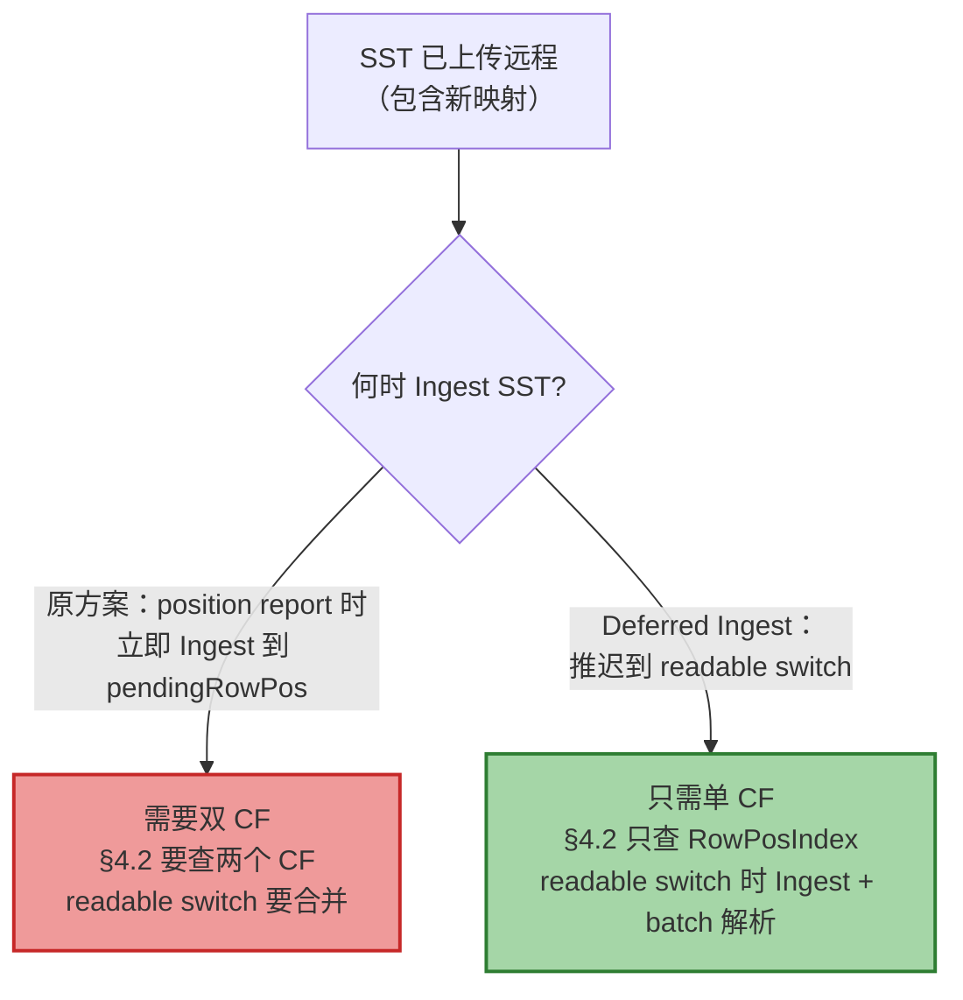
```mermaid
graph TD
    A["SST 已上传远程<br/>（包含新映射）"] --> B{"何时 Ingest SST?"}

    B -->|"原方案：position report 时<br/>立即 Ingest 到 pendingRowPos"| C["需要双 CF<br/>§4.2 要查两个 CF<br/>readable switch 要合并"]

    B -->|"Deferred Ingest：<br/>推迟到 readable switch"| D["只需单 CF<br/>§4.2 只查 RowPosIndex<br/>readable switch 时 Ingest + batch 解析"]

    style C fill:#ef9a9a,stroke:#c62828,stroke-width:2px,color:#333
    style D fill:#a5d6a7,stroke:#2e7d32,stroke-width:2px,color:#333
```

**为什么可以推迟**：prepare 到 readable switch 之间，union read 仍然使用旧 snapshot。§4.2 的删除只需查 RowPosIndex（旧位置），标记的 LakeDv 对旧 snapshot 完全正确。**不需要同时看到新旧两个位置**——因为读端还没切到新 snapshot。

### 3.4 PendingDeletes（未物化死行日志）

**为什么需要 PendingDeletes？**

当 `-U/-D` 删除一行时，需要在 LakeDv 中标记该行在 Iceberg 中的物理位置。但有两种情况无法立即完整标记：

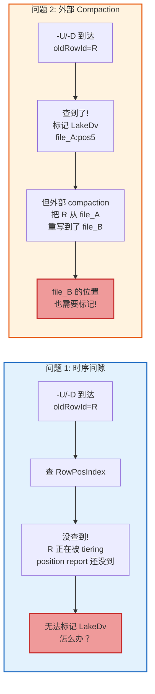
```mermaid
flowchart LR
    subgraph Problem1["问题 1: 时序间隙"]
        direction TB
        P1A["-U/-D 到达<br/>oldRowId=R"] --> P1B["查 RowPosIndex"]
        P1B --> P1C["没查到!<br/>R 正在被 tiering<br/>position report 还没到"]
        P1C --> P1D["无法标记 LakeDv<br/>怎么办？"]
    end

    subgraph Problem2["问题 2: 外部 Compaction"]
        direction TB
        P2A["-U/-D 到达<br/>oldRowId=R"] --> P2B["查到了!<br/>标记 LakeDv<br/>file_A:pos5"]
        P2B --> P2C["但外部 compaction<br/>把 R 从 file_A<br/>重写到了 file_B"]
        P2C --> P2D["file_B 的位置<br/>也需要标记!"]
    end

    style P1D fill:#ef9a9a,stroke:#c62828,stroke-width:2px,color:#333
    style P2D fill:#ef9a9a,stroke:#c62828,stroke-width:2px,color:#333
    style Problem1 fill:#e3f2fd,stroke:#1565c0,stroke-width:2px,color:#333
    style Problem2 fill:#fff3e0,stroke:#e65100,stroke-width:2px,color:#333
```

**解决方案**：PendingDeletes 记录所有已删除的 RowId 及其已知位置（或 pending 标记），在 **readable switch 时 batch 解析**——Ingest SST 后统一查 RowPosIndex 补齐 LakeDv 标记。

**PendingDeletes 怎么写入？**

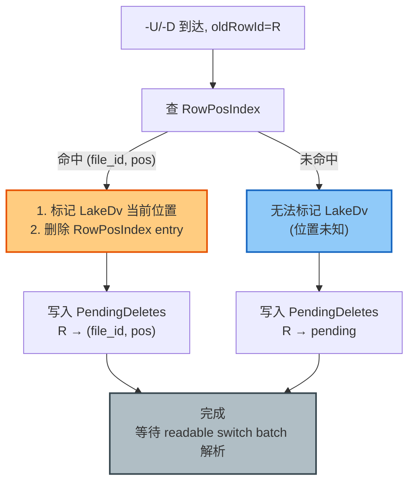
```mermaid
flowchart TD
    Delete["-U/-D 到达, oldRowId=R"] --> Query["查 RowPosIndex"]

    Query -->|"命中 (file_id, pos)"| Hit["1. 标记 LakeDv 当前位置<br/>2. 删除 RowPosIndex entry"]
    Query -->|"未命中"| Miss["无法标记 LakeDv<br/>(位置未知)"]

    Hit --> WriteHit["写入 PendingDeletes<br/>R → (file_id, pos)"]
    Miss --> WriteMiss["写入 PendingDeletes<br/>R → pending"]

    WriteHit --> Done["完成<br/>等待 readable switch batch 解析"]
    WriteMiss --> Done

    style Hit fill:#ffcc80,stroke:#e65100,stroke-width:2px,color:#333
    style Miss fill:#90caf9,stroke:#1565c0,stroke-width:2px,color:#333
    style Done fill:#b0bec5,stroke:#37474f,stroke-width:2px,color:#333
```

**后续怎么消费？** readable switch 时 Ingest SST 后，batch 遍历 PendingDeletes，查 `RowPosIndex.get(R)` 补齐：

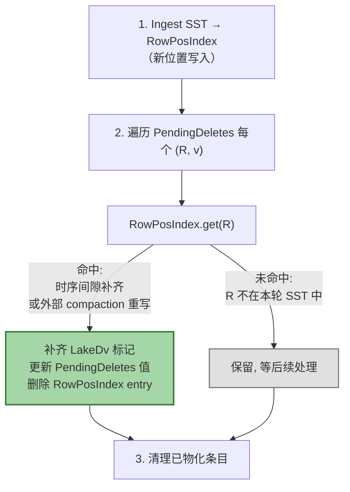
```mermaid
flowchart TD
    Ingest["1. Ingest SST → RowPosIndex<br/>（新位置写入）"] --> Scan["2. 遍历 PendingDeletes 每个 (R, v)"]

    Scan --> Check["RowPosIndex.get(R)"]

    Check -->|"命中:<br/>时序间隙补齐<br/>或外部 compaction 重写"| Fix["补齐 LakeDv 标记<br/>更新 PendingDeletes 值<br/>删除 RowPosIndex entry"]
    Check -->|"未命中:<br/>R 不在本轮 SST 中"| Keep["保留, 等后续处理"]

    Fix --> Clean["3. 清理已物化条目"]
    Keep --> Clean

    style Fix fill:#a5d6a7,stroke:#2e7d32,stroke-width:2px,color:#333
    style Keep fill:#e0e0e0,stroke:#757575,stroke-width:1.5px,color:#333
```

> 对比原方案：原方案在 position report 阶段做 reverse-scan PendingDeletes + 查 pendingRowPos；Deferred Ingest 将相同的遍历解析操作移到 readable switch 阶段，查询目标改为 Ingest 后的 RowPosIndex。操作本质相同（O(|PendingDeletes|) point-gets），但时机不同，消除了对 pendingRowPos 的依赖。

### 3.5 DV-Readable Snapshot

并非每个 Iceberg snapshot 都可以立即用于 union read。**DV-readable snapshot** 指 CoordinatorServer 已对外发布、允许 client 发起 union read 的目标 snapshot。发布前 CoordinatorServer 需要收齐所有 bucket 的 ready ack，确保每个 TabletServer 已完成 SST 预取、具备执行 readable switch 的条件。

### 3.6 存储架构：DvRocksDB

DvRocksDB 独立于 KvTablet RocksDB，包含**五个**列族（对比原方案的六个，删除了 pendingRowPos）：

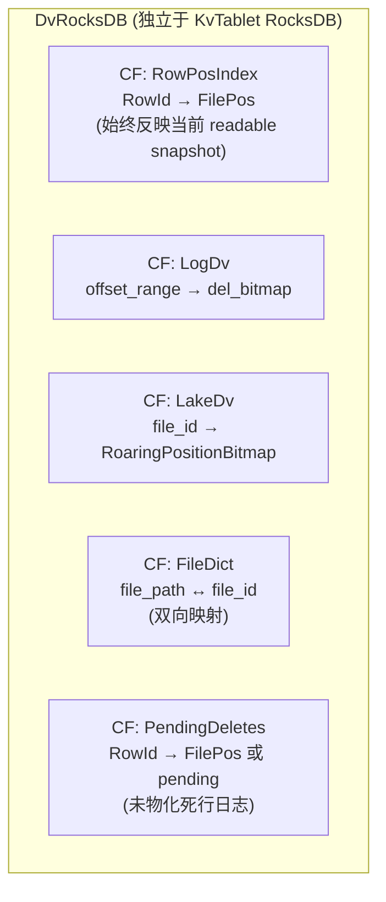
```mermaid
graph TD
    subgraph DvRocksDB["DvRocksDB (独立于 KvTablet RocksDB)"]
        CF1["CF: RowPosIndex<br/>RowId → FilePos<br/>(始终反映当前 readable snapshot)"]
        CF3["CF: LogDv<br/>offset_range → del_bitmap"]
        CF4["CF: LakeDv<br/>file_id → RoaringPositionBitmap"]
        CF5["CF: FileDict<br/>file_path ↔ file_id<br/>(双向映射)"]
        CF6["CF: PendingDeletes<br/>RowId → FilePos 或 pending<br/>(未物化死行日志)"]
    end
```

**对比原方案**：

| 变更 | 原方案 | Deferred Ingest |
|------|--------|-----------------|
| CF 数量 | 6 个 | **5 个**（删除 pendingRowPos） |
| RowPosIndex | 反映当前 readable snapshot | **不变** |
| pendingRowPos | 存储待合并的新位置 | **删除** |
| PendingDeletes | sentinel {0,0} + filePos，reverse-scan 解析 | pending / filePos，**batch lookup 解析**（语义简化，不再使用 sentinel） |

**并发控制：DvRWLock（全局读写锁）**

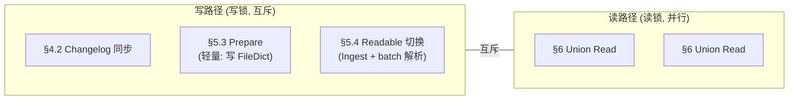
```mermaid
graph LR
    subgraph WritePaths["写路径 (写锁, 互斥)"]
        W1["§4.2 Changelog 同步"]
        W2["§5.3 Prepare<br/>(轻量: 写 FileDict)"]
        W3["§5.4 Readable 切换<br/>(Ingest + batch 解析)"]
    end

    subgraph ReadPaths["读路径 (读锁, 并行)"]
        R1["§6 Union Read"]
        R2["§6 Union Read"]
    end

    WritePaths ---|"互斥"| ReadPaths
```

---

## 4. 写入流程

### 4.1 新数据写入

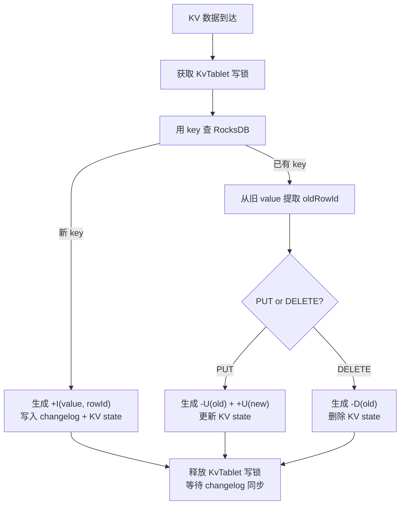
```mermaid
flowchart TD
    Start["KV 数据到达"] --> Lock["获取 KvTablet 写锁"]
    Lock --> Query["用 key 查 RocksDB"]

    Query -->|"新 key"| NewKey["生成 +I(value, rowId)<br/>写入 changelog + KV state"]
    Query -->|"已有 key"| ExistKey["从旧 value 提取 oldRowId"]

    ExistKey --> IsPut{PUT or DELETE?}
    IsPut -->|PUT| Put["生成 -U(old) + +U(new)<br/>更新 KV state"]
    IsPut -->|DELETE| Del["生成 -D(old)<br/>删除 KV state"]

    NewKey --> Unlock["释放 KvTablet 写锁<br/>等待 changelog 同步"]
    Put --> Unlock
    Del --> Unlock
```

### 4.2 Changelog 同步成功后的 DV 更新

这是 DV 机制的核心——每当 `-U`/`-D` 同步成功，立即更新 DV：

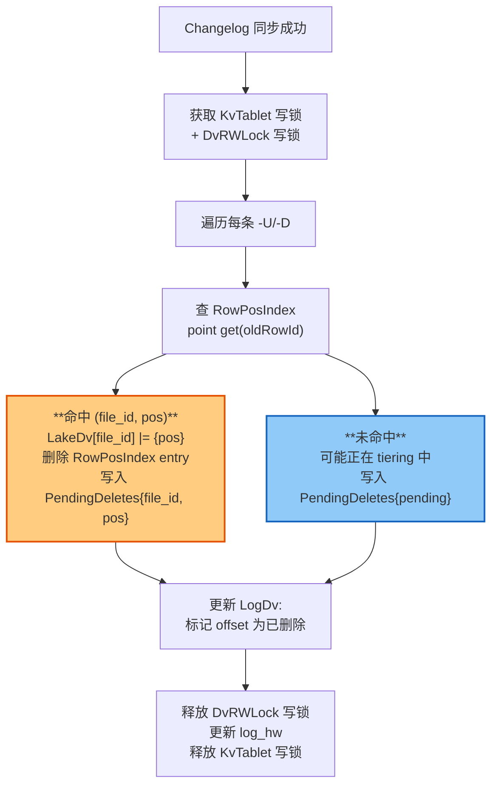
```mermaid
flowchart TD
    Start["Changelog 同步成功"] --> Lock["获取 KvTablet 写锁<br/>+ DvRWLock 写锁"]

    Lock --> ForEach["遍历每条 -U/-D"]
    ForEach --> Query["查 RowPosIndex<br/>point get(oldRowId)"]

    Query --> Hit["**命中 (file_id, pos)**<br/>LakeDv[file_id] |= {pos}<br/>删除 RowPosIndex entry<br/>写入 PendingDeletes{file_id, pos}"]
    Query --> Miss["**未命中**<br/>可能正在 tiering 中<br/>写入 PendingDeletes{pending}"]

    Hit --> LogDv["更新 LogDv:<br/>标记 offset 为已删除"]
    Miss --> LogDv

    LogDv --> Unlock["释放 DvRWLock 写锁<br/>更新 log_hw<br/>释放 KvTablet 写锁"]

    style Hit fill:#ffcc80,stroke:#e65100,stroke-width:2px,color:#333
    style Miss fill:#90caf9,stroke:#1565c0,stroke-width:2px,color:#333
```

**对比原方案**：
- **1 次 point-get**（原方案 2 次：RowPosIndex + pendingRowPos）
- **统一处理逻辑**：命中/未命中都写 PendingDeletes，不区分 Case X / Case Y
- **无 sentinel {0,0} 语义**：未命中时写 pending 标记

> **关键顺序**：必须先更新 DV → 再更新 log_hw。否则 union read 可能看到更大的 logEndOffset 但 LakeDv 还没更新，导致读到已删除的旧行。

---

## 5. Tiering 与 Snapshot 处理（核心生命周期）

### 5.1 端到端时序

这是整个 DV 方案最核心的流程——一轮 tiering 从 commit 到 readable switch 的完整生命周期。**CoordinatorServer 作为统一调度中心**，TieringService 只负责写数据 + commit，不直接与 TabletServer 通信：

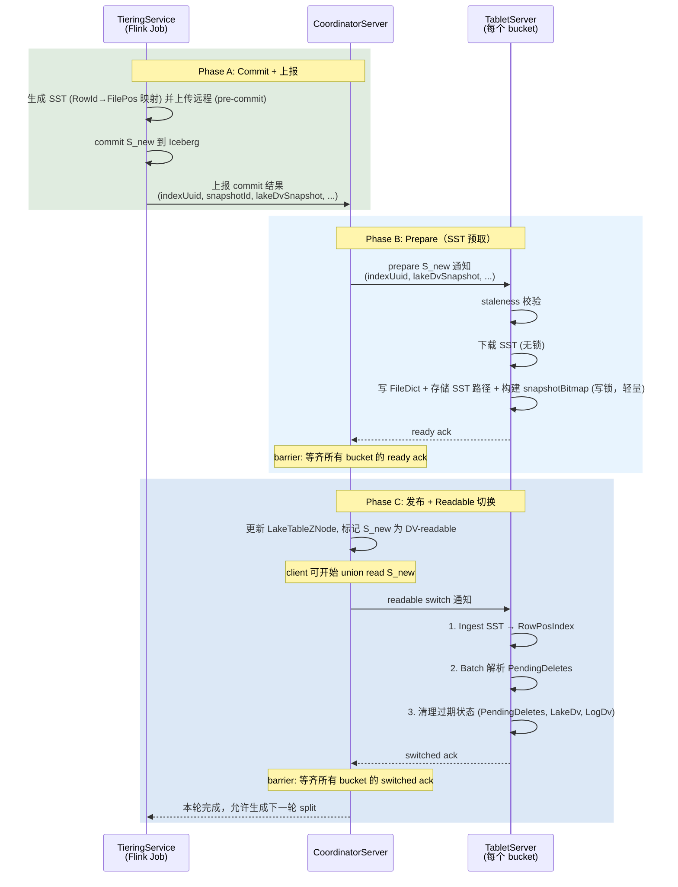
```mermaid
sequenceDiagram
    participant TS as TieringService<br/>(Flink Job)
    participant CS as CoordinatorServer
    participant TB as TabletServer<br/>(每个 bucket)

    rect rgba(46, 125, 50, 0.15)
        Note over TS,CS: Phase A: Commit + 上报
        TS->>TS: 生成 SST (RowId→FilePos 映射) 并上传远程 (pre-commit)
        TS->>TS: commit S_new 到 Iceberg
        TS->>CS: 上报 commit 结果<br/>(indexUuid, snapshotId, lakeDvSnapshot, ...)
    end

    rect rgba(100, 181, 246, 0.15)
        Note over CS,TB: Phase B: Prepare（SST 预取）
        CS->>TB: prepare S_new 通知<br/>(indexUuid, lakeDvSnapshot, ...)
        TB->>TB: staleness 校验
        TB->>TB: 下载 SST (无锁)
        TB->>TB: 写 FileDict + 存储 SST 路径 + 构建 snapshotBitmap (写锁，轻量)
        TB-->>CS: ready ack
        Note over CS: barrier: 等齐所有 bucket 的 ready ack
    end

    rect rgba(21, 101, 192, 0.15)
        Note over CS,TB: Phase C: 发布 + Readable 切换
        CS->>CS: 更新 LakeTableZNode, 标记 S_new 为 DV-readable
        Note over CS: client 可开始 union read S_new
        CS->>TB: readable switch 通知
        TB->>TB: 1. Ingest SST → RowPosIndex
        TB->>TB: 2. Batch 解析 PendingDeletes
        TB->>TB: 3. 清理过期状态 (PendingDeletes, LakeDv, LogDv)
        TB-->>CS: switched ack
        Note over CS: barrier: 等齐所有 bucket 的 switched ack
        CS-->>TS: 本轮完成，允许生成下一轮 split
    end
```

**架构简化**：

| 维度 | 原方案 | Deferred Ingest |
|------|--------|-----------------|
| TieringService 职责 | 写数据 + commit + 直接向 TabletServer 发 positionReport | **写数据 + commit + 上报 CoordinatorServer，不与 TabletServer 通信** |
| 调度中心 | TieringService 驱动 Phase A，CoordinatorServer 驱动 Phase B/C | **CoordinatorServer 统一驱动 Phase B/C** |
| Prepare 阶段 | **重**：Ingest + reverse-scan + hard-link | **轻**：下载 SST + 存储路径 |
| Readable switch | **轻**：Ingest hard-link + DropCF | **重**：Ingest SST + batch 解析 PendingDeletes |

### 5.2 TieringService 处理流程

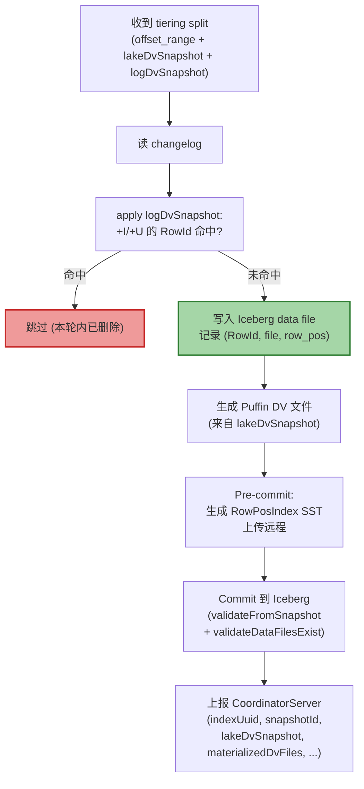
```mermaid
flowchart TD
    Split["收到 tiering split<br/>(offset_range + lakeDvSnapshot + logDvSnapshot)"] --> Read["读 changelog"]

    Read --> Filter["apply logDvSnapshot:<br/>+I/+U 的 RowId 命中?"]
    Filter -->|"命中"| Skip["跳过 (本轮内已删除)"]
    Filter -->|"未命中"| Write["写入 Iceberg data file<br/>记录 (RowId, file, row_pos)"]

    Write --> GenDV["生成 Puffin DV 文件<br/>(来自 lakeDvSnapshot)"]
    GenDV --> GenSST["Pre-commit:<br/>生成 RowPosIndex SST<br/>上传远程"]
    GenSST --> Commit["Commit 到 Iceberg<br/>(validateFromSnapshot<br/>+ validateDataFilesExist)"]
    Commit --> Report["上报 CoordinatorServer<br/>(indexUuid, snapshotId,<br/>lakeDvSnapshot, materializedDvFiles, ...)"]

    style Skip fill:#ef9a9a,stroke:#c62828,stroke-width:2px,color:#333
    style Write fill:#a5d6a7,stroke:#2e7d32,stroke-width:2px,color:#333
```

> **TieringService 不再直接与 TabletServer 通信**。commit 完成后只需将元数据（indexUuid、snapshotId、lakeDvSnapshot 等）上报 CoordinatorServer，由 CoordinatorServer 统一驱动后续的 prepare 和 readable switch 流程。SST 路径通过 `indexUuid → cross-bucket index → per-bucket sstDir` 链路自动定位，与恢复流程使用同一套基础设施。

### 5.3 Prepare 阶段（CoordinatorServer → TabletServer）

CoordinatorServer 收到 TieringService 的 commit 上报后，向所有相关 bucket 的 TabletServer 发送 **prepare 通知**，携带 `indexUuid`、`lakeDvSnapshot`、`materializedDvFiles` 等元数据。TabletServer 通过 `indexUuid` 自行定位并下载 SST。

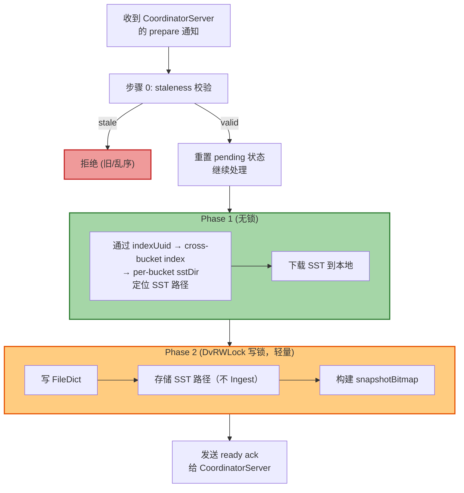
```mermaid
flowchart TD
    Receive["收到 CoordinatorServer<br/>的 prepare 通知"] --> Epoch["步骤 0: staleness 校验"]

    Epoch -->|"stale"| Reject["拒绝 (旧/乱序)"]
    Epoch -->|"valid"| Continue["重置 pending 状态<br/>继续处理"]

    Continue --> Phase1

    subgraph Phase1["Phase 1 (无锁)"]
        Locate["通过 indexUuid → cross-bucket index<br/>→ per-bucket sstDir<br/>定位 SST 路径"]
        DL["下载 SST 到本地"]
        Locate --> DL
    end

    Phase1 --> Phase2

    subgraph Phase2["Phase 2 (DvRWLock 写锁，轻量)"]
        FD["写 FileDict"]
        SP["存储 SST 路径（不 Ingest）"]
        SB["构建 snapshotBitmap"]
        FD --> SP --> SB
    end

    Phase2 --> Ready["发送 ready ack<br/>给 CoordinatorServer"]

    style Reject fill:#ef9a9a,stroke:#c62828,stroke-width:2px,color:#333
    style Phase1 fill:#a5d6a7,stroke:#2e7d32,stroke-width:2px,color:#333
    style Phase2 fill:#ffcc80,stroke:#e65100,stroke-width:2px,color:#333
```

**Prepare 阶段的核心价值**：

- **SST 预取**：提前将 SST 从远程下载到本地，确保 readable switch 只做本地 I/O
- **Preflight check**：确认所有 bucket 存活、SST 可达、元数据就绪后才 publish
- **两阶段屏障**：防止部分 bucket switch 成功、部分失败导致的 torn state

Prepare 阶段是纯粹的**下载 + 存储**，不做任何 DV 状态变更，DvRWLock 写锁临界区极短。

### 5.4 Readable 切换（CoordinatorServer → TabletServer）

CoordinatorServer 收齐所有 bucket 的 ready ack 后，publish S_new 为 DV-readable，然后通知所有 TabletServer 执行 readable switch。

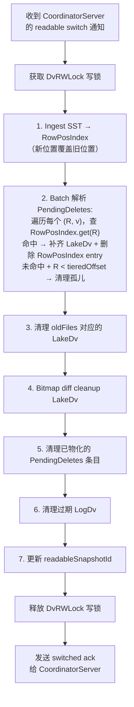
```mermaid
flowchart TD
    Notify["收到 CoordinatorServer<br/>的 readable switch 通知"] --> Lock["获取 DvRWLock 写锁"]

    Lock --> Step1["1. Ingest SST → RowPosIndex<br/>（新位置覆盖旧位置）"]

    Step1 --> Step2["2. Batch 解析 PendingDeletes:<br/>遍历每个 (R, v)，查 RowPosIndex.get(R)<br/>命中 → 补齐 LakeDv + 删除 RowPosIndex entry<br/>未命中 + R < tieredOffset → 清理孤儿"]

    Step2 --> Step3["3. 清理 oldFiles 对应的 LakeDv"]
    Step3 --> Step4["4. Bitmap diff cleanup LakeDv"]
    Step4 --> Step5["5. 清理已物化的 PendingDeletes 条目"]
    Step5 --> Step6["6. 清理过期 LogDv"]
    Step6 --> Step7["7. 更新 readableSnapshotId"]

    Step7 --> Unlock["释放 DvRWLock 写锁"]
    Unlock --> Ack["发送 switched ack<br/>给 CoordinatorServer"]
```

CoordinatorServer 收齐所有 bucket 的 switched ack 后，通知 TieringService 本轮完成，允许生成下一轮 split。

**步骤 2 的 batch 解析统一处理两个难题**：

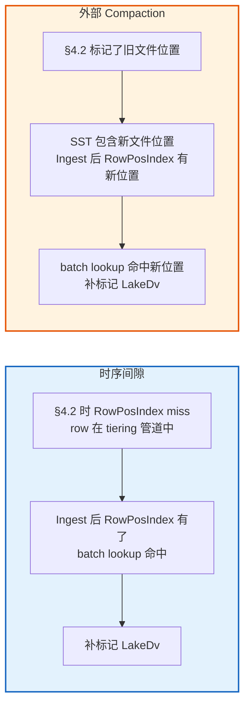
```mermaid
flowchart LR
    subgraph TimingGap["时序间隙"]
        TG1["§4.2 时 RowPosIndex miss<br/>row 在 tiering 管道中"]
        TG2["Ingest 后 RowPosIndex 有了<br/>batch lookup 命中"]
        TG3["补标记 LakeDv"]
        TG1 --> TG2 --> TG3
    end

    subgraph ExtCompaction["外部 Compaction"]
        EC1["§4.2 标记了旧文件位置"]
        EC2["SST 包含新文件位置<br/>Ingest 后 RowPosIndex 有新位置"]
        EC3["batch lookup 命中新位置<br/>补标记 LakeDv"]
        EC1 --> EC2 --> EC3
    end

    style TimingGap fill:#e3f2fd,stroke:#1565c0,stroke-width:2px,color:#333
    style ExtCompaction fill:#fff3e0,stroke:#e65100,stroke-width:2px,color:#333
```

---

## 6. Union Read 流程

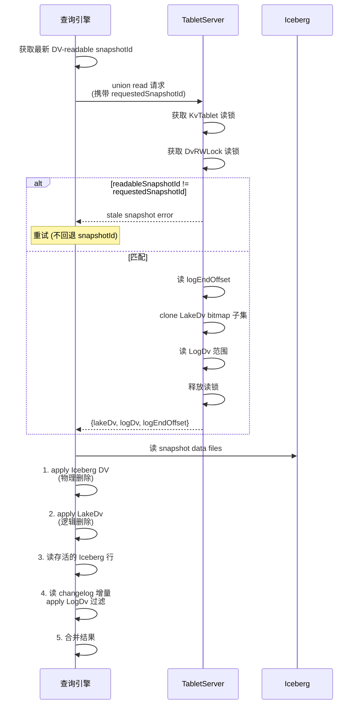
```mermaid
sequenceDiagram
    participant Client as 查询引擎
    participant TS as TabletServer
    participant Iceberg as Iceberg

    Client->>Client: 获取最新 DV-readable snapshotId

    Client->>TS: union read 请求<br/>(携带 requestedSnapshotId)
    TS->>TS: 获取 KvTablet 读锁
    TS->>TS: 获取 DvRWLock 读锁

    alt readableSnapshotId != requestedSnapshotId
        TS-->>Client: stale snapshot error
        Note over Client: 重试 (不回退 snapshotId)
    else 匹配
        TS->>TS: 读 logEndOffset
        TS->>TS: clone LakeDv bitmap 子集
        TS->>TS: 读 LogDv 范围
        TS->>TS: 释放读锁
        TS-->>Client: {lakeDv, logDv, logEndOffset}
    end

    Client->>Iceberg: 读 snapshot data files
    Client->>Client: 1. apply Iceberg DV<br/>(物理删除)
    Client->>Client: 2. apply LakeDv<br/>(逻辑删除)
    Client->>Client: 3. 读存活的 Iceberg 行
    Client->>Client: 4. 读 changelog 增量<br/>apply LogDv 过滤
    Client->>Client: 5. 合并结果
```

> Union read 流程与原方案完全一致，Deferred Ingest 不影响读路径。

---

## 7. 恢复流程

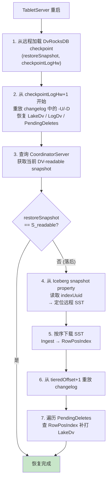
```mermaid
flowchart TD
    Start["TabletServer 重启"] --> Load["1. 从远程加载 DvRocksDB checkpoint<br/>(restoreSnapshot, checkpointLogHw)"]

    Load --> Replay["2. 从 checkpointLogHw+1 开始<br/>重放 changelog 中的 -U/-D<br/>恢复 LakeDv / LogDv / PendingDeletes"]

    Replay --> Query["3. 查询 CoordinatorServer<br/>获取当前 DV-readable snapshot"]
    Query --> Compare{"restoreSnapshot<br/>== S_readable?"}

    Compare -->|"是"| Done["恢复完成"]
    Compare -->|"否 (落后)"| Catch["4. 从 Iceberg snapshot property<br/>读取 indexUuid<br/>→ 定位远程 SST"]

    Catch --> Download["5. 按序下载 SST<br/>Ingest → RowPosIndex"]
    Download --> ReplayMore["6. 从 tieredOffset+1 重放 changelog"]
    ReplayMore --> BackScan["7. 遍历 PendingDeletes<br/>查 RowPosIndex 补打 LakeDv"]
    BackScan --> Done

    style Done fill:#c8e6c9
```

**恢复路径关键**：恢复流程与 prepare 阶段使用**同一套 SST 定位基础设施**——通过 `indexUuid` 自行定位 SST，不依赖 TieringService：

```
snapshotId → snapshot property → indexUuid
    → cross-bucket index 文件
    → per-bucket sstDir → manifest → SST 文件
    → Ingest 到 RowPosIndex
```

---

## 8. 与外部 Compaction 的交互

```mermaid
sequenceDiagram
    participant Ext as 外部引擎 (Spark)
    participant Ice as Iceberg
    participant TS as TieringService
    participant CS as CoordinatorServer
    participant Tab as TabletServer

    Ext->>Ice: compaction: 合并旧文件 → 新文件
    Note over Ice: 产生 compaction snapshot

    TS->>Ice: 下次 tiering commit 时
    TS->>TS: 检测 externalNewFiles<br/>= (currentFiles - lastKnown) - tieringNew

    TS->>TS: 扫描 externalNewFiles<br/>读取 __rowid + __bucket 列<br/>按 bucket 分组

    TS->>TS: 合并到 SST 生成管道<br/>commit S_new

    TS->>CS: 上报 commit 结果<br/>(indexUuid, snapshotId, ...)

    CS->>Tab: prepare S_new 通知
    Tab->>Tab: 下载 SST（含外部 compaction 的新位置）
    Tab-->>CS: ready ack

    CS->>CS: publish S_new
    CS->>Tab: readable switch 通知
    Tab->>Tab: Ingest SST + batch 解析 PendingDeletes<br/>为已删行的新位置补打 LakeDv
    Tab-->>CS: switched ack
```

**约束**：外部 compaction 必须保留 `__rowid` 和 `__bucket` 列。

---

## 9. LakeDv 物化与清理

### 物化流程

```mermaid
flowchart LR
    A["生成 split 时<br/>快照 LakeDv"] --> B["随 split 下发<br/>给 Tiering Writer"]
    B --> C["Writer 生成<br/>Puffin DV 文件"]
    C --> D["commit 到 Iceberg"]
    D --> E["成为 DV-readable 后<br/>差集清理 LakeDv"]
```

### 差集清理（为什么不能直接清空）

```mermaid
graph TD
    T1["T1: 快照 LakeDv = {file_A: {0, 2}}"]
    T2["T2: 新 -D 到达<br/>LakeDv = {file_A: {0, 2, 5}}"]
    T3["T3: commit 成功<br/>Puffin DV = {file_A: {0, 2}}"]

    T1 --> T2 --> T3

    T3 -->|"直接清空?"| Bad["LakeDv = {}<br/>bit 5 丢失!<br/>旧行复活 ✗"]
    T3 -->|"差集清理"| Good["LakeDv = {file_A: {5}}<br/>bit 5 保留 ✓"]

    style T1 fill:#b0bec5,stroke:#37474f,stroke-width:2px,color:#333
    style T2 fill:#b0bec5,stroke:#37474f,stroke-width:2px,color:#333
    style T3 fill:#b0bec5,stroke:#37474f,stroke-width:2px,color:#333
    style Bad fill:#ef9a9a,stroke:#c62828,stroke-width:2px,color:#333
    style Good fill:#a5d6a7,stroke:#2e7d32,stroke-width:2px,color:#333
```

```
清理后的 bitmap = 当前 bitmap AND NOT 快照时的 bitmap
```

---

## 10. 数据格式变更

### KV State 和 Changelog 格式

```
之前: [schemaId (2B)][BinaryRow]
之后: [RowId (8B)][schemaId (2B)][BinaryRow]
```

所有四种 changelog 记录（`+I`、`+U`、`-U`、`-D`）格式统一，value 首部均携带 8 字节 RowId。

### Iceberg 数据列

| 列 | 类型 | 用途 |
|----|------|------|
| `__rowid` | long | 行的 RowId（= log offset），已有列 |
| `__bucket` | int | 行所属的 Fluss bucket id，**新增列** |

### Iceberg 版本

从 v2 切换到 **v3**，使用 position delete（Puffin DV）完全替代 equality delete。

---

## 11. 端到端示例

以下展示一个完整场景：写入 → tiering → 更新 → union read → 再次 tiering。

### 初始状态

Iceberg 为空，DV 全部为空。

### Step 1: 写入 3 条数据

```mermaid
graph LR
    PUT1["PUT(key1, v1)"] -->|"+I offset=0"| R0["RowId=0"]
    PUT2["PUT(key2, v2)"] -->|"+I offset=1"| R1["RowId=1"]
    PUT3["PUT(key3, v3)"] -->|"+I offset=2"| R2["RowId=2"]
```

### Step 2: 第一轮 Tiering

```mermaid
sequenceDiagram
    participant TS as TieringService
    participant CS as CoordinatorServer
    participant Ice as Iceberg
    participant Tab as TabletServer

    TS->>Ice: 写入 data_file_A<br/>pos0=key1, pos1=key2, pos2=key3
    TS->>Ice: commit S1
    TS->>CS: 上报 commit 结果 (indexUuid, ...)

    CS->>Tab: prepare S1 通知
    Tab->>Tab: 下载 SST + 存储路径（不 Ingest）
    Tab-->>CS: ready ack

    CS->>CS: publish S1 为 DV-readable
    CS->>Tab: readable switch 通知
    Tab->>Tab: Ingest SST → RowPosIndex<br/>batch 解析 PendingDeletes（空，无操作）
    Tab-->>CS: switched ack
```

**readable switch 后**：
```
RowPosIndex: {0→file_A:pos0, 1→file_A:pos1, 2→file_A:pos2}
LakeDv: 空
PendingDeletes: 空
```

### Step 3: 更新 key1

```
PUT(key1, v4) → -U(offset=3, oldRowId=0) + +U(offset=4, RowId=4)
```

```mermaid
flowchart LR
    Delete["-U(oldRowId=0)"] --> Query["查 RowPosIndex<br/>命中 file_A:pos0"]
    Query --> Mark["LakeDv: file_A → {0}<br/>LogDv: offset0 已删除<br/>PendingDeletes: 0 → (file_A, pos0)"]
    Query --> Remove["删除 RowPosIndex[0]"]
```

### Step 4: Union Read (S1)

```mermaid
graph TD
    Read["union read S1"]
    Read --> Apply1["Iceberg: 读 file_A"]
    Apply1 --> Apply2["apply LakeDv {0}<br/>→ 跳过 pos0(key1,v1)"]
    Apply2 --> Lake["读出 pos1(key2,v2)<br/>pos2(key3,v3)"]

    Read --> Delta["读 changelog [3,4]"]
    Delta --> Apply3["+U offset=4<br/>→ key1,v4"]

    Lake --> Result["最终结果:<br/>(key1,v4), (key2,v2), (key3,v3) ✓"]
    Apply3 --> Result

    style Result fill:#c8e6c9
```

### Step 5: 第二轮 Tiering

```mermaid
sequenceDiagram
    participant TS as TieringService
    participant CS as CoordinatorServer
    participant Ice as Iceberg
    participant Tab as TabletServer

    Note over Tab: 快照 LakeDv = {file_A: {0, 2}}
    Note over Tab: (此前 key3 也被 DELETE 了)

    TS->>Ice: 写入 data_file_B<br/>pos0=key1,v4
    TS->>Ice: 写入 Puffin DV<br/>file_A → {0, 2}
    TS->>Ice: commit S2
    TS->>CS: 上报 commit 结果

    CS->>Tab: prepare S2 通知
    Tab->>Tab: 下载 SST + 存储路径
    Tab-->>CS: ready ack

    CS->>CS: publish S2 为 DV-readable
    CS->>Tab: readable switch 通知
    Tab->>Tab: 1. Ingest SST → RowPosIndex<br/>2. Batch 解析 PendingDeletes<br/>3. 差集清理 LakeDv<br/>{0,2} AND NOT {0,2} = {}
    Tab-->>CS: switched ack

    Note over Tab: LakeDv = 空<br/>PendingDeletes = 空
```

---

## 12. 关键设计决策总结

| 维度 | 决策 | 理由 |
|------|------|------|
| **RowId** | 用 log offset | 天然唯一递增，无额外分配 |
| **单 CF 架构** | 仅 RowPosIndex，无 pendingRowPos | Deferred Ingest 消除了双 CF 需求 |
| **Deferred Ingest** | SST 推迟到 readable switch 时 Ingest | prepare 到 readable switch 期间读端仍用旧 snapshot，不需要同时看到新旧位置 |
| **CoordinatorServer 统一调度** | TieringService 只 commit + 上报，不与 TabletServer 通信 | 职责清晰：TieringService 只管写数据，CoordinatorServer 统一驱动 prepare / publish / switch |
| **SST 由 TieringService 生成** | TabletServer 通过 indexUuid 自行下载 | 避免 TabletServer 做重 I/O；SST 定位与恢复流程复用同一路径 |
| **batch 解析 PendingDeletes** | readable switch 时统一遍历 + point-get | 统一处理时序间隙和外部 compaction，O(\|PendingDeletes\|) |
| **差集清理 LakeDv** | AND NOT snapshotBitmap | 不丢新增删除，不膨胀 |
| **staleness 校验** | 用 lastTieredOffset 比较 | 拦截乱序/过期请求 |
| **DvRWLock 读写锁** | 写路径互斥，读路径并行 | 简单高效，临界区 ms 级 |
| **UUID SST + pre-commit index** | commit 前上传 | committed → 可恢复 position metadata |
| **两阶段屏障** | prepare (ready ack) → publish → switch (switched ack) | 防止部分 bucket switch 成功/部分失败导致 torn state |

### Trade-off

| 维度 | 收益 | 代价 |
|------|------|------|
| **协议简化** | 删除 pendingRowPos CF，§4.2 从 2 次 point-get 降到 1 次，prepare 阶段轻量 | readable switch 变重（Ingest + batch 解析） |
| **架构简化** | TieringService 不与 TabletServer 通信，CoordinatorServer 统一调度 | CoordinatorServer 承担更多协调职责 |
| **可用性窗口** | — | publish 到 readable switch 之间存在几十 ms 窗口，请求 S_new 的客户端会收到 stale error 需重试（丢失 pendingReadableSnapshotId 优化） |
| **整体工作量** | 不变 | 工作分布从 prepare 移到 readable switch |

> **窗口大小**：Ingest 是 O(1) 元数据操作；batch 解析在 3 分钟 tiering、~100 delete/s 场景下约 1.8 万条 point-get，RocksDB 内存 point-get 微秒级，总计约几十毫秒。

---

## 附：文件路径约定

```
{$remoteLakeTableSnapshotDir}/
├── metadata/
│   └── {UUID}.offsets              ← 已有
└── rowPos/
    ├── {bucketId}/{uuid}/          ← per-bucket SST 目录
    │   ├── manifest
    │   ├── sst_0.sst
    │   └── sst_1.sst
    └── {indexUuid}                 ← cross-bucket index 文件
```

其中 `$remoteLakeTableSnapshotDir` = `FlussPaths.remoteLakeTableSnapshotDir()` = `{remote.data.dir}/lake/{databaseName}/{tableName}-{tableId}`
