# Fluss Deletion Vector 设计概览

本文档是 [Fluss Deletion Vector 详细设计文档](./fluss-deletion-vector-design-v2.md) 的简化版本，面向普通开发者和架构师，用图表和简洁语言呈现核心设计思路。

---

## 1. 问题背景

Fluss 的 Streamhouse 架构中，**Fluss 是实时层**，**Iceberg 是历史层**。Fluss 通过 lake tiering 将实时数据同步到 Iceberg，并提供 **union read**（联合查询）能力。

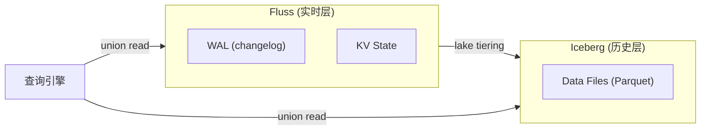
```mermaid
graph LR
    subgraph Fluss["Fluss (实时层)"]
        WAL["WAL (changelog)"]
        KV["KV State"]
    end
    subgraph Iceberg["Iceberg (历史层)"]
        DataFiles["Data Files (Parquet)"]
    end
    Fluss -->|"lake tiering"| Iceberg
    Client["查询引擎"] -->|"union read"| Fluss
    Client -->|"union read"| Iceberg
```

**核心问题**：

| 问题 | 描述 | 影响 |
|------|------|------|
| **跨层数据去重** | 用户删除/更新了一条数据，但旧版本已在 Iceberg 中 | union read 会读到"已删除"的旧行 |
| **Equality Delete 性能劣化** | 当前 tiering 用 Iceberg v2 equality delete 处理删除 | 小文件累积、读取性能持续下降 |

**解决方案**：引入三层 Deletion Vector，同时解决以上两个问题。

**前置要求**：主键表必须使用 **FULL changelog 模式**（更新时同时写 `-U` 和 `+U`），否则无法获知被覆盖的旧版本 RowId。

---

## 2. 整体架构：三层 Deletion Vector

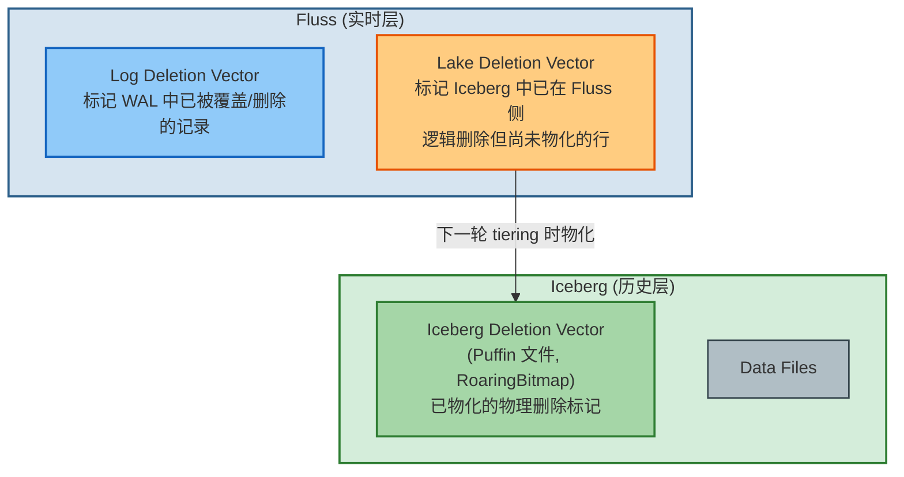
```mermaid
graph TB
    subgraph FlussLayer["Fluss (实时层)"]
        direction TB
        LogDv["Log Deletion Vector<br/>标记 WAL 中已被覆盖/删除的记录"]
        LakeDv["Lake Deletion Vector<br/>标记 Iceberg 中已在 Fluss 侧<br/>逻辑删除但尚未物化的行"]
    end

    subgraph IcebergLayer["Iceberg (历史层)"]
        direction TB
        IcebergDv["Iceberg Deletion Vector<br/>(Puffin 文件, RoaringBitmap)<br/>已物化的物理删除标记"]
        DataFiles["Data Files"]
    end

    LakeDv -->|"下一轮 tiering 时物化"| IcebergDv

    style FlussLayer fill:#d6e4f0,stroke:#2c5f8a,stroke-width:2px,color:#333
    style IcebergLayer fill:#d4edda,stroke:#2e7d32,stroke-width:2px,color:#333
    style LogDv fill:#90caf9,stroke:#1565c0,stroke-width:2px,color:#333
    style LakeDv fill:#ffcc80,stroke:#e65100,stroke-width:2px,color:#333
    style IcebergDv fill:#a5d6a7,stroke:#2e7d32,stroke-width:2px,color:#333
    style DataFiles fill:#b0bec5,stroke:#37474f,stroke-width:1.5px,color:#333
```

### 三层协作

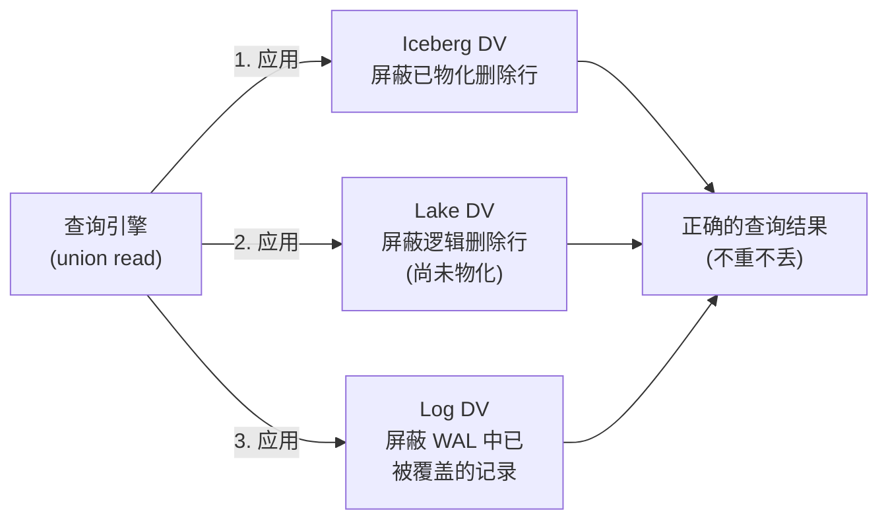
```mermaid
graph LR
    Query["查询引擎<br/>(union read)"]

    Query -->|"1. 应用"| IDV["Iceberg DV<br/>屏蔽已物化删除行"]
    Query -->|"2. 应用"| LDV["Lake DV<br/>屏蔽逻辑删除行<br/>(尚未物化)"]
    Query -->|"3. 应用"| LOGDV["Log DV<br/>屏蔽 WAL 中已<br/>被覆盖的记录"]

    IDV --> Result["正确的查询结果<br/>(不重不丢)"]
    LDV --> Result
    LOGDV --> Result
```

| 层 | 位置 | 作用 | 生命周期 |
|----|------|------|----------|
| **Iceberg DV** | Iceberg Puffin 文件 | 物理删除标记 | Iceberg snapshot 管理 |
| **Lake DV** | TabletServer DvRocksDB | 跨层逻辑删除（实时生效） | 每轮 tiering 后差集清理 |
| **Log DV** | TabletServer DvRocksDB | WAL 内部去重 | readable snapshot 前移后清理 |

---

## 3. 核心概念

### 3.1 RowId

每条数据的**版本标识**，取值为 `+I`/`+U` changelog 的 log offset。

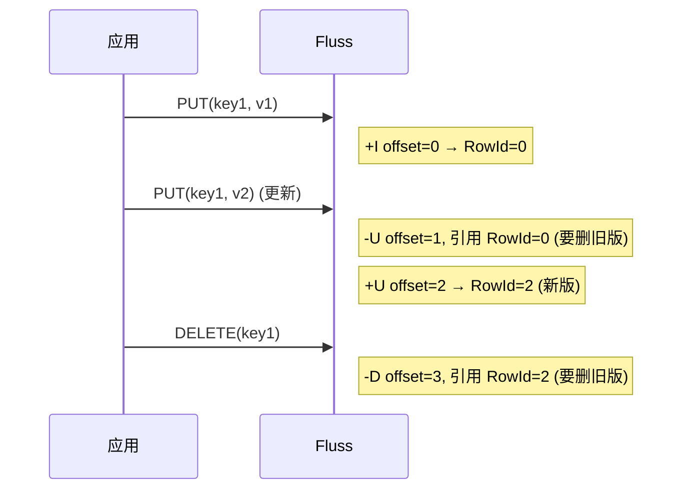
```mermaid
sequenceDiagram
    participant App as 应用
    participant Fluss as Fluss

    App->>Fluss: PUT(key1, v1)
    Note right of Fluss: +I offset=0 → RowId=0

    App->>Fluss: PUT(key1, v2) (更新)
    Note right of Fluss: -U offset=1, 引用 RowId=0 (要删旧版)
    Note right of Fluss: +U offset=2 → RowId=2 (新版)

    App->>Fluss: DELETE(key1)
    Note right of Fluss: -D offset=3, 引用 RowId=2 (要删旧版)
```

### 3.2 FilePos

标记数据在 Iceberg 中的物理位置：

```
FilePos (8 bytes) = file_id (高 4B) + row_position (低 4B)
```

- `file_id`：data file 的字典编码 ID（节省存储）
- `row_position`：数据在文件中的行号（从 0 开始）

### 3.3 RowPosIndex（双 CF 架构）

RowId → FilePos 的映射，用于快速定位行在 Iceberg 中的物理位置。

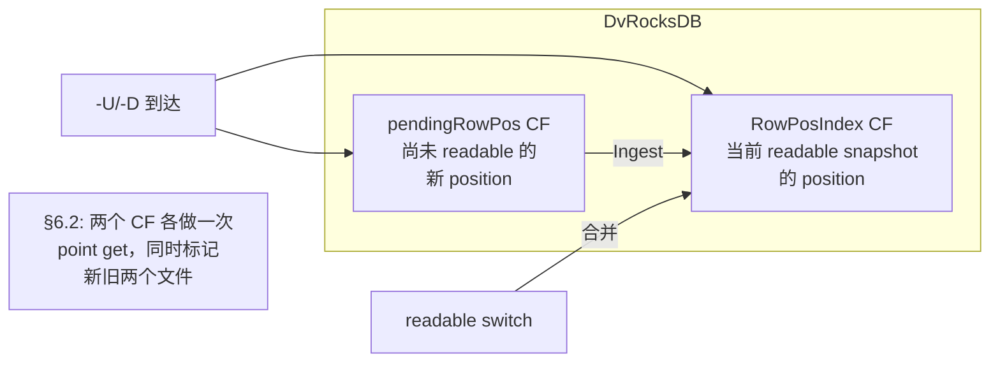
```mermaid
graph LR
    subgraph DvRocksDB
        RPI["RowPosIndex CF<br/>当前 readable snapshot<br/>的 position"]
        PRP["pendingRowPos CF<br/>尚未 readable 的<br/>新 position"]
    end

    Delete["-U/-D 到达"] --> RPI
    Delete --> PRP
    Note["§6.2: 两个 CF 各做一次<br/>point get，同时标记<br/>新旧两个文件"]

    Switch["readable switch"] -->|"合并"| RPI
    PRP -->|"Ingest"| RPI
```

**为什么需要两个 CF？**

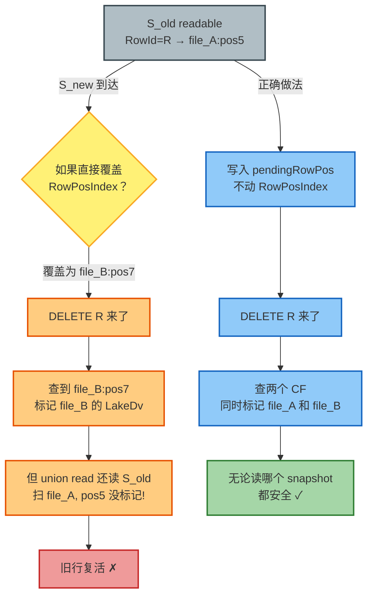
```mermaid
graph TD
    A["S_old readable<br/>RowId=R → file_A:pos5"] -->|"S_new 到达"| B{"如果直接覆盖<br/>RowPosIndex？"}
    B -->|"覆盖为 file_B:pos7"| C["DELETE R 来了"]
    C --> D["查到 file_B:pos7<br/>标记 file_B 的 LakeDv"]
    D --> E["但 union read 还读 S_old<br/>扫 file_A, pos5 没标记!"]
    E --> F["旧行复活 ✗"]

    A -->|"正确做法"| G["写入 pendingRowPos<br/>不动 RowPosIndex"]
    G --> H["DELETE R 来了"]
    H --> I["查两个 CF<br/>同时标记 file_A 和 file_B"]
    I --> J["无论读哪个 snapshot<br/>都安全 ✓"]

    style A fill:#b0bec5,stroke:#37474f,stroke-width:2px,color:#333
    style B fill:#fff176,stroke:#f9a825,stroke-width:2px,color:#333
    style C fill:#ffcc80,stroke:#e65100,stroke-width:2px,color:#333
    style D fill:#ffcc80,stroke:#e65100,stroke-width:2px,color:#333
    style E fill:#ffcc80,stroke:#e65100,stroke-width:2px,color:#333
    style F fill:#ef9a9a,stroke:#c62828,stroke-width:2px,color:#333
    style G fill:#90caf9,stroke:#1565c0,stroke-width:2px,color:#333
    style H fill:#90caf9,stroke:#1565c0,stroke-width:2px,color:#333
    style I fill:#90caf9,stroke:#1565c0,stroke-width:2px,color:#333
    style J fill:#a5d6a7,stroke:#2e7d32,stroke-width:2px,color:#333
```

### 3.4 PendingDeletes（未物化死行日志）

**为什么需要 PendingDeletes？**

当 `-U/-D` 删除一行时，需要在 LakeDv 中标记该行在 Iceberg 中的物理位置。但有两种情况无法立即完整标记：

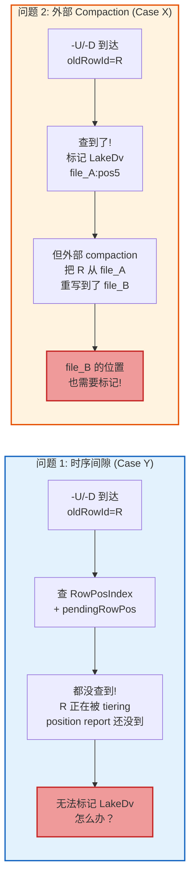
```mermaid
flowchart LR
    subgraph Problem1["问题 1: 时序间隙 (Case Y)"]
        direction TB
        P1A["-U/-D 到达<br/>oldRowId=R"] --> P1B["查 RowPosIndex<br/>+ pendingRowPos"]
        P1B --> P1C["都没查到!<br/>R 正在被 tiering<br/>position report 还没到"]
        P1C --> P1D["无法标记 LakeDv<br/>怎么办？"]
    end

    subgraph Problem2["问题 2: 外部 Compaction (Case X)"]
        direction TB
        P2A["-U/-D 到达<br/>oldRowId=R"] --> P2B["查到了!<br/>标记 LakeDv<br/>file_A:pos5"]
        P2B --> P2C["但外部 compaction<br/>把 R 从 file_A<br/>重写到了 file_B"]
        P2C --> P2D["file_B 的位置<br/>也需要标记!"]
    end

    style P1D fill:#ef9a9a,stroke:#c62828,stroke-width:2px,color:#333
    style P2D fill:#ef9a9a,stroke:#c62828,stroke-width:2px,color:#333
    style Problem1 fill:#e3f2fd,stroke:#1565c0,stroke-width:2px,color:#333
    style Problem2 fill:#fff3e0,stroke:#e65100,stroke-width:2px,color:#333
```

**解决方案**：PendingDeletes 记录所有"已删除但 LakeDv 标记可能不完整"的 RowId，后续 position report 到达时通过**反向扫描**补齐。

**PendingDeletes 怎么写入？**

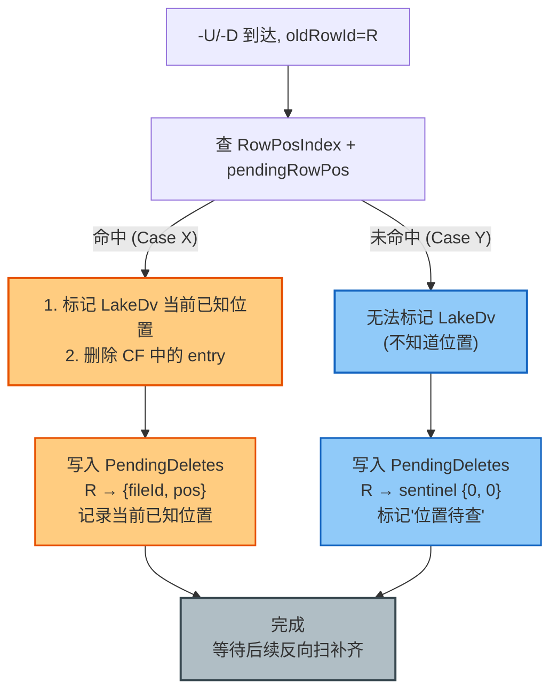
```mermaid
flowchart TD
    Delete["-U/-D 到达, oldRowId=R"] --> Query["查 RowPosIndex + pendingRowPos"]

    Query -->|"命中 (Case X)"| CaseX["1. 标记 LakeDv 当前已知位置<br/>2. 删除 CF 中的 entry"]
    Query -->|"未命中 (Case Y)"| CaseY["无法标记 LakeDv<br/>(不知道位置)"]

    CaseX --> WriteX["写入 PendingDeletes<br/>R → {fileId, pos}<br/>记录当前已知位置"]
    CaseY --> WriteY["写入 PendingDeletes<br/>R → sentinel {0, 0}<br/>标记'位置待查'"]

    WriteX --> Done["完成<br/>等待后续反向扫补齐"]
    WriteY --> Done

    style CaseX fill:#ffcc80,stroke:#e65100,stroke-width:2px,color:#333
    style CaseY fill:#90caf9,stroke:#1565c0,stroke-width:2px,color:#333
    style WriteX fill:#ffcc80,stroke:#e65100,stroke-width:1.5px,color:#333
    style WriteY fill:#90caf9,stroke:#1565c0,stroke-width:1.5px,color:#333
    style Done fill:#b0bec5,stroke:#37474f,stroke-width:2px,color:#333
```

**后续怎么消费？** §7.3.1 position report 到达后，反向扫 PendingDeletes 中每个 `(R, v)`，查 `pendingRowPos.get(R)`：

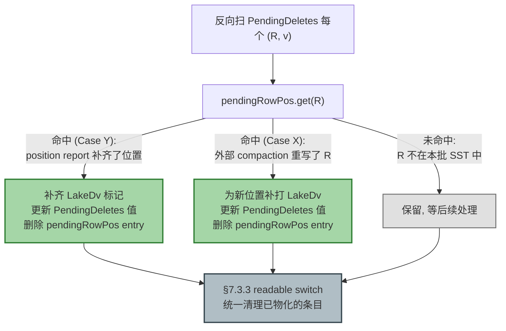
```mermaid
flowchart TD
    Scan["反向扫 PendingDeletes 每个 (R, v)"] --> Check["pendingRowPos.get(R)"]

    Check -->|"命中 (Case Y):<br/>position report 补齐了位置"| FixY["补齐 LakeDv 标记<br/>更新 PendingDeletes 值<br/>删除 pendingRowPos entry"]
    Check -->|"命中 (Case X):<br/>外部 compaction 重写了 R"| FixX["为新位置补打 LakeDv<br/>更新 PendingDeletes 值<br/>删除 pendingRowPos entry"]
    Check -->|"未命中:<br/>R 不在本批 SST 中"| Keep["保留, 等后续处理"]

    FixY --> Clean["§7.3.3 readable switch<br/>统一清理已物化的条目"]
    FixX --> Clean
    Keep --> Clean

    style FixY fill:#a5d6a7,stroke:#2e7d32,stroke-width:2px,color:#333
    style FixX fill:#a5d6a7,stroke:#2e7d32,stroke-width:2px,color:#333
    style Keep fill:#e0e0e0,stroke:#757575,stroke-width:1.5px,color:#333
    style Clean fill:#b0bec5,stroke:#37474f,stroke-width:2px,color:#333
```

> PendingDeletes 的清理推迟到 readable switch 时统一执行——这是保证 position report 幂等性的关键。

### 3.5 DV-Readable Snapshot

并非每个 Iceberg snapshot 都可以立即用于 union read。**DV-readable snapshot** 指 CoordinatorServer 已对外发布、允许 client 发起 union read 的目标 snapshot。发布前需要收齐所有 bucket 的 ready ack，确保每个 TabletServer 的 DV 元数据已就绪。

### 3.6 存储架构：DvRocksDB

DvRocksDB 独立于 KvTablet RocksDB，包含六个列族：

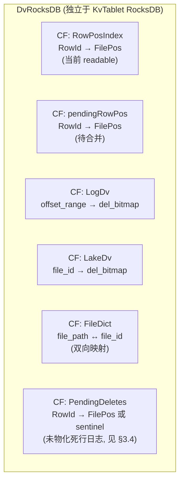
```mermaid
graph TD
    subgraph DvRocksDB["DvRocksDB (独立于 KvTablet RocksDB)"]
        CF1["CF: RowPosIndex<br/>RowId → FilePos<br/>(当前 readable)"]
        CF2["CF: pendingRowPos<br/>RowId → FilePos<br/>(待合并)"]
        CF3["CF: LogDv<br/>offset_range → del_bitmap"]
        CF4["CF: LakeDv<br/>file_id → del_bitmap"]
        CF5["CF: FileDict<br/>file_path ↔ file_id<br/>(双向映射)"]
        CF6["CF: PendingDeletes<br/>RowId → FilePos 或 sentinel<br/>(未物化死行日志, 见 §3.4)"]
    end
```

**并发控制：DvRWLock（全局读写锁）**

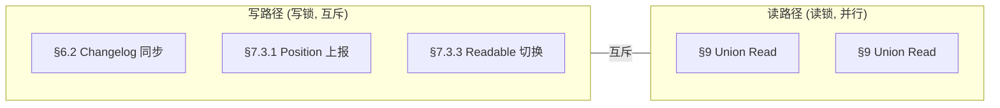
```mermaid
graph LR
    subgraph WritePaths["写路径 (写锁, 互斥)"]
        W1["§6.2 Changelog 同步"]
        W2["§7.3.1 Position 上报"]
        W3["§7.3.3 Readable 切换"]
    end

    subgraph ReadPaths["读路径 (读锁, 并行)"]
        R1["§9 Union Read"]
        R2["§9 Union Read"]
    end

    WritePaths ---|"互斥"| ReadPaths
```

---

## 4. 写入流程

### 4.1 新数据写入

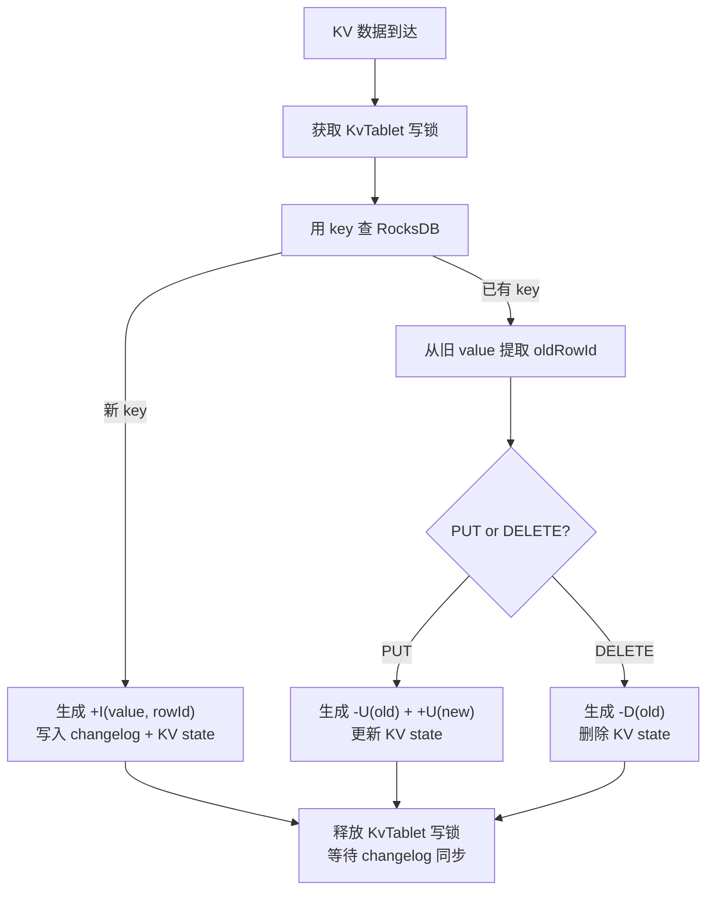
```mermaid
flowchart TD
    Start["KV 数据到达"] --> Lock["获取 KvTablet 写锁"]
    Lock --> Query["用 key 查 RocksDB"]

    Query -->|"新 key"| NewKey["生成 +I(value, rowId)<br/>写入 changelog + KV state"]
    Query -->|"已有 key"| ExistKey["从旧 value 提取 oldRowId"]

    ExistKey --> IsPut{PUT or DELETE?}
    IsPut -->|PUT| Put["生成 -U(old) + +U(new)<br/>更新 KV state"]
    IsPut -->|DELETE| Del["生成 -D(old)<br/>删除 KV state"]

    NewKey --> Unlock["释放 KvTablet 写锁<br/>等待 changelog 同步"]
    Put --> Unlock
    Del --> Unlock
```

### 4.2 Changelog 同步成功后的 DV 更新

这是 DV 机制的核心——每当 `-U`/`-D` 同步成功，立即更新 DV：

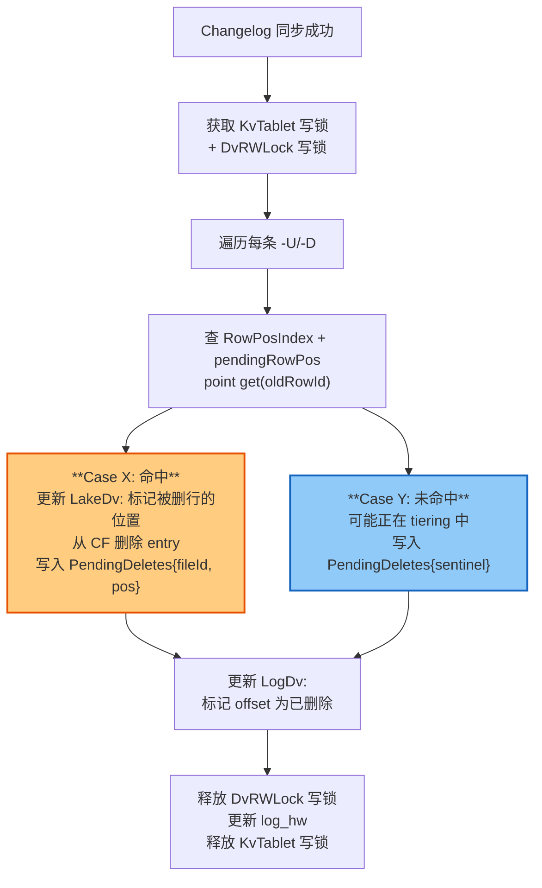
```mermaid
flowchart TD
    Start["Changelog 同步成功"] --> Lock["获取 KvTablet 写锁<br/>+ DvRWLock 写锁"]

    Lock --> ForEach["遍历每条 -U/-D"]
    ForEach --> Query["查 RowPosIndex + pendingRowPos<br/>point get(oldRowId)"]

    Query --> Hit["**Case X: 命中**<br/>更新 LakeDv: 标记被删行的位置<br/>从 CF 删除 entry<br/>写入 PendingDeletes{fileId, pos}"]
    Query --> Miss["**Case Y: 未命中**<br/>可能正在 tiering 中<br/>写入 PendingDeletes{sentinel}"]

    Hit --> LogDv["更新 LogDv:<br/>标记 offset 为已删除"]
    Miss --> LogDv

    LogDv --> Unlock["释放 DvRWLock 写锁<br/>更新 log_hw<br/>释放 KvTablet 写锁"]

    style Hit fill:#ffcc80,stroke:#e65100,stroke-width:2px,color:#333
    style Miss fill:#90caf9,stroke:#1565c0,stroke-width:2px,color:#333
```

> **关键顺序**：必须先更新 DV → 再更新 log_hw。否则 union read 可能看到更大的 logEndOffset 但 LakeDv 还没更新，导致读到已删除的旧行。

---

## 5. Tiering 与 Snapshot 处理（核心生命周期）

### 5.1 端到端时序

这是整个 DV 方案最核心的流程——一轮 tiering 从 commit 到 readable switch 的完整生命周期：

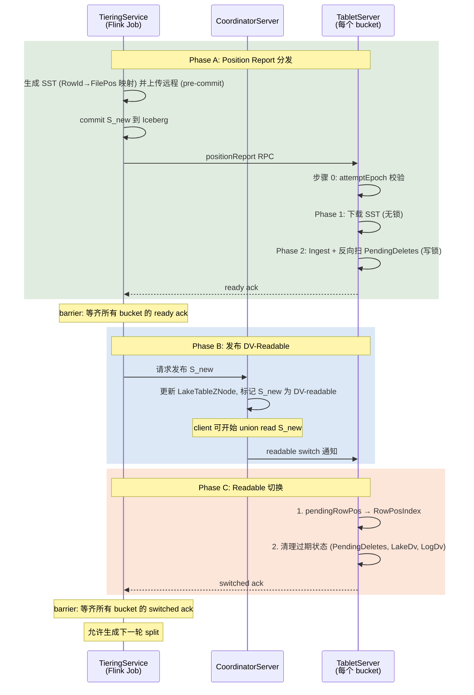
```mermaid
sequenceDiagram
    participant TS as TieringService<br/>(Flink Job)
    participant CS as CoordinatorServer
    participant TB as TabletServer<br/>(每个 bucket)

    rect rgba(46, 125, 50, 0.15)
        Note over TS,TB: Phase A: Position Report 分发
        TS->>TS: 生成 SST (RowId→FilePos 映射) 并上传远程 (pre-commit)
        TS->>TS: commit S_new 到 Iceberg
        TS->>TB: positionReport RPC
        TB->>TB: 步骤 0: attemptEpoch 校验
        TB->>TB: Phase 1: 下载 SST (无锁)
        TB->>TB: Phase 2: Ingest + 反向扫 PendingDeletes (写锁)
        TB-->>TS: ready ack
    end

    Note over TS: barrier: 等齐所有 bucket 的 ready ack

    rect rgba(21, 101, 192, 0.15)
        Note over TS,TB: Phase B: 发布 DV-Readable
        TS->>CS: 请求发布 S_new
        CS->>CS: 更新 LakeTableZNode, 标记 S_new 为 DV-readable
        Note over CS: client 可开始 union read S_new
        CS->>TB: readable switch 通知
    end

    rect rgba(230, 81, 0, 0.15)
        Note over TS,TB: Phase C: Readable 切换
        TB->>TB: 1. pendingRowPos → RowPosIndex
        TB->>TB: 2. 清理过期状态 (PendingDeletes, LakeDv, LogDv)
        TB-->>TS: switched ack
    end

    Note over TS: barrier: 等齐所有 bucket 的 switched ack
    Note over TS: 允许生成下一轮 split
```

### 5.2 Tiering Writer 处理流程

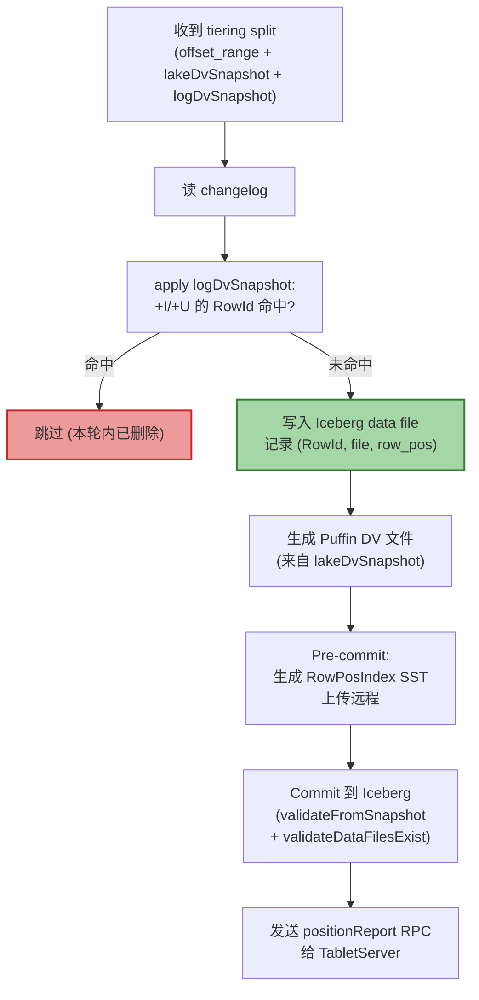
```mermaid
flowchart TD
    Split["收到 tiering split<br/>(offset_range + lakeDvSnapshot + logDvSnapshot)"] --> Read["读 changelog"]

    Read --> Filter["apply logDvSnapshot:<br/>+I/+U 的 RowId 命中?"]
    Filter -->|"命中"| Skip["跳过 (本轮内已删除)"]
    Filter -->|"未命中"| Write["写入 Iceberg data file<br/>记录 (RowId, file, row_pos)"]

    Write --> GenDV["生成 Puffin DV 文件<br/>(来自 lakeDvSnapshot)"]
    GenDV --> GenSST["Pre-commit:<br/>生成 RowPosIndex SST<br/>上传远程"]
    GenSST --> Commit["Commit 到 Iceberg<br/>(validateFromSnapshot<br/>+ validateDataFilesExist)"]
    Commit --> Report["发送 positionReport RPC<br/>给 TabletServer"]

    style Skip fill:#ef9a9a,stroke:#c62828,stroke-width:2px,color:#333
    style Write fill:#a5d6a7,stroke:#2e7d32,stroke-width:2px,color:#333
```

### 5.3 Position Report 处理（TabletServer 侧）

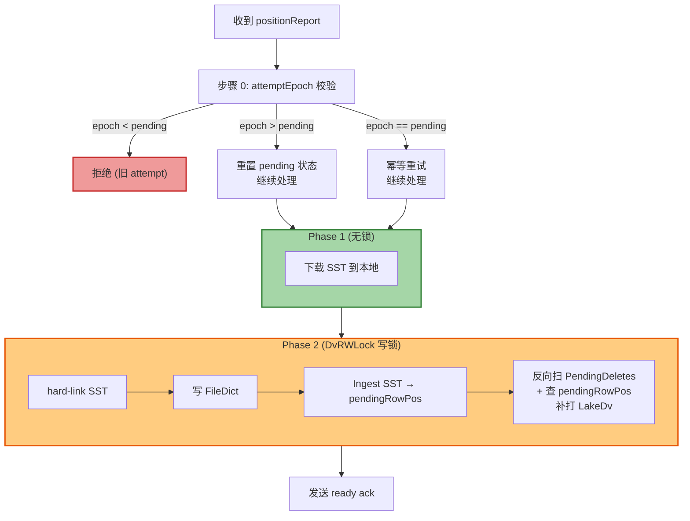
```mermaid
flowchart TD
    Receive["收到 positionReport"] --> Epoch["步骤 0: attemptEpoch 校验"]

    Epoch -->|"epoch < pending"| Reject["拒绝 (旧 attempt)"]
    Epoch -->|"epoch > pending"| Reset["重置 pending 状态<br/>继续处理"]
    Epoch -->|"epoch == pending"| Continue["幂等重试<br/>继续处理"]

    Reset --> Phase1
    Continue --> Phase1

    subgraph Phase1["Phase 1 (无锁)"]
        DL["下载 SST 到本地"]
    end

    Phase1 --> Phase2

    subgraph Phase2["Phase 2 (DvRWLock 写锁)"]
        HL["hard-link SST"]
        FD["写 FileDict"]
        IG["Ingest SST → pendingRowPos"]
        RS["反向扫 PendingDeletes<br/>+ 查 pendingRowPos<br/>补打 LakeDv"]
        HL --> FD --> IG --> RS
    end

    Phase2 --> Ready["发送 ready ack"]

    style Reject fill:#ef9a9a,stroke:#c62828,stroke-width:2px,color:#333
    style Phase1 fill:#a5d6a7,stroke:#2e7d32,stroke-width:2px,color:#333
    style Phase2 fill:#ffcc80,stroke:#e65100,stroke-width:2px,color:#333
```

**反向扫 PendingDeletes（替代逐行 alive check 的关键优化）**：

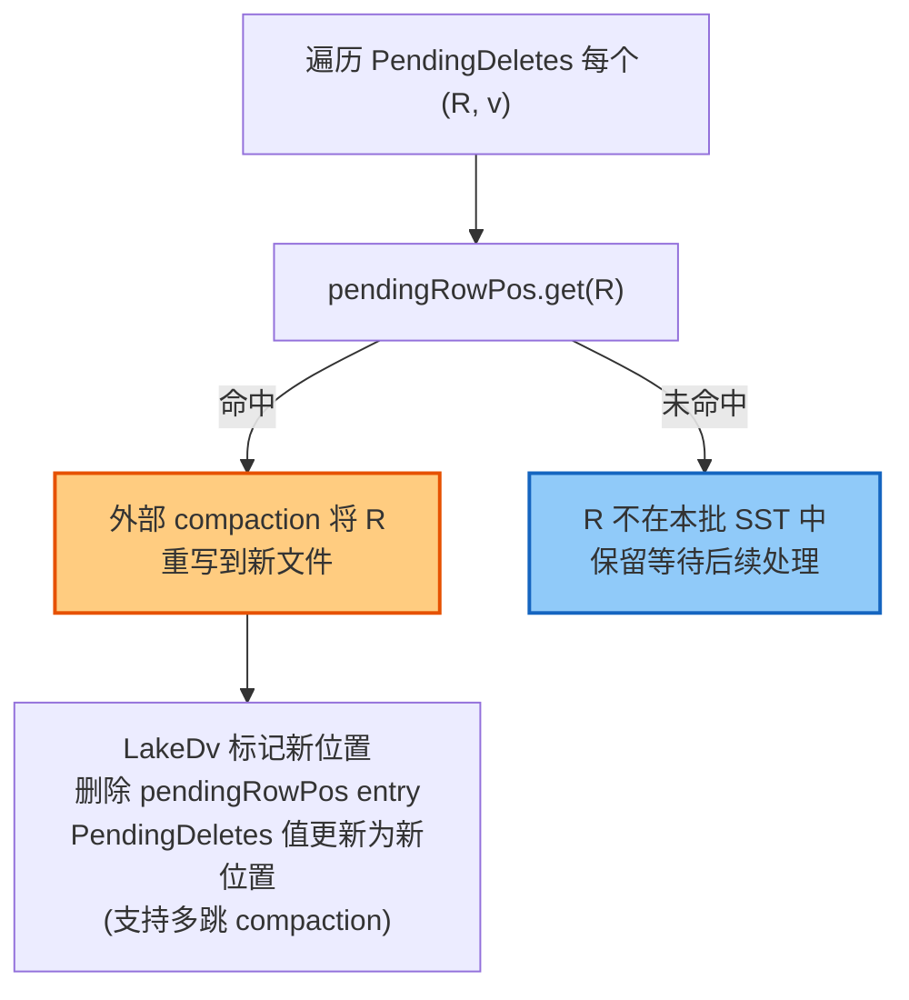
```mermaid
flowchart TD
    Scan["遍历 PendingDeletes 每个 (R, v)"] --> Check["pendingRowPos.get(R)"]

    Check -->|"命中"| Hit["外部 compaction 将 R<br/>重写到新文件"]
    Hit --> Mark["LakeDv 标记新位置<br/>删除 pendingRowPos entry<br/>PendingDeletes 值更新为新位置<br/>(支持多跳 compaction)"]

    Check -->|"未命中"| NoHit["R 不在本批 SST 中<br/>保留等待后续处理"]

    style Hit fill:#ffcc80,stroke:#e65100,stroke-width:2px,color:#333
    style NoHit fill:#90caf9,stroke:#1565c0,stroke-width:2px,color:#333
```

> **复杂度对比**：旧方案遍历 SST 每行做 alive check = O(|SST|)；新方案反向扫 PendingDeletes = O(|PendingDeletes|)，后者远小于前者。

### 5.4 Readable 切换

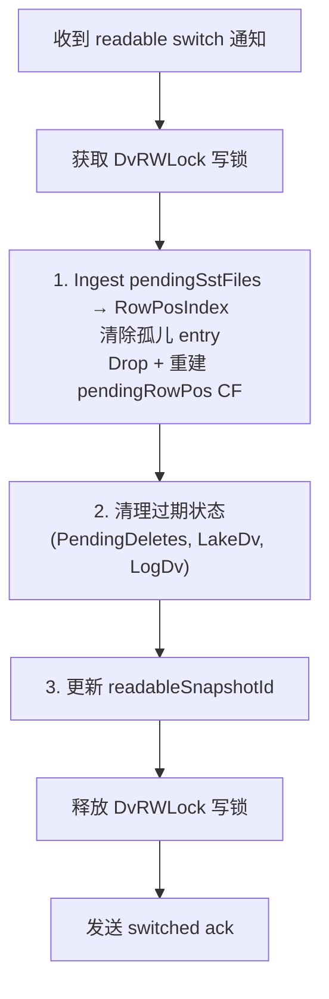
```mermaid
flowchart TD
    Notify["收到 readable switch 通知"] --> Lock["获取 DvRWLock 写锁"]

    Lock --> Step1["1. Ingest pendingSstFiles → RowPosIndex<br/>清除孤儿 entry<br/>Drop + 重建 pendingRowPos CF"]
    Step1 --> Step2["2. 清理过期状态<br/>(PendingDeletes, LakeDv, LogDv)"]
    Step2 --> Step3["3. 更新 readableSnapshotId"]

    Step3 --> Unlock["释放 DvRWLock 写锁"]
    Unlock --> Ack["发送 switched ack"]
```

---

## 6. Union Read 流程

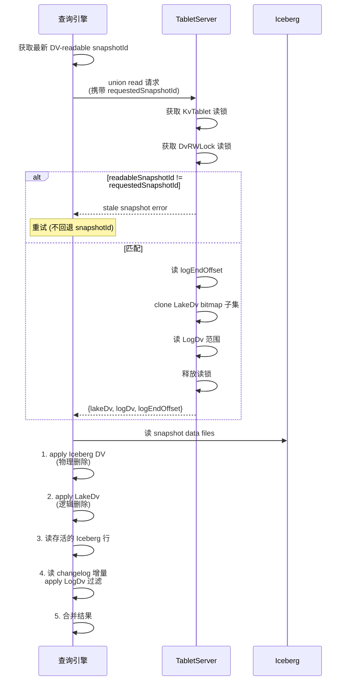
```mermaid
sequenceDiagram
    participant Client as 查询引擎
    participant TS as TabletServer
    participant Iceberg as Iceberg

    Client->>Client: 获取最新 DV-readable snapshotId

    Client->>TS: union read 请求<br/>(携带 requestedSnapshotId)
    TS->>TS: 获取 KvTablet 读锁
    TS->>TS: 获取 DvRWLock 读锁

    alt readableSnapshotId != requestedSnapshotId
        TS-->>Client: stale snapshot error
        Note over Client: 重试 (不回退 snapshotId)
    else 匹配
        TS->>TS: 读 logEndOffset
        TS->>TS: clone LakeDv bitmap 子集
        TS->>TS: 读 LogDv 范围
        TS->>TS: 释放读锁
        TS-->>Client: {lakeDv, logDv, logEndOffset}
    end

    Client->>Iceberg: 读 snapshot data files
    Client->>Client: 1. apply Iceberg DV<br/>(物理删除)
    Client->>Client: 2. apply LakeDv<br/>(逻辑删除)
    Client->>Client: 3. 读存活的 Iceberg 行
    Client->>Client: 4. 读 changelog 增量<br/>apply LogDv 过滤
    Client->>Client: 5. 合并结果
```

---

## 7. 恢复流程

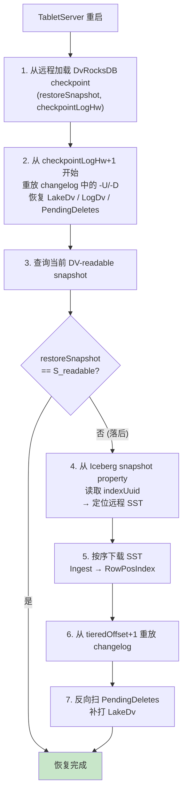
```mermaid
flowchart TD
    Start["TabletServer 重启"] --> Load["1. 从远程加载 DvRocksDB checkpoint<br/>(restoreSnapshot, checkpointLogHw)"]

    Load --> Replay["2. 从 checkpointLogHw+1 开始<br/>重放 changelog 中的 -U/-D<br/>恢复 LakeDv / LogDv / PendingDeletes"]

    Replay --> Query["3. 查询当前 DV-readable snapshot"]
    Query --> Compare{"restoreSnapshot<br/>== S_readable?"}

    Compare -->|"是"| Done["恢复完成"]
    Compare -->|"否 (落后)"| Catch["4. 从 Iceberg snapshot property<br/>读取 indexUuid<br/>→ 定位远程 SST"]

    Catch --> Download["5. 按序下载 SST<br/>Ingest → RowPosIndex"]
    Download --> ReplayMore["6. 从 tieredOffset+1 重放 changelog"]
    ReplayMore --> BackScan["7. 反向扫 PendingDeletes<br/>补打 LakeDv"]
    BackScan --> Done

    style Done fill:#c8e6c9
```

**恢复路径关键**：

```
snapshotId → snapshot property → indexUuid
    → cross-bucket index 文件
    → per-bucket sstDir → manifest → SST 文件
    → Ingest 到 RowPosIndex
```

---

## 8. 与外部 Compaction 的交互

```mermaid
sequenceDiagram
    participant Ext as 外部引擎 (Spark)
    participant Ice as Iceberg
    participant TS as TieringService
    participant Tab as TabletServer

    Ext->>Ice: compaction: 合并旧文件 → 新文件
    Note over Ice: 产生 snapshot S3

    TS->>Ice: 下次 tiering commit 时
    TS->>TS: 检测 externalNewFiles<br/>= (currentFiles - lastKnown) - tieringNew

    TS->>TS: 扫描 externalNewFiles<br/>读取 __offset + __bucket 列<br/>按 bucket 分组

    TS->>TS: 合并到 SST 生成管道

    TS->>Tab: positionReport<br/>(包含外部 compaction 的 position)

    Tab->>Tab: §7.3.1 统一处理<br/>反向扫 PendingDeletes<br/>为已删行的新位置补打 LakeDv
```

**约束**：外部 compaction 必须保留 `__rowid` 和 `__bucket` 列。

---

## 9. LakeDv 物化与清理

### 物化流程

```mermaid
flowchart LR
    A["生成 split 时<br/>快照 LakeDv"] --> B["随 split 下发<br/>给 Tiering Writer"]
    B --> C["Writer 生成<br/>Puffin DV 文件"]
    C --> D["commit 到 Iceberg"]
    D --> E["成为 DV-readable 后<br/>差集清理 LakeDv"]
```

### 差集清理（为什么不能直接清空）

```mermaid
graph TD
    T1["T1: 快照 LakeDv = {file_A: {0, 2}}"]
    T2["T2: 新 -D 到达<br/>LakeDv = {file_A: {0, 2, 5}}"]
    T3["T3: commit 成功<br/>Puffin DV = {file_A: {0, 2}}"]

    T1 --> T2 --> T3

    T3 -->|"直接清空?"| Bad["LakeDv = {}<br/>bit 5 丢失!<br/>旧行复活 ✗"]
    T3 -->|"差集清理"| Good["LakeDv = {file_A: {5}}<br/>bit 5 保留 ✓"]

    style T1 fill:#b0bec5,stroke:#37474f,stroke-width:2px,color:#333
    style T2 fill:#b0bec5,stroke:#37474f,stroke-width:2px,color:#333
    style T3 fill:#b0bec5,stroke:#37474f,stroke-width:2px,color:#333
    style Bad fill:#ef9a9a,stroke:#c62828,stroke-width:2px,color:#333
    style Good fill:#a5d6a7,stroke:#2e7d32,stroke-width:2px,color:#333
```

```
清理后的 bitmap = 当前 bitmap AND NOT 快照时的 bitmap
```

---

## 10. 数据格式变更

### KV State 和 Changelog 格式

```
之前: [schemaId (2B)][BinaryRow]
之后: [RowId (8B)][schemaId (2B)][BinaryRow]
```

所有四种 changelog 记录（`+I`、`+U`、`-U`、`-D`）格式统一，value 首部均携带 8 字节 RowId。

### Iceberg 数据列

| 列 | 类型 | 用途 |
|----|------|------|
| `__rowid` | long | 行的 RowId（= log offset），已有列 |
| `__bucket` | int | 行所属的 Fluss bucket id，**新增列** |

### Iceberg 版本

从 v2 切换到 **v3**，使用 position delete（Puffin DV）完全替代 equality delete。

---

## 11. 端到端示例

以下展示一个完整场景：写入 → tiering → 更新 → union read → 再次 tiering。

### 初始状态

Iceberg 为空，DV 全部为空。

### Step 1: 写入 3 条数据

```mermaid
graph LR
    PUT1["PUT(key1, v1)"] -->|"+I offset=0"| R0["RowId=0"]
    PUT2["PUT(key2, v2)"] -->|"+I offset=1"| R1["RowId=1"]
    PUT3["PUT(key3, v3)"] -->|"+I offset=2"| R2["RowId=2"]
```

### Step 2: 第一轮 Tiering

```mermaid
sequenceDiagram
    participant TS as TieringService
    participant Ice as Iceberg
    participant Tab as TabletServer

    TS->>Ice: 写入 data_file_A<br/>pos0=key1, pos1=key2, pos2=key3
    TS->>Ice: commit S1

    TS->>Tab: positionReport<br/>{RowId 0→file_A:pos0, 1→pos1, 2→pos2}

    Tab->>Tab: Ingest → pendingRowPos
    Note over Tab: readable switch 后<br/>合并到 RowPosIndex
```

**readable switch 后**：
```
RowPosIndex: {0→file_A:pos0, 1→file_A:pos1, 2→file_A:pos2}
LakeDv: 空
```

### Step 3: 更新 key1

```
PUT(key1, v4) → -U(offset=3, oldRowId=0) + +U(offset=4, RowId=4)
```

```mermaid
flowchart LR
    Delete["-U(oldRowId=0)"] --> Query["查 RowPosIndex<br/>命中 file_A:pos0"]
    Query --> Mark["LakeDv: file_A → {0}<br/>LogDv: offset0 已删除"]
    Query --> Remove["删除 RowPosIndex[0]"]
```

### Step 4: Union Read (S1)

```mermaid
graph TD
    Read["union read S1"]
    Read --> Apply1["Iceberg: 读 file_A"]
    Apply1 --> Apply2["apply LakeDv {0}<br/>→ 跳过 pos0(key1,v1)"]
    Apply2 --> Lake["读出 pos1(key2,v2)<br/>pos2(key3,v3)"]

    Read --> Delta["读 changelog [3,4]"]
    Delta --> Apply3["+U offset=4<br/>→ key1,v4"]

    Lake --> Result["最终结果:<br/>(key1,v4), (key2,v2), (key3,v3) ✓"]
    Apply3 --> Result

    style Result fill:#c8e6c9
```

### Step 5: 第二轮 Tiering

```mermaid
sequenceDiagram
    participant TS as TieringService
    participant Ice as Iceberg
    participant Tab as TabletServer

    Note over Tab: 快照 LakeDv = {file_A: {0, 2}}
    Note over Tab: (此前 key3 也被 DELETE 了)

    TS->>Ice: 写入 data_file_B<br/>pos0=key1,v4
    TS->>Ice: 写入 Puffin DV<br/>file_A → {0, 2}
    TS->>Ice: commit S2

    TS->>Tab: positionReport
    Tab->>Tab: ready ack

    Note over Tab: S2 成为 DV-readable

    Tab->>Tab: readable switch:<br/>差集清理 LakeDv<br/>{0,2} AND NOT {0,2} = {}

    Note over Tab: LakeDv = 空<br/>PendingDeletes = 空
```

---

## 12. 关键设计决策总结

| 维度 | 决策 | 理由 |
|------|------|------|
| **RowId** | 用 log offset | 天然唯一递增，无额外分配 |
| **双 CF 架构** | RowPosIndex + pendingRowPos | 保证 readable 切换窗口期删除不丢 |
| **SST 由 TieringService 生成** | TabletServer 只下载 + Ingest | 避免 TabletServer 做重 I/O |
| **hard-link 迁移** | 物理数据不拷贝 | readable switch 轻量化 (O(1)) |
| **反向扫 PendingDeletes** | 替代逐行 alive check | O(\|PendingDeletes\|) vs O(\|SST\|) |
| **差集清理 LakeDv** | AND NOT snapshotBitmap | 不丢新增删除，不膨胀 |
| **attemptEpoch** | 全局单调递增 | 拦截乱序/过期请求 |
| **DvRWLock 读写锁** | 写路径互斥，读路径并行 | 简单高效，临界区 ms 级 |
| **UUID SST + pre-commit index** | commit 前上传 | committed → 可恢复 position metadata |
| **post-commit reconcile** | 只补 metadata 不重提数据 | 避免重复 append |

---

## 附：文件路径约定

```
{$remoteLakeTableSnapshotDir}/
├── metadata/
│   └── {UUID}.offsets              ← 已有
└── rowPos/
    ├── {bucketId}/{uuid}/          ← per-bucket SST 目录
    │   ├── manifest
    │   ├── sst_0.sst
    │   └── sst_1.sst
    └── {indexUuid}                 ← cross-bucket index 文件
```

其中 `$remoteLakeTableSnapshotDir` = `FlussPaths.remoteLakeTableSnapshotDir()` = `{remote.data.dir}/lake/{databaseName}/{tableName}-{tableId}`
