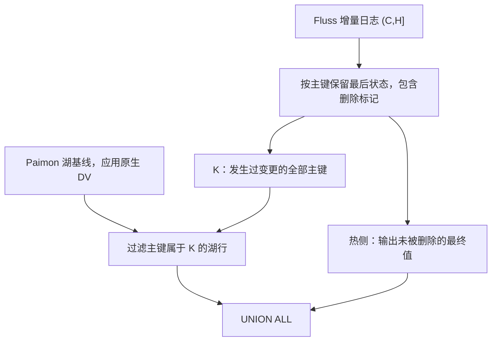

<!-- SPDX-License-Identifier: Apache-2.0
     https://www.apache.org/licenses/LICENSE-2.0 -->

# Paimon 主键表 Union Read：基于变更主键集合的过滤方案

本文讨论一种不依赖 Paimon `__offset`、也不新增 `__rowid` 列的跨层去重方案：先收集湖基线之后发生过变更的主键，再过滤湖里对应的旧行，最终值由 Fluss 热层提供。

本文定位为读路径上的 hash anti join 方案及性能对照，尚未完成实现和性能验证。它取消跨层排序要求，但仍需在查询时读取主键、执行匹配；它没有保留 RowId + LakeDv 已提前生成位置位图、读时直接按 pos 判断可见性的优化。算法成立的前提、工程约束与待验证事项分别列出。

## 1. 背景与设计目标

主键表 union read 需要合并 Paimon 历史数据与 Fluss 尚未纳入湖基线的增量。同一个主键可能同时存在于两层，更新和删除必须覆盖湖里的旧状态。

RowId + LakeDv 方案通过 `RowId → (file, position)` 索引，把跨层更新和删除转换为位置位图。为了在 compaction 后恢复位置关联，方案要求 Paimon 保存 Fluss 的逐行版本标识，并在重写时保留它。

在同时去掉 `__offset`、不增加 `__rowid` 的约束下，可以考虑在读取时直接按主键判断覆盖关系。这一方案的目标是：

- 避免新增 Paimon 逐行元数据列。
- 避免 Fluss 维护湖侧 `RowId → FilePos` 或 `PK → FilePos` 索引。
- 取消跨层合并对主键排序的要求。
- 继续由 Paimon 负责湖内版本合并和原生 DV，由 Fluss 增量决定跨层覆盖关系。

这一方案仍然需要准确的湖基线和日志边界，也仍然需要扫描查询涉及的湖数据。

如果设计目标同时要求“不增加逐行元数据列”和“保留按 pos 读取的能力”，本文方案只满足前一个条件。继续研究的位置 DV 方案仍需解决无新增列时如何建立、迁移和恢复位置映射。

## 2. 定义与前提

先在一个 Fluss table/partition/bucket 范围内讨论。不同范围的状态不能混用。

| 符号 | 定义 |
|---|---|
| `S` | 本次读取固定的可读湖基线 |
| `C` | 湖基线已覆盖的最后一个日志 offset |
| `H` | 本次读取包含的最后一个日志 offset |
| `E` | 按日志顺序排列的 `(C, H]` 内变更 |
| `K` | `E` 中出现过的全部主键，包含最终已被删除的主键 |
| `delta` | 每个变更主键在 `E` 中的最后状态：完整新行或删除标记 |

本文采用以下前提进行正确性推导：

1. `S` 的逻辑结果等于该范围截至 `C` 的状态；应用湖侧版本合并或原生 DV 后，每个主键最多有一条可见行。
2. `(C, H]` 的变更完整、有序，查询期间的边界固定。实现必须保留对应日志和湖快照文件。
3. `C`、`H` 不切开一次更新的 `-U/+U`，正向记录携带 Fluss 已计算好的完整行。
4. 主键提取、序列化、哈希和相等判断，与表的主键语义一致。

这里的 `C` 是明确的逻辑覆盖边界，不能直接用 COMPACT snapshot ID 或部分已 compact 数据的最大 offset 替代。实际系统若只能提供更复杂的覆盖关系，需要另行证明读取组合的正确性。

本文为便于说明使用左开右闭区间 `(C, H]`。实现可以使用右开区间，但订阅起点、停止条件、快照元数据和示例必须统一换算。

逐 bucket 的正确性推导不自动提供跨 bucket 的全局事务快照保证；跨 bucket 的一致性仍由现有读取协议约定。

## 3. 核心算法

对湖里的每条可见行，检查其主键是否属于 `K`：

```text
PK 属于 K：跳过湖里的行，由热层提供最终状态。
PK 不属于 K：保留湖里的行。
```

热层则把同一个主键的多次变更合并成最后状态，仅输出最后状态不是删除标记的行。

用关系运算表达：

```text
result = (lake(S) LEFT ANTI JOIN K ON primary_key)
         UNION ALL
         hot_latest_alive(C, H]
```

这里的 anti join 可以直接实现为 reader 内部的哈希查询，不要求构造一条包含大量主键的 SQL `NOT IN` 表达式。



**K 只用于过滤湖侧，不能再用 K 过滤热侧的新版本。**

## 4. 完整示例

### 4.1 湖基线与增量

假设 `C = 100`，湖里的逻辑数据为：

| 主键 | 值 |
|---|---:|
| k1 | 10 |
| k2 | 20 |
| k3 | 30 |

本次查询读取到 `H = 106`，Fluss 增量为：

| offset | 记录 | 含义 |
|---:|---|---|
| 101 | `-U(k1, 10)` | 撤回 k1 的旧值 |
| 102 | `+U(k1, 11)` | k1 更新为 11 |
| 103 | `-D(k2, 20)` | 删除 k2 |
| 104 | `+I(k4, 40)` | 新增 k4 |
| 105 | `-U(k1, 11)` | 再次撤回 k1 |
| 106 | `+U(k1, 12)` | k1 更新为 12 |

所有发生过变更的主键为：

```text
K = {k1, k2, k4}
```

k1 更新两次，在集合里仍然只有一个 k1。

### 4.2 湖侧过滤

| 湖里的行 | 是否属于 K | 处理 |
|---|---|---|
| `(k1, 10)` | 是 | 跳过，热层已更新 |
| `(k2, 20)` | 是 | 跳过，热层已删除 |
| `(k3, 30)` | 否 | 保留 |

### 4.3 热层合并与最终结果

按 offset 顺序处理增量，得到：

```text
delta = {
    k1: Row(value=12),
    k2: DELETED,
    k4: Row(value=40)
}
```

仅输出未被删除的热层最终状态：

```text
湖侧输出：(k3, 30)
热侧输出：(k1, 12), (k4, 40)
最终结果：(k1, 12), (k3, 30), (k4, 40)
```

## 5. 数据结构与伪代码

### 5.1 用一个 HashMap 保存覆盖信息与最终状态

一种直接实现是：

```text
delta: HashMap<PrimaryKey, LatestRowOrDeleted>
K = delta.keySet()
```

`DELETED` 是显式删除标记，不与业务字段的 NULL 混用。处理伪代码如下：

```text
delta = empty map

# 先完整读取本次日志区间，按 offset 顺序覆盖每个主键的状态。
for event in flussLog(C, H]:
    if event.kind is +I or +U:
        delta[copy(event.pk)] = copy(event.fullRow)
    else if event.kind is -U or -D:
        delta[copy(event.pk)] = DELETED

# delta 构建完成后，对本次查询保持不变。
for row in readLogicalLakeSnapshot(S):
    if not delta.containsKey(row.pk):
        emit(row)

for state in delta.values():
    if state != DELETED:
        emit(state)
```

保存主键和行时，需要处理 reader 复用对象的问题；伪代码中的 `copy` 表示获得可稳定保存的内容。实际实现也可以使用有明确生命周期的二进制存储。

### 5.2 删除标记不能提前丢弃

处理 `-D(k2)` 时必须保留 `k2 → DELETED`。如果执行 `delta.remove(k2)`，扫描湖时就会认为 k2 没有变更，错误地输出旧行。

同样，不能只从热层最后存活的行提取 K。示例中这样只能得到 `{k1, k4}`，会漏掉已删除的 k2。

若一个 key 在区间内删除后重新插入，后续正向记录会覆盖删除标记，但这个 key 始终属于 K。湖里的旧行被过滤，热层输出重新插入后的值。

### 5.3 与 LogDv 的组合

也可以让 LogDv 负责热层多版本过滤，只单独维护主键集合 K。此时集合本身不必保存完整的新行，但 LogDv、K 和日志读取必须对应同一个 `(S, C, H)`。

若 K 从原始增量提取，需要在丢弃删除记录之前收集其主键；不能从 LogDv 过滤后的存活正向行反推 K。

HashMap 方案本身不依赖 RowId 来合并热层版本。是否保留 Fluss 内部 RowId/LogDv，是另一项实现选择；两种方式都不要求把 RowId 写入 Paimon 数据列。

## 6. 正确性推导

令 `state_C(k)` 表示主键 k 在湖基线时的状态，`state_H(k)` 表示应用截至 H 的全部变更后的状态。不存在的行记为 `ABSENT`。

按 K 的定义，对任意主键 k 分情况检查：

1. **`k ∉ K`。** 区间 `(C, H]` 内没有 k 的变更，因此 `state_H(k) = state_C(k)`。算法保留湖行，热层没有该 key 的输出；若湖里本来不存在，也不会产生新行。
2. **`k ∈ K`，最后状态为完整新行 v。** 湖行被过滤。由于按日志顺序覆盖，`delta[k] = v`；在完整行前提下，v 就是 `state_H(k)`。算法仅从热层输出 v。
3. **`k ∈ K`，最后状态为删除。** 湖行被过滤，热层删除标记不输出，因此结果中没有 k，与 `state_H(k) = ABSENT` 一致。

上述情况覆盖所有主键。

湖侧输出主键属于 K 的补集；热侧输出主键属于 K。两个输出集合的主键不相交，且各自内部每个主键最多输出一次，因此可以使用 `UNION ALL`，无需再进行跨层去重。

如果正向记录只有局部字段补丁，最后一条记录不足以表示最终完整行，上面的第二种情况就不成立。此时必须先解析出完整状态，不能直接套用此算法。

## 7. Compaction 与湖基线推进

### 7.1 只有物理位置发生变化

假设 compaction 将 `(k1, 10)` 从 `A:3` 移动到 `B:7`，逻辑湖基线与 C 保持不变。扫描时仍然检查 `K.contains(k1)`，无需更新 Fluss 的文件位置映射。

Paimon 内部的删除、文件重写和原生 DV 仍由 Paimon 自己处理。读取器必须获得 S 的正确逻辑结果，不能把所有原始文件行直接当成可见行。

### 7.2 湖基线吸收更多增量

沿用第 4 节的例子，如果新湖基线覆盖到 `C' = 104`，其逻辑数据为：

```text
k1 → 11
k3 → 30
k4 → 40
```

同样读取到 `H = 106`，增量区间变成 `(104, 106]`，得到 `K' = {k1}`。过滤湖里的 k1，保留 k3、k4，再输出热层的 `(k1, 12)`，结果与原来一致。

新查询必须为新基线构建匹配的增量状态；已开始的查询继续使用其固定的 S、C、H。不能让正在扫描旧湖基线的查询中途切换到新 K。

### 7.3 仍然需要覆盖边界协议

本方案省掉物理位置映射，但仍然需要证明湖基线覆盖了什么。没有逐行 offset 后，可以研究通过 tiering 输入范围、提交元数据及 compaction 输入文件的覆盖关系确定 C。

普通 compaction 可能只处理部分文件，不能仅凭出现了一个 COMPACT snapshot 就推进 C。边界推导、快照保留和故障恢复需要独立验证。

## 8. 查询谓词与投影

### 8.1 构建 K 时不能丢掉不满足业务谓词的变更

考虑查询：

```sql
SELECT * FROM t WHERE balance >= 80;
```

某个 key 的湖值为 `balance = 100`，热层更新为 `balance = 50`。正确结果中没有该行。

如果先按查询谓词过滤热层，值为 50 的更新会被丢弃，key 不会进入 K，湖里的旧值 100 就可能被错误输出。

正确处理过程为：

1. 更新的 key 进入 K，与新值是否满足查询条件无关。
2. K 遮掉湖里的旧值 100。
3. 热层最终值 50 不满足谓词，不输出。

热层也不能在合并版本前随意丢弃不满足谓词的新版本，否则可能保留满足谓词的旧版本。概念上先解析覆盖关系和最终状态，再应用业务谓词；具体下推需要单独证明安全性。

### 8.2 查询未选择主键时仍需读取主键

即使查询只投影非主键列，湖侧仍需要主键来查询 K。reader 应将主键加入内部投影，并在输出时移除用户未请求的字段。

这是相对于位置位图的实际成本：位置位图可以按行位置判断，而本方案需要读取并解释主键。

## 9. 并行读取与实现约束

- **构建阶段先完成。** 在 K 完整可用前，不能把尚未判定覆盖关系的湖行直接返回给用户。预读可以与构建并行，但必须延迟相关输出。
- **按范围组织状态。** 可以在可确定的 partition/bucket 范围内构建和分发集合，避免无条件广播全表主键。实际范围映射需要与湖 split 规划一致。
- **共享集合，避免重复输出热行。** 同一范围的多个湖 split 可以共享或获取同一 K；热层最终行应有明确的输出归属，不能每个湖文件输出一遍。
- **使用准确的主键相等判断。** 仅保存未经碰撞处理的哈希值不足以安全丢弃湖行。Bloom Filter 可以用于预筛，但其“可能存在”结果必须再经准确集合确认。
- **保留固定读取上下文。** 重试需要继续使用匹配的 S、C、H，或整体重新规划；不能将来自不同上下文的湖数据、K、LogDv 混合。
- **不要用当前 KV 状态代替区间变更。** 当前状态可能已经超过 H，也不保留所有已删除的 key，无法直接恢复本次所需的覆盖集合。

## 10. 与当前实现的关系

整理本文时，工作区中的实现已经按主键保留热层最后状态：

- [LakeSnapshotAndLogSplitScanner](../fluss-client/src/main/java/org/apache/fluss/client/table/scanner/batch/LakeSnapshotAndLogSplitScanner.java) 用 `TreeMap` 保存增量，将删除和 `UPDATE_BEFORE` 记录保留为删除状态，并要求湖 reader 返回有序记录。
- [SortMergeReader](../fluss-client/src/main/java/org/apache/fluss/client/table/scanner/SortMergeReader.java) 对有序的湖数据与增量执行归并，同一个主键出现于两侧时选择热层状态。

主键集合过滤保留相同的覆盖语义，改用哈希查询判断湖行是否被覆盖。可研究的实现方向是：以 HashMap 保存增量状态，取消跨层读取的排序要求，并使用 Paimon 原生 DV 支持的正确读取路径。

落地时还需验证主键哈希语义、投影、删除标记、读取边界、并行输出，以及湖 reader 在目标配置下能否避免 merge-on-read。

已有有序流之间的两路归并本身是线性工作，不能据此声称每次查询都会重新排序整张湖表。性能比较应区分热层排序、湖侧有序读取、多个文件的归并，以及普通扫描成本。

## 11. 成本与方案比较

### 11.1 读时主键关联与提前生成位置位图的区别

两种方案的跨层可见性判定路径分别为：

```text
RowId + LakeDv：
  写入处理与快照切换阶段建立覆盖关系 → 生成文件位置位图
  查询时：(file, pos) → 位图判定 → 按可见位置读取或选择输出

主键集合过滤：
  构建增量主键集合 K
  查询时：读取湖行主键 → 哈希与匹配 → 决定是否保留该行
```

位置位图使 reader 无需为跨层去重读取、解码和匹配主键。reader 可以根据位图构造行选择向量或跳过行；能否进一步跳过数据页或减少物理 I/O，取决于文件格式、删除位置分布和 reader 的实现。

例如查询 `SELECT SUM(amount) FROM t` 时，在支持原生 DV 直接读取的湖基线上，位置方案不需要为了跨层去重额外读取主键列。主键集合方案仍需读取主键并查询 K，即使用户完全不关心主键。

因此，主键集合过滤保留了查询时的 hash anti join 工作，只消除了对跨层排序的要求。原方案则提前把跨层覆盖关系转换成位置过滤，查询阶段不再执行主键关联。这是二者在读路径上的主要差别。

### 11.2 成本模型

设 `L` 为增量日志记录数，`D` 为其中不同主键数，`N` 为查询需要扫描的湖记录数，`Bkey` 和 `Brow` 分别为保存主键与最新行的平均字节数。

| 工作 | HashMap 方案的预期成本 |
|---|---|
| 处理 L 条增量 | 在哈希分布正常、主键长度有界时为 `O(L)` |
| 过滤 N 条湖记录 | N 次主键查询，在相同假设下为 `O(N)` |
| 输出热层最终状态 | 遍历 D 个条目，为 `O(D)` |
| 保存主键集合 | 约 `O(D × Bkey)`，另有数据结构开销 |
| 保存最新行和删除标记 | 约 `O(D × (Bkey + Brow))`，另有数据结构开销 |

字符串或复合主键的哈希与比较还包含实际字节处理成本。不能把总查询成本描述为只与变更量有关。

| 项目 | RowId + LakeDv | 变更主键集合过滤 |
|---|---|---|
| Paimon 逐行 Fluss 版本标识 | 讨论中的方案要求保存 | 不需要 |
| Fluss 湖侧位置索引 | 需要 | 不需要 |
| compaction 后的位置关联维护 | 需要 | 不需要 |
| 湖侧跨层过滤 | 按行位置查询位图 | 读取主键并查询集合 |
| 查询阶段的跨层主键关联 | 不需要，覆盖关系已转为位置位图 | 需要，执行 hash anti join |
| 为跨层去重额外读取主键列 | 不需要 | 需要 |
| 主要附加状态 | 位置索引、位图及生命周期元数据等 | 变更主键；HashMap 变体还保存最新行 |
| 湖基线与日志边界 | 需要准确匹配 | 需要准确匹配 |
| 湖内版本合并与原生 DV | 由 Paimon 负责 | 由 Paimon 负责 |
| 跨层排序要求 | 位图过滤不要求 | 哈希过滤不要求 |

主键集合方案可以减少湖存储格式和位置索引的耦合。集合需要保存完整主键，通常比仅保存位置的位图占用更多空间；比较整体状态时，还应计入原方案的位置索引。宽主键、大增量、很多并行 reader 以及不查询主键的投影，都可能放大本方案的成本。

哈希查询也不保证比顺序归并更快。潜在收益主要来自取消有序读取要求、避免相关排序或归并工作，以及省掉持久化位置索引维护；需要实测这些收益是否超过哈希和额外列读取成本。

## 12. 后续验证重点

正确性验证应至少覆盖：连续更新、删除后重插、只有删除的增量、新增后又删除、空增量、空湖基线、查询谓词变化、未投影主键、跨快照读取与重试，以及多个湖 split 的热行输出归属。

针对 compaction，需要分别验证“逻辑基线不变的文件重写”和“推进 C 的基线更新”，确认快照文件保留与增量边界在并发查询中始终匹配。

性能对照应包括当前 sort-merge、RowId + LakeDv 和主键集合过滤，至少变化以下参数：

- 不同主键数 D、日志数 L，以及重复更新同一主键的比例。
- BIGINT、字符串和复合主键的宽度。
- 查询是否投影主键，以及返回行的宽度。
- 湖文件数量、原生 DV 状态、过滤选择率和并行 reader 数量。
- K 的构建时间、首行延迟、总耗时、CPU、峰值内存、网络和存储读取量。

若目标是保留原方案的 pos 读取优化，本文方案应作为性能对照，不作为等价替代。若考虑接受查询时的主键关联，以减少湖格式和索引维护的耦合，则需要根据这些对照结果判断取舍。
