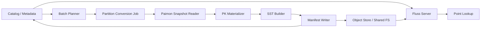
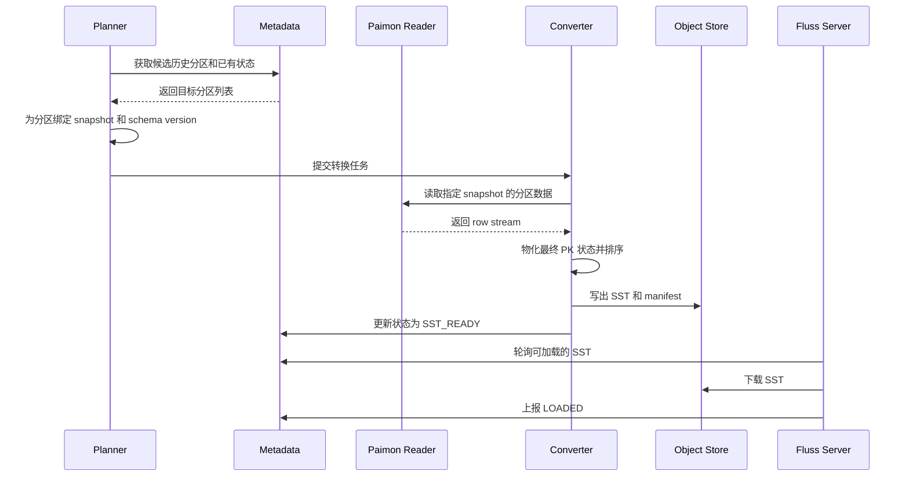
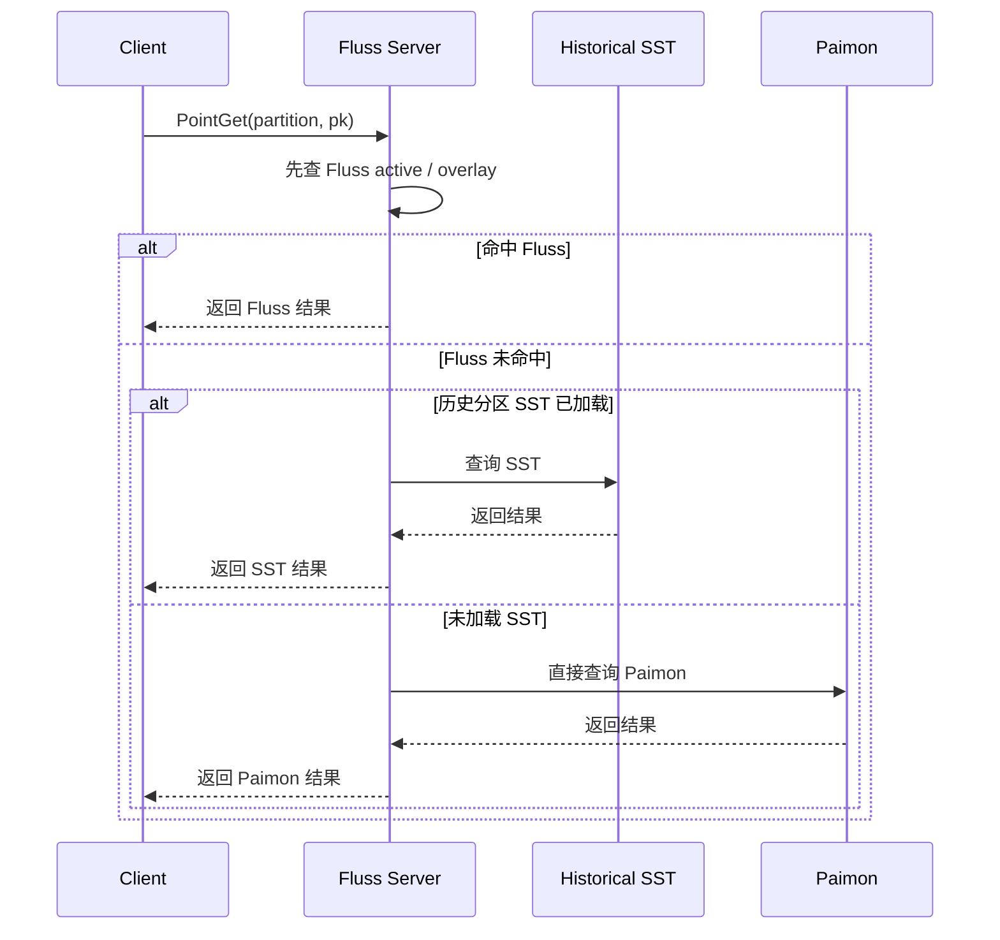
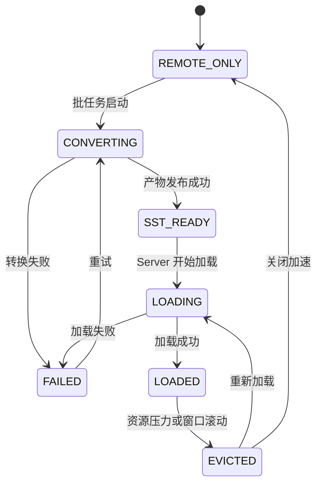
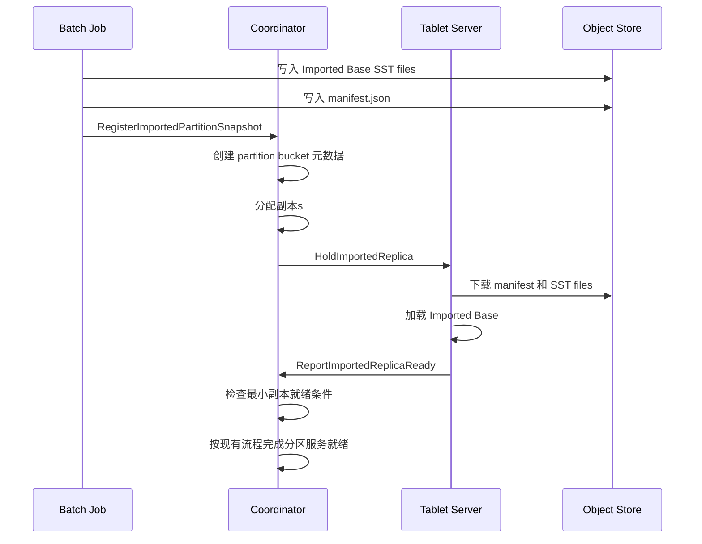

# Paimon 历史分区转 Fluss SST 批任务设计文档

## 1. 背景

当前用户已经有一张 Paimon 主键分区表，希望将这张表渐进式升级为 Fluss 主键表。

升级目标是：

- 后续所有新写入统一进入 Fluss。
- 历史分区的数据仍保留在 Paimon 中，不做一次性全量迁移。
- 对历史分区的点查，希望优先由 Fluss 提供更低延迟的查询能力。
- 但如果让 Fluss Server 直接读取 Paimon 的 Parquet 文件，并在本地做主键重建、排序和索引构建，会带来较高的 CPU、内存和加载时延开销。

因此，需要一条离线链路，把热点历史分区从 Paimon 转换为 Fluss 可直接加载的 SST 文件。Fluss Server 只需要下载并加载 SST 文件，不再承担沉重的 Parquet 解析与重建成本。

经过收敛后，本阶段不强依赖长期运行的 Tiering Service，而是优先实现一个 **Paimon 历史分区转 Fluss SST 的批任务**。

## 2. 设计目标

- 支持将指定的 Paimon 历史分区离线转换为 Fluss SST 文件。
- 支持按固定策略处理最近 `N` 个热点历史分区，默认 `N=2`。
- 支持 Fluss Server 基于生成的 manifest 下载并加载 SST 文件。
- 支持绑定 Paimon snapshot，保证转换结果稳定、可复现。
- 支持在 SST 不可用时回退到直接查询 Paimon。
- 保证与 Fluss overlay 的查询优先级语义兼容。
- 第一版优先满足“简单、稳定、易落地”，而不是做成完整的平台化服务。

## 3. 非目标

- 不做历史数据全量迁移到 Fluss。
- 不实现复杂的动态热点识别。
- 不实现多表统一调度平台。
- 不优化 scan、范围查询等非主键点查场景。
- 不处理 Fluss 与 Paimon 之间的双写一致性问题。
- 不替代 Paimon 作为历史分区的真实来源。

## 4. 方案结论

本方案采用一个独立批任务完成历史分区加速产物构建。

核心思路如下：

1. 根据配置识别需要加速的历史分区，例如最近两个历史分区。
2. 为每个分区绑定一个稳定的 Paimon snapshot。
3. 读取该 snapshot 下对应分区的 Parquet 文件。
4. 按主键语义物化每个目标历史分区的最终记录状态。
5. 将结果写成 Fluss SST 文件与 manifest。
6. 将产物发布到对象存储或共享文件系统。
7. 更新元数据，让 Fluss Server 可以加载 SST。

运行时查询优先级保持为：

`Fluss active / overlay > Historical SST > Direct Paimon lookup`

也就是说，批任务只负责生成历史分区的基础加速层，不负责合并 cutover 之后落入历史分区的迟到写和删除，这些覆盖语义仍由 Fluss 本身负责。

## 5. 为什么先做批任务，而不是 Tiering Service

相比完整的 Tiering Service，这个需求当前更适合批任务，原因如下：

- 热点范围清晰，通常只是最近两个历史分区。
- 转换触发条件简单，可以是按天、按分区滚动、按运维脚本触发。
- 不要求秒级生效，通常允许分钟级或小时级完成加速。
- 目标是先验证 `Paimon -> SST -> Fluss Server Load` 这条链路的可行性和收益。
- 平台化调度、统一治理、多表优先级等能力当前不是刚需。

因此，当前更推荐的落地方式是：

- 第一阶段：实现一个稳定的批任务
- 第二阶段：如果未来表规模变大、策略变复杂，再将其演进为 Tiering Service

## 6. 总体架构



### 组件职责

- `Catalog / Metadata`
  - 存储升级表配置。
  - 存储历史分区 SST 版本、状态和 manifest 路径。
- `Batch Planner`
  - 选择需要转换的历史分区。
  - 为每个分区解析应绑定的 snapshot。
- `Partition Conversion Job`
  - 执行单个分区的转换任务。
- `Paimon Snapshot Reader`
  - 从指定 snapshot 中读取指定分区的数据文件。
- `PK Materializer`
  - 恢复分区级最终主键状态。
- `SST Builder`
  - 按 Fluss key 顺序写出 SST 文件。
- `Manifest Writer`
  - 生成供 Fluss Server 加载使用的 manifest。
- `Fluss Server`
  - 下载并加载 SST 文件。
  - 在查询时将其作为历史基础层。

## 7. 批任务执行模型

## 7.1 任务粒度

推荐任务粒度为：

- 一个任务处理一个 `(table, partition, source_snapshot_id, schema_version)`

这是最自然的幂等边界，也是最适合问题定位和失败重试的粒度。

## 7.2 触发方式

第一版建议支持以下两种触发方式：

- **定时触发**
  - 例如每天或每小时扫描一次历史分区窗口。
- **手动触发**
  - 运维或开发者显式指定表、分区、snapshot 执行转换。

后续可以再补：

- 分区滚动事件触发
- 元数据变化触发

## 7.3 Job 拓扑

可实现为一个批模式作业，也可以是一次性命令行程序。逻辑流水线建议如下：

```text
Partition Discover
    -> Snapshot Resolve
    -> File Read
    -> PK Materialize
    -> Sort
    -> SST Build
    -> Manifest Commit
    -> Metadata Update
```

## 8. 分区选择策略

第一版保持策略简单明确。

### 默认规则

- 只处理历史分区。
- 默认只处理最近 `2` 个历史分区。
- 当以下条件之一满足时认为某个目标历史分区需要转换：
  - 该目标历史分区还没有 SST 版本。
  - 该目标历史分区绑定的最新可用 snapshot 发生变化。
  - 运维手动要求重建。

### 示例

假设：

- `cutover_partition = dt=2026-03-21`
- 当前已形成历史分区：`dt=2026-03-19`、`dt=2026-03-20`

则默认会选择：

- `dt=2026-03-20`
- `dt=2026-03-19`

作为批任务转换目标。

## 9. Snapshot 绑定与版本管理

## 9.1 为什么必须绑定 snapshot

如果批任务直接读取“当前分区文件列表”，会面临以下问题：

- 读取期间文件集合可能变化。
- 得到的结果不可复现。
- 生成的 SST 与 Paimon 状态不一致。

因此必须在任务开始阶段先固定一个 `source_snapshot_id`。

## 9.2 幂等键

建议使用以下四元组作为任务幂等键：

- `table_id`
- `partition`
- `source_snapshot_id`
- `schema_version`

### 规则

- 相同幂等键的任务重复执行，逻辑上必须得到同一结果。
- 如果对应版本产物已经存在，则直接返回已有结果，不重复构建。
- 当 snapshot 变化时，生成新的 SST 版本。

## 9.3 版本语义

建议同时维护两类版本：

- `source_snapshot_id`
  - 表示产物对应哪个 Paimon 快照。
- `sst_version`
  - 表示在 Fluss 侧发布的第几个 SST 版本。

其中：

- snapshot 用于正确性追踪。
- sst version 用于产物管理、回滚和 server 端加载。

## 10. 数据处理语义

## 10.1 输入边界

单个转换任务只读取：

- 一个表
- 一个目标历史分区
- 一个 snapshot

不跨分区，不混多个 snapshot。

## 10.2 主键物化目标

输出结果必须表示这个历史分区在指定 snapshot 下的**最终主键状态**。

要求：

- 每个主键最多一条最终记录。
- 已删除记录在基础 SST 层中不输出。
- 输出进入 SST 之前必须按 Fluss 的主键比较器排序。

## 10.3 推荐物化流程

1. 读取目标历史分区在指定 snapshot 下的所有有效数据文件。
2. 按 Paimon 主键语义恢复每个主键的最终值。
3. 将已删除主键从结果中移除。
4. 将最终 KV 对按 Fluss key 编码排序。
5. 送入 SST Builder 生成 SST 文件。

## 10.4 与 Fluss Overlay 的边界

历史 SST 只提供“历史分区的基础状态”。

如果 cutover 后，某个历史分区上又发生了迟到写或删除，则：

- 这些变更进入 Fluss。
- 查询时由 Fluss overlay 覆盖历史 SST。
- 批任务不需要把这些覆盖再写回历史 SST。

## 11. 端到端流程

## 11.1 总体流程图



## 11.2 查询流程



## 12. SST 产物设计

## 12.1 目录布局

建议对象存储目录结构：

```text
<root>/historical-sst/
  table=<table_id>/
    partition=<partition_spec>/
      snapshot=<source_snapshot_id>/
        schema=<schema_version>/
          version=<sst_version>/
            manifest.json
            000001.sst
            000002.sst
            ...
```

这样做的好处：

- 便于定位每个目标历史分区的具体转换版本。
- 便于 Fluss Server 拉取指定版本。
- 便于做垃圾回收和版本清理。

## 12.2 Manifest 格式

```json
{
  "tableId": 10021,
  "partition": "dt=2026-03-20",
  "sourceSnapshotId": 9281,
  "schemaVersion": 7,
  "sstVersion": 3,
  "createdAtMs": 1774212000000,
  "primaryKeyFields": ["dt", "pk"],
  "files": [
    {
      "path": "s3://bucket/historical-sst/table=10021/partition=dt=2026-03-20/snapshot=9281/schema=7/version=3/000001.sst",
      "sizeBytes": 268435456,
      "sha256": "abc123",
      "rowCount": 4000000,
      "smallestKey": "...",
      "largestKey": "..."
    }
  ],
  "stats": {
    "rowCount": 12345678,
    "fileCount": 3,
    "uncompressedBytes": 3456789012
  }
}
```

### Manifest 要求

- 必须完整描述 Fluss Server 加载所需的信息。
- 一旦发布后必须不可修改。
- 必须在所有 SST 文件写成功之后再写出。

## 13. 元数据设计

## 13.1 表级元数据

```json
{
  "tableId": 10021,
  "flussTable": "fluss.db.target_table",
  "paimonTable": "paimon.db.source_table",
  "cutoverPartition": "2026-03-21",
  "hotPartitionCount": 2,
  "historicalLookupMode": "PREFER_SST_FALLBACK_PAIMON",
  "lateWritePolicy": "OVERLAY_IN_FLUSS",
  "batchAccelerationEnabled": true
}
```

## 13.2 分区级元数据

```json
{
  "tableId": 10021,
  "partition": "dt=2026-03-20",
  "sourceSnapshotId": 9281,
  "schemaVersion": 7,
  "sstVersion": 3,
  "manifestPath": "s3://bucket/.../manifest.json",
  "state": "SST_READY",
  "lastAttemptTimeMs": 1774212000000,
  "lastSuccessTimeMs": 1774212060000,
  "errorCode": "",
  "errorMessage": ""
}
```

## 14. 状态机设计



### 状态说明

- `REMOTE_ONLY`
  - 当前分区没有加速产物，只能走 Paimon 直查。
- `CONVERTING`
  - 批任务正在构建对应历史分区的 SST。
- `SST_READY`
  - SST 与 manifest 已发布，可供 Fluss Server 加载。
- `LOADING`
  - Fluss Server 正在拉取和打开 SST。
- `LOADED`
  - SST 已被 Fluss Server 加载，点查可以直接命中。
- `FAILED`
  - 转换或加载失败。
- `EVICTED`
  - 由于资源压力或窗口变化，SST 已从本地移除。

## 15. 接口设计

## 15.1 批任务输入参数

建议批任务支持如下参数：

```text
--fluss-table=<catalog.db.target_table>
--paimon-table=<catalog.db.source_table>
--partition=<dt=2026-03-20>
--source-snapshot-id=<9281>
--schema-version=<7>
--output-root=<s3://bucket/historical-sst/>
--target-sst-file-size=<268435456>
--max-materialization-memory=<4g>
--mode=<single-partition|auto-window>
```

### 参数说明

- `--fluss-table`
  - 目标 Fluss 表。
- `--paimon-table`
  - 源 Paimon 表。
- `--partition`
  - 手动模式下指定转换的历史分区。
- `--source-snapshot-id`
  - 指定转换所绑定的 snapshot。
- `--schema-version`
  - 指定 schema 版本。
- `--output-root`
  - SST 产物输出根路径。
- `--target-sst-file-size`
  - SST 目标文件大小。
- `--max-materialization-memory`
  - 物化阶段最大可用内存。
- `--mode`
  - 单分区执行或自动扫描热点窗口。

## 15.2 Metadata API

### 查询热点历史分区

```proto
rpc ListHistoricalPartitionsForAcceleration(ListHistoricalPartitionsForAccelerationRequest)
    returns (ListHistoricalPartitionsForAccelerationResponse);

message ListHistoricalPartitionsForAccelerationRequest {
  string fluss_table = 1;
}
```

### 更新分区状态

```proto
rpc UpdateHistoricalPartitionAccelerationState(UpdateHistoricalPartitionAccelerationStateRequest)
    returns (UpdateHistoricalPartitionAccelerationStateResponse);

message UpdateHistoricalPartitionAccelerationStateRequest {
  string fluss_table = 1;
  string partition = 2;
  int64 source_snapshot_id = 3;
  int32 schema_version = 4;
  int32 sst_version = 5;
  string state = 6;
  string manifest_path = 7;
  string error_code = 8;
  string error_message = 9;
}
```

## 15.3 Fluss Server 加载接口

```proto
rpc LoadHistoricalSst(LoadHistoricalSstRequest) returns (LoadHistoricalSstResponse);

message LoadHistoricalSstRequest {
  string fluss_table = 1;
  string partition = 2;
  string manifest_path = 3;
  int32 sst_version = 4;
}
```

## 16. 核心模块设计

## 16.1 Planner

Planner 负责：

- 识别哪些分区需要转换。
- 判断是否已有可复用产物。
- 解析 snapshot 与 schema 版本。
- 生成执行计划。

### 输出示例

```json
{
  "tableId": 10021,
  "partition": "dt=2026-03-20",
  "sourceSnapshotId": 9281,
  "schemaVersion": 7,
  "sstVersion": 3,
  "outputPrefix": "s3://bucket/historical-sst/.../version=3/"
}
```

## 16.2 Reader

Reader 负责：

- 列出指定 snapshot 下目标分区的数据文件。
- 用稳定 schema 读取行流。
- 向 Materializer 输出标准化记录。

要求：

- snapshot 一致性。
- schema 映射校验。
- 流式读取与背压控制。

## 16.3 Materializer

Materializer 负责将输入行流恢复为目标历史分区的最终主键状态。

可选策略：

- **内存 map + sort**
  - 实现简单，适合小分区。
- **外部排序 + merge**
  - 更适合大分区，推荐优先实现。

建议第一版优先支持外部排序方案，避免最近两个分区过大时内存爆炸。

## 16.4 SST Builder

SST Builder 负责：

- 按目标文件大小切分输出。
- 写入排序后的 KV 流。
- 构建 index、bloom 和统计信息。
- 输出 checksum 和范围信息。

要求：

- key comparator 必须与 Fluss 运行时一致。
- 生成结果必须支持 Fluss Server 直接打开。

## 16.5 Manifest Committer

Committer 负责：

1. 将临时 SST 文件写入目标存储。
2. 校验文件数量、大小与 checksum。
3. 写出不可变 manifest。
4. 更新元数据状态为 `SST_READY`。

必须保证：

- 不发布半成品。
- manifest 一旦可见，就必须指向完整产物集合。

## 17. 故障处理

## 17.1 故障分类

- `SNAPSHOT_NOT_FOUND`
- `SCHEMA_INCOMPATIBLE`
- `READ_PAIMON_FAILED`
- `MATERIALIZE_FAILED`
- `SORT_FAILED`
- `WRITE_SST_FAILED`
- `UPLOAD_FAILED`
- `MANIFEST_COMMIT_FAILED`

## 17.2 恢复原则

- 转换失败不能影响正确性。
- 转换失败只影响性能，不影响可用性。
- Fluss Server 在任何时候都必须可以回退到 Paimon 直查。
- 不允许暴露不完整 manifest。

## 17.3 重试策略

- 对临时 I/O 故障使用指数退避。
- 对 schema 不兼容类故障不自动重试。
- 对同一张表限制并发重试数量。

## 18. 资源管理

## 18.1 为什么批任务优于 Server 在线转换

如果由 Fluss Server 在线解析 Paimon Parquet 并构建 SST，会带来：

- 较高 CPU 峰值。
- 较高内存占用。
- 较慢的历史分区预热时延。
- 多个 Server 重复执行相同工作。

使用批任务后：

- 转换工作集中在离线链路。
- 多个 Server 共享同一份 SST 产物。
- Fluss Server 只承担下载和打开成本。
- 系统整体资源利用更稳定。

## 18.2 建议配置项

- `historical.sst.batch.hot-partition-count`
- `historical.sst.batch.max-concurrent-tasks`
- `historical.sst.batch.target-sst-file-size`
- `historical.sst.batch.max-materialization-memory`
- `historical.sst.batch.retry.max-attempts`
- `historical.sst.batch.output-root`

## 19. 指标设计

建议指标：

- `historical_sst_batch_task_total`
- `historical_sst_batch_task_success_total`
- `historical_sst_batch_task_failure_total`
- `historical_sst_batch_task_latency_ms`
- `historical_sst_batch_input_rows_total`
- `historical_sst_batch_output_rows_total`
- `historical_sst_batch_output_files_total`
- `historical_sst_batch_uploaded_bytes_total`
- `historical_sst_batch_partition_state_count`

建议标签：

- `table`
- `partition`
- `state`
- `error_code`

## 20. 测试方案

## 20.1 单元测试

- 分区选择策略正确。
- snapshot 绑定正确。
- 相同幂等键重复执行结果一致。
- 删除记录不会写入基础 SST。
- manifest 内容与产物一致。

## 20.2 集成测试

- 指定历史分区可成功转换为 SST。
- Fluss Server 可以成功加载生成的 SST。
- 查询优先级遵循 `Fluss > SST > Paimon`。
- SST 缺失或加载失败时可以回退到 Paimon。
- snapshot 更新后可以生成新版本 SST。

## 20.3 性能测试

- 最近两个历史分区的转换时长。
- 转换过程 CPU / 内存 / 磁盘峰值。
- Fluss Server 从 SST 加载的耗时。
- 历史点查命中 SST 后的 P50 / P95 / P99 延迟。

## 21. 分阶段落地计划

### Phase 1

- 打通单分区手动批转换。
- 支持 `Paimon -> SST -> manifest` 输出。
- 支持 Fluss Server 手动加载 SST。

### Phase 2

- 支持自动扫描最近两个历史分区。
- 支持 metadata 状态更新。
- 支持失败重试和基本指标。

### Phase 3

- 支持窗口滚动和旧版本清理。
- 支持更高效的外部排序与并行转换。
- 视需求决定是否演进为常驻的 Tiering Service。

## 22. 待确认问题

- 这个批任务最终是以 CLI 程序、Flink 批作业，还是 Spark/Flink SQL 作业方式运行？
- Fluss 当前是否已有稳定的离线 SST Writer API？
- manifest 和 metadata 是由同一个组件提交，还是分离提交？
- Fluss Server 是否需要支持版本切换和回滚？
- 同一分区是否保留多个历史 SST 版本，还是只保留最新版本？

## 23. 建议结论

建议当前阶段优先实现 **Paimon 历史分区转 Fluss SST 批任务**，而不是先做完整的 Tiering Service。

推荐的第一版形态是：

- 一个批任务处理一个 `(table, partition, snapshot, schema)`。
- 使用稳定 snapshot 绑定，保证结果可复现。
- 生成不可变 SST 与 manifest。
- 由元数据驱动 Fluss Server 加载。
- 任何失败都自动回退到 Paimon 直查。

这样可以以最小复杂度完成关键闭环：

**把热点历史分区从 Paimon 低成本转换成 Fluss 可直接加载的 SST，从而提升历史点查性能，同时避免把重型转换逻辑压到 Fluss Server。**

## 24. Imported Base 路径设计与发布协议

针对“如果批任务产物路径和 Tablet Server 最终持有路径不一致，就需要做 rename”的问题，本设计建议：

- **批任务直接写入最终 Imported Base 路径**。
- **不依赖跨路径 rename 完成发布**。
- **通过 manifest 发布和 Coordinator 注册控制可见性**。

这样可以避免：

- 大文件跨目录搬运。
- 对对象存储执行高成本的 copy + delete。
- 由于 rename 语义不一致导致的实现复杂度。

### 24.1 设计原则

- SST 文件一旦生成，尽量直接落到最终归属路径。
- 产物“是否可见”由 manifest 决定，而不是由目录切换决定。
- 分区“是否可服务”由 Coordinator 决定，而不是由文件是否存在决定。

### 24.2 推荐目录结构

```text
<table-root>/
  imported-bases/
    table=<table_id>/
      partition=<partition_spec>/
        source-snapshot=<paimon_snapshot_id>/
          schema=<schema_version>/
            import-version=<import_version>/
              manifest.json
              000001.sst
              000002.sst
              ...
```

这里：

- `source-snapshot` 表示这份 base 来源于哪个 Paimon snapshot。
- `import-version` 表示这份 Imported Base 在 Fluss 侧的发布版本。
- `manifest.json` 是 Coordinator 和 Tablet Server 唯一依赖的入口。

### 24.3 为什么不依赖 rename

对于对象存储，rename 往往不是原子元数据操作，而是：

- `copy`
- `delete`

如果 SST 文件很大，这会带来明显的额外成本。

因此更合适的做法是：

1. 批任务直接向最终版本目录写入 SST 文件。
2. 写入过程中使用临时文件名或隐藏标记。
3. 所有 SST 文件写完并校验通过后，最后写出 `manifest.json`。
4. `manifest.json` 的出现，表示这份 Imported Base 版本已经完整可读。

也就是说，真正的“发布动作”是：

- `manifest.json` 成功写出
- 后续 `Coordinator` 注册该版本，并按现有流程创建分区与分配副本

而不是整批文件 rename。

### 24.4 推荐写入协议

推荐的文件发布协议如下：

```text
1. 创建 import-version 目录
2. 写入 *.sst.tmp 或写入临时子目录
3. 校验所有 SST 文件大小、checksum、row count
4. 将临时文件原地 finalize 为正式文件名
5. 最后写出 manifest.json
6. 通知 Coordinator 注册 Imported Base
```

注意：

- 即使存在 rename，也只建议发生在**同目录内的小范围 finalize**。
- 不建议做“从 staging 路径搬到 active 路径”的跨路径大文件 rename。

## 25. Coordinator 接管流程

SST 构建成功并不意味着该历史分区已经可对外服务。

正确流程应该是：

- 批任务只负责准备 Imported Base。
- Coordinator 负责接管分区控制面。
- Tablet Server 负责持有副本并准备数据面。

### 25.1 总体时序



### 25.2 Coordinator 职责

Coordinator 需要负责：

- 校验 Imported Base 的注册信息。
- 创建该历史分区对应的 bucket 元数据。
- 为 bucket 分配 leader 和 follower 副本。
- 通知对应 Tablet Server `持有副本`。
- 等待足够多 副本就绪。
- 让该分区按现有流程对外提供服务。

### 25.3 为什么必须经过 Coordinator

如果不经过 Coordinator，而是让 Tablet Server 看到产物后自己加载并对外服务，会有以下问题：

- bucket id 由谁分配不清晰。
- 副本集合和 leader 关系不清晰。
- 客户端路由无法统一。
- 何时可以开始写入没有统一门禁。
- 多副本 readiness 无法形成 quorum 判断。

因此，分区接管必须统一由 Coordinator 驱动。

## 26. Tablet Server Hold Replica 设计

Tablet Server 的职责不是决定是否接管历史分区，而是执行 Coordinator 下发的持有任务。

### 26.1 Hold 流程

当 Tablet Server 收到 `HoldImportedReplica` 命令后，建议执行以下流程：

```text
1. 拉取 manifest
2. 下载 manifest 引用的 SST 文件集合
3. 校验 checksum / schema version / source snapshot
4. 打开 Imported Base SST Reader
5. 初始化该分区副本的 WAL / MemTable
6. 注册本地副本
7. 上报 副本就绪
```

### 26.2 本地副本结构

如果该历史分区在接管后支持继续写入，则 Tablet Server 本地应持有：

```text
Partition Replica
  = Imported Base SST
  + WAL
  + MemTable
  + Delta SSTs
```

其中：

- `Imported Base SST` 是只读基线层。
- `WAL / MemTable / Delta SSTs` 是 Fluss 后续原生写入层。

### 26.3 查询顺序

分区进入服务后，查询顺序建议固定为：

```text
1. MemTable
2. Delta SSTs
3. Imported Base SST
```

如果命中 tombstone，则直接返回 `NOT_FOUND`，不能继续向下查 Imported Base。

## 27. 接入门禁与写入门禁

这是整个设计里最重要的约束之一：

> 历史分区只有在 Imported Base 已构建完成，并且已经按 Fluss 现有分区创建与副本就绪流程接入之后，才允许对外提供写入服务。

### 27.1 推荐的简化阶段

```text
REMOTE_ONLY
  -> BASE_BUILDING
  -> BASE_BUILT
  -> 进入 Fluss 现有分区创建与副本就绪流程
```

### 27.2 阶段说明

- `REMOTE_ONLY`
  - 目标历史分区还在 Paimon 侧，只读，不可写。
- `BASE_BUILDING`
  - 批任务正在构建 Imported Base。
- `BASE_BUILT`
  - SST 和 manifest 已写出，后续直接进入 Fluss 现有分区创建、副本分配和副本就绪流程。

### 27.3 写入门禁规则

建议在 Coordinator 和 Tablet Server 两层都做写入门禁：

- Coordinator 路由层：未完成现有分区创建与副本就绪流程的分区不向客户端暴露可写路由。
- Tablet Server 执行层：收到写入时再次校验本地副本是否已就绪。

伪代码如下：

```text
if partition is not ready by the existing partition lifecycle:
    reject write
else:
    append WAL -> MemTable -> normal Fluss write path
```

### 27.4 分区就绪后的所有权切换

一旦分区按现有流程完成就绪：

- 对应历史分区的在线服务所有权从 Paimon 转移到 Fluss。
- 后续所有新增写入、更新和删除都只进入 Fluss。
- 在线查询路径不再直接依赖 Paimon。
- Paimon 仅保留为历史来源和离线重建参考。

### 27.5 接入 Fluss 服务流程的前置条件

Coordinator 只有在以下条件都满足时，才允许该分区进入 Fluss 现有服务流程：

- Imported Base 已成功注册。
- bucket 元数据已创建。
- 副本已完成分配。
- 至少满足最小副本就绪数量。
- 所有已就绪副本的 `source_snapshot_id`、`schema_version`、`import_version` 一致。

只有满足这些条件，才能保证：

- 查询基线一致。
- 写入路由稳定。
- 故障恢复边界清晰。
