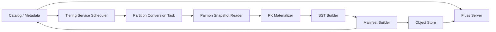
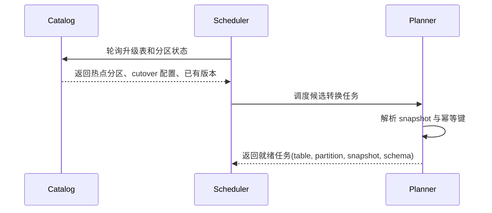
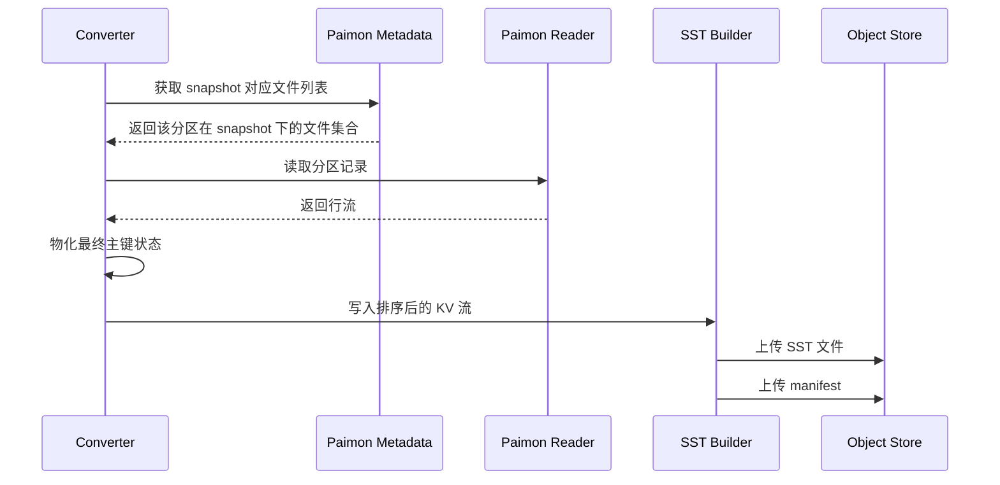
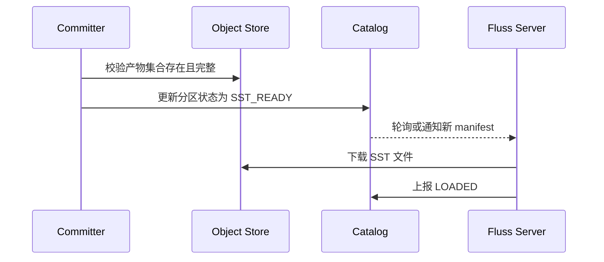
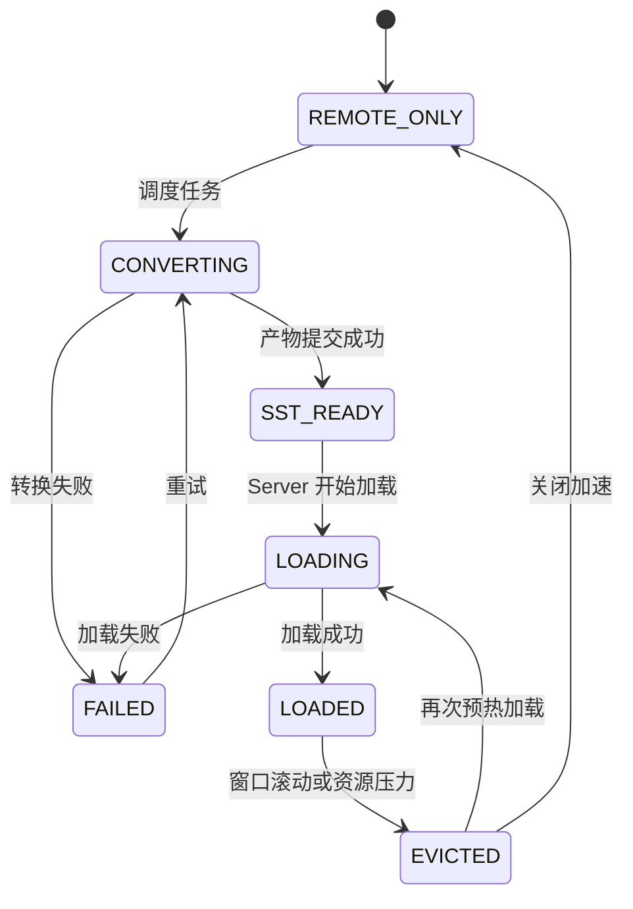

# 面向 Paimon 历史分区加速的 Tiering Service 设计

## 1. 背景

用户当前已经有一张 Paimon 主键分区表，希望将其渐进式升级为 Fluss 主键表。

目标行为如下：

- 后续所有新写入都进入 Fluss。
- 对历史分区的点查仍然可以直接查询 Paimon 表。
- 最近的历史分区通常是点查最热点的数据范围，需要额外加速。
- Fluss Server 不应该承担解析 Paimon Parquet 文件、重建主键状态、构建内存查询结构的全部成本。

因此，希望由 Tiering Service 负责将最近热点历史分区对应的 Paimon 文件转换为 Fluss 可直接加载的 SST 文件，Fluss Server 只需要下载并打开 SST 文件即可提供高性能点查。

本文重点描述这条链路下 Tiering Service 应该如何设计。

## 2. 目标

- 将选定的 Paimon 历史分区转换为 Fluss 可读取的 SST 产物。
- 将转换成本从 Fluss Server 数据路径上移出。
- 让多个 Fluss Server 可以复用同一份转换结果。
- 在 Fluss 存在迟到写和删除的情况下保证点查语义正确。
- 当 SST 不可用时，自动回退到直接查询 Paimon。
- 尽可能复用现有 `fluss-flink-tiering` 的执行模型和基础设施。

## 3. 非目标

- 不做所有 Paimon 历史数据向 Fluss 的全量迁移。
- 不优化所有查询类型的批量扫描。
- 不处理 Fluss 与 Paimon 之间的跨系统分布式事务。
- 不实现历史 Paimon 分区向 Fluss 的实时 CDC 回流。
- 不用历史 SST 替代 Paimon 作为历史数据的真实来源。

## 4. 核心思路

Tiering Service 作为一个异步转换流水线工作：

1. 发现需要加速的热点历史分区。
2. 为每个转换任务绑定一个稳定的 Paimon snapshot。
3. 读取该 snapshot 下对应分区的 Paimon 文件。
4. 物化该分区最终的主键状态。
5. 生成 Fluss SST 文件与 manifest。
6. 将生成的产物发布到远端对象存储。
7. 更新元数据，让 Fluss Server 可下载并加载这些 SST。

这样运行时查询成本从：

`Paimon Parquet 解码 + 主键重建 + 内存索引构建`

变为：

`下载 SST + 打开 SST Reader`

## 5. 总体架构



### 组件职责

- `Catalog / Metadata`
  - 存储升级表配置。
  - 存储历史分区转换状态。
  - 发布最新可用的 SST 版本。
- `Tiering Service Scheduler`
  - 选择哪些分区需要转换。
  - 控制并发度与重试策略。
- `Partition Conversion Task`
  - 负责将一个 `(table, partition, snapshot)` 转成一个 SST 版本。
- `Paimon Snapshot Reader`
  - 从指定的 Paimon snapshot 中读取稳定文件集合。
- `PK Materializer`
  - 为每个主键产出最终的一条记录状态。
- `SST Builder`
  - 生成排序后的 SST 文件、索引块和布隆过滤器。
- `Manifest Builder`
  - 生成 Fluss Server 用于校验与加载的元数据清单。

## 6. 与现有 Fluss Tiering 的关系

当前 `fluss-flink-tiering` 的职责是将 Fluss 数据同步到湖格式，例如 Paimon。

本文设计新增的是另一条方向明确的能力：

- 现有方向：`Fluss -> Lake`
- 新增方向：`Paimon 历史分区 -> Fluss SST`

这条新链路不是替换现有湖仓 tiering，而是在历史分区点查加速场景下新增一条能力链路。建议复用现有：

- 基于 Flink 的执行模型
- coordinator heartbeat 或 metadata polling 模式
- 按表调度任务的机制
- 以 manifest 为中心的产物发布方式

推荐的实现方式：

- 在 tiering service 内增加一个新的 job mode，例如 `historical-acceleration`。
- 与现有 lake tiering 逻辑保持逻辑隔离。
- 共用调度、配置、文件系统、指标等公共基础设施。

## 7. 执行模型

## 7.1 Job 拓扑

推荐 Flink Job 拓扑：

```text
Source: HistoricalPartitionSource
    -> Operator: PartitionPlanner
    -> Operator: PartitionConverter
    -> Operator: ArtifactCommitter
    -> Sink: NoOp
```

### 各 Operator 职责

- `HistoricalPartitionSource`
  - 轮询元数据，产出候选历史分区。
- `PartitionPlanner`
  - 解析 snapshot、schema version 和任务幂等键。
- `PartitionConverter`
  - 读取 Paimon 文件并写出 SST 文件。
- `ArtifactCommitter`
  - 原子发布 manifest，并更新元数据状态。

## 7.2 为什么需要 Committer 阶段

Committer 用来保证从系统视角看以下动作具备原子性：

- SST 产物已经完整写出。
- Manifest 只引用有效的 SST 文件。
- 元数据只有在产物持久化成功后才更新。

如果没有独立的 commit 阶段，Fluss Server 可能观察到不完整的中间结果。

## 8. 端到端流程

## 8.1 调度流程



## 8.2 转换流程



## 8.3 发布流程



## 9. 分区选择策略

第一版建议保持简单、可预测。

### 推荐默认策略

- 只有历史分区才有资格进入加速流程。
- 只加速最近 `N` 个历史分区。
- 默认 `N = 2`。
- 当以下任一条件满足时触发转换：
  - 分区进入热点历史窗口。
  - 该分区对应的 Paimon snapshot 变化，当前 SST 版本过期。

### 后续可扩展策略

- 基于点查频率选择热点分区。
- 基于内存预算动态调节窗口大小。
- 按表设置不同优先级。

## 10. Snapshot 绑定与幂等性

每个转换任务必须由以下字段唯一标识：

- `table_id`
- `partition`
- `source_snapshot_id`
- `schema_version`

这个四元组就是转换任务的幂等键。

### 规则

- 重复执行同一个任务，必须得到相同的逻辑输出。
- 如果对应产物版本已经存在，则直接返回成功，不重复发布新版本。
- 只有当 Paimon snapshot 更新时，才会生成新的 SST 版本。

## 11. 数据处理语义

## 11.1 输入语义

Converter 只能读取：

- 单一 Paimon snapshot
- 单一分区

不能在未绑定 snapshot 的情况下读取动态变化的文件列表。

## 11.2 主键物化语义

物化阶段的目标是为某个分区构建最终的主键查找基线状态。

输出必须满足：

- 每个主键最多只有一条最终记录。
- 已删除主键在 SST 基线视图中不存在。
- 输出写入 SST 前需要按 Fluss 内部 key 编码全局排序。

### 物化策略

推荐第一版实现：

1. 从绑定的 Paimon snapshot 读取该分区行数据。
2. 按 Paimon 语义还原每个主键的最终记录。
3. 将删除记录从基础 SST 输出中剔除。
4. 按 Fluss 内部主键比较器对最终 KV 排序。
5. 将排序后的 KV 流送入 SST Builder。

这样可以让历史 SST 保持紧凑，同时把 cutover 后的删除覆盖交给 Fluss overlay 层处理。

## 11.3 与 Fluss Overlay 的关系

历史 SST 只是一层 base layer。

运行时查询优先级为：

1. Fluss active 数据或历史分区上的 late-write overlay
2. Historical SST
3. Direct Paimon lookup fallback

因此 Tiering Service 不需要把 cutover 之后的写入变更编码回历史 SST。

## 12. SST 产物布局

## 12.1 目录布局

推荐对象存储路径布局：

```text
<root>/historical-acceleration/
  table=<table_id>/
    partition=<partition_spec>/
      snapshot=<source_snapshot_id>/
        schema=<schema_version>/
          version=<sst_version>/
            manifest.json
            000001.sst
            000002.sst
            ...
```

这样便于版本管理、问题排查和垃圾回收。

## 12.2 Manifest 格式

```json
{
  "tableId": 10021,
  "partition": "dt=2026-03-20",
  "sourceSnapshotId": 9281,
  "schemaVersion": 7,
  "sstVersion": 3,
  "createdAtMs": 1774212000000,
  "primaryKeyFields": ["dt", "pk"],
  "files": [
    {
      "path": "s3://bucket/historical-acceleration/table=10021/partition=dt=2026-03-20/snapshot=9281/schema=7/version=3/000001.sst",
      "sizeBytes": 268435456,
      "sha256": "abc123",
      "rowCount": 4000000,
      "smallestKey": "...",
      "largestKey": "..."
    }
  ],
  "stats": {
    "rowCount": 12345678,
    "fileCount": 3,
    "uncompressedBytes": 3456789012
  }
}
```

### Manifest 要求

- 必须包含 Fluss Server 校验和加载 SST 所需的全部必要信息。
- 一旦发布后必须不可变。
- 只能在所有被引用的 SST 文件都持久化成功后写出。

## 13. 元数据模型

## 13.1 表级元数据

```json
{
  "tableId": 10021,
  "flussTable": "fluss.db.target_table",
  "paimonTable": "paimon.db.source_table",
  "cutoverPartition": "2026-03-21",
  "hotPartitionCount": 2,
  "historicalLookupMode": "PREFER_SST_FALLBACK_PAIMON",
  "lateWritePolicy": "OVERLAY_IN_FLUSS",
  "tieringEnabled": true
}
```

## 13.2 分区级元数据

```json
{
  "tableId": 10021,
  "partition": "dt=2026-03-20",
  "sourceSnapshotId": 9281,
  "schemaVersion": 7,
  "sstVersion": 3,
  "manifestPath": "s3://bucket/.../manifest.json",
  "state": "SST_READY",
  "lastAttemptTimeMs": 1774212000000,
  "lastSuccessTimeMs": 1774212060000,
  "errorCode": "",
  "errorMessage": ""
}
```

## 14. 分区状态机



### 状态定义

- `REMOTE_ONLY`
  - 当前没有启用加速产物，只能走 Paimon 直查。
- `CONVERTING`
  - Tiering Service 正在生成新的 SST 版本。
- `SST_READY`
  - 转换成功，manifest 已发布。
- `LOADING`
  - Fluss Server 正在下载并打开 SST 文件。
- `LOADED`
  - Fluss Server 已可以直接从 SST 提供点查。
- `FAILED`
  - 转换或加载失败。
- `EVICTED`
  - 本地缓存已驱逐该分区。

## 15. 接口设计

## 15.1 Catalog API

### 注册或更新升级映射

```proto
rpc RegisterUpgradeTable(RegisterUpgradeTableRequest) returns (RegisterUpgradeTableResponse);

message RegisterUpgradeTableRequest {
  string fluss_table = 1;
  string paimon_table = 2;
  string cutover_partition = 3;
  int32 hot_partition_count = 4;
  string historical_lookup_mode = 5;
  string late_write_policy = 6;
  bool tiering_enabled = 7;
}
```

### 拉取热点历史分区

```proto
rpc ListHotHistoricalPartitions(ListHotHistoricalPartitionsRequest)
    returns (ListHotHistoricalPartitionsResponse);

message ListHotHistoricalPartitionsRequest {
  string fluss_table = 1;
}
```

### 更新转换结果状态

```proto
rpc UpdateHistoricalPartitionState(UpdateHistoricalPartitionStateRequest)
    returns (UpdateHistoricalPartitionStateResponse);

message UpdateHistoricalPartitionStateRequest {
  string fluss_table = 1;
  string partition = 2;
  int64 source_snapshot_id = 3;
  int32 schema_version = 4;
  int32 sst_version = 5;
  string state = 6;
  string manifest_path = 7;
  string error_code = 8;
  string error_message = 9;
}
```

## 15.2 Tiering Service 内部任务接口

```proto
rpc TriggerPartitionConversion(TriggerPartitionConversionRequest)
    returns (TriggerPartitionConversionResponse);

message TriggerPartitionConversionRequest {
  string fluss_table = 1;
  string paimon_table = 2;
  string partition = 3;
  int64 source_snapshot_id = 4;
  int32 schema_version = 5;
}
```

```proto
rpc GetConversionTask(GetConversionTaskRequest)
    returns (GetConversionTaskResponse);

message GetConversionTaskRequest {
  string fluss_table = 1;
  string partition = 2;
  int64 source_snapshot_id = 3;
  int32 schema_version = 4;
}
```

## 15.3 Fluss Server 加载接口

```proto
rpc LoadHistoricalSst(LoadHistoricalSstRequest) returns (LoadHistoricalSstResponse);

message LoadHistoricalSstRequest {
  string fluss_table = 1;
  string partition = 2;
  string manifest_path = 3;
  int32 sst_version = 4;
}
```

## 16. Converter 内部设计

## 16.1 Planner

Planner 负责解析：

- 该分区是否在加速窗口中。
- 应该绑定哪个 Paimon snapshot。
- 当前转换是否已经被现有产物满足。
- 输出路径和 SST version 应该如何分配。

### Planner 输出示例

```json
{
  "tableId": 10021,
  "partition": "dt=2026-03-20",
  "sourceSnapshotId": 9281,
  "schemaVersion": 7,
  "sstVersion": 3,
  "outputPrefix": "s3://bucket/.../version=3/"
}
```

## 16.2 Reader

Reader 的职责：

- 列出指定 Paimon snapshot 下该分区的文件集合。
- 按 schema 映射读取行数据。
- 对上游输出标准化后的 row stream。

要求：

- 视图必须是 snapshot 一致的。
- 必须进行 schema 映射校验。
- 必须支持背压友好的流式读取。

## 16.3 Materializer

Materializer 负责将 Paimon 的 row stream 还原为最终 Fluss 基线状态。

可选实现策略：

- **内存 Map 后排序**
  - 实现简单，但只适合小分区。
- **外部排序 + Merge**
  - 更推荐，能支持大分区。

建议第一版：

- 当分区大小可能超过内存预算时，采用 partition-local external sort。
- 始终保证输出按 Fluss 编码后的主键顺序排序。

## 16.4 SST Builder

SST Builder 负责：

- 按目标文件大小切分输出。
- 写入排序后的 KV 数据。
- 构建索引和布隆过滤器。
- 生成每个文件的统计信息和校验和。

建议配置：

- 目标 SST 文件大小可配置，例如 `256 MB`。
- 布隆过滤器默认开启。
- Key comparator 必须与 Fluss 运行时点查 comparator 完全一致。

## 16.5 Committer

Committer 的职责：

1. 上传临时 SST 文件。
2. 校验上传后的文件数量和校验和。
3. 写入不可变 manifest。
4. 将元数据状态从 `CONVERTING` 更新为 `SST_READY`。

任何一步失败，都应该让分区保留在 `FAILED` 或重新回到可重试状态。

## 17. 故障处理

## 17.1 故障分类

- `SNAPSHOT_NOT_FOUND`
- `SCHEMA_INCOMPATIBLE`
- `READ_PAIMON_FAILED`
- `MATERIALIZE_FAILED`
- `WRITE_SST_FAILED`
- `UPLOAD_FAILED`
- `MANIFEST_COMMIT_FAILED`

## 17.2 恢复原则

- 转换失败不能影响点查正确性。
- 任何转换失败都只影响加速效果，不影响可用性。
- Fluss Server 必须始终可以回退到 Paimon 直查。
- 不允许将部分产物发布为有效 manifest。

## 17.3 重试策略

- 对瞬时 I/O 故障使用指数退避重试。
- 对 schema 不兼容错误，在元数据变化前不自动重试。
- 限制每张表的并发重试数，避免重试风暴。

## 18. 资源管理

## 18.1 为什么转换工作应该放在 Tiering Service

如果由 Fluss Server 直接把 Paimon Parquet 加载进内存，需要承担：

- Parquet 解码 CPU
- 行到主键的重建
- 主键去重
- 排序和索引构建
- 大量临时内存占用

把这些工作放到 Tiering Service 的好处是：

- 转换成本集中化
- 多个 Server 可复用同一产物
- Server 侧内存曲线更稳定
- 运维和故障定位更清晰

## 18.2 Tiering Service 资源参数

建议配置项：

- `historical.acceleration.max-concurrent-tasks`
- `historical.acceleration.max-concurrent-tasks-per-table`
- `historical.acceleration.target-sst-file-size`
- `historical.acceleration.max-materialization-memory`
- `historical.acceleration.retry.max-attempts`
- `historical.acceleration.hot-partition-count`

## 19. 指标设计

建议指标：

- `historical_acceleration_task_total`
- `historical_acceleration_task_success_total`
- `historical_acceleration_task_failure_total`
- `historical_acceleration_task_latency_ms`
- `historical_acceleration_input_rows_total`
- `historical_acceleration_output_rows_total`
- `historical_acceleration_sst_files_total`
- `historical_acceleration_uploaded_bytes_total`
- `historical_acceleration_partition_state_count`

建议标签：

- `table`
- `partition`
- `state`
- `error_code`

## 20. 分阶段落地计划

### Phase 1

- 支持元数据模型。
- 支持历史分区调度。
- 支持仅 fallback 的历史点查能力。

### Phase 2

- 支持单分区 `Paimon -> SST` 转换。
- 支持 manifest 发布。
- 支持 Fluss Server 加载 SST。

### Phase 3

- 支持热点分区窗口滚动。
- 支持重试、指标和可观测性。
- 优化外部排序和并行转换。

## 21. 待确认问题

- 这套能力应该作为 `fluss-flink-tiering` 的一个新 job mode 实现，还是单独拆成一个历史加速模块？
- Fluss 侧是否已经有适合离线构建 SST 的 writer API？
- 同一台机器上的多个 Fluss Server 是否可以共享本地 SST 缓存？
- 热点窗口是固定按分区顺序，还是未来按点查频率动态决策？
- 除了 checksum，是否还需要更强的 manifest 或产物完整性校验？

## 22. 建议结论

建议第一版作为现有 Tiering Service 的一个新 job mode 落地，并满足以下特征：

- 每个 `(table, partition, snapshot, schema)` 对应一个转换任务。
- 基于 snapshot 绑定，保证幂等产物生成。
- 发布不可变的 SST 与 manifest。
- 由元数据驱动 Fluss Server 进行加载。
- 保证任何时候都可以回退到直接查询 Paimon。

这样可以在保持整体实现和运维复杂度可控的前提下，满足核心诉求：

**在不把重型 Parquet -> SST 工作压到 Fluss Server 的情况下，加速历史分区的点查。**
